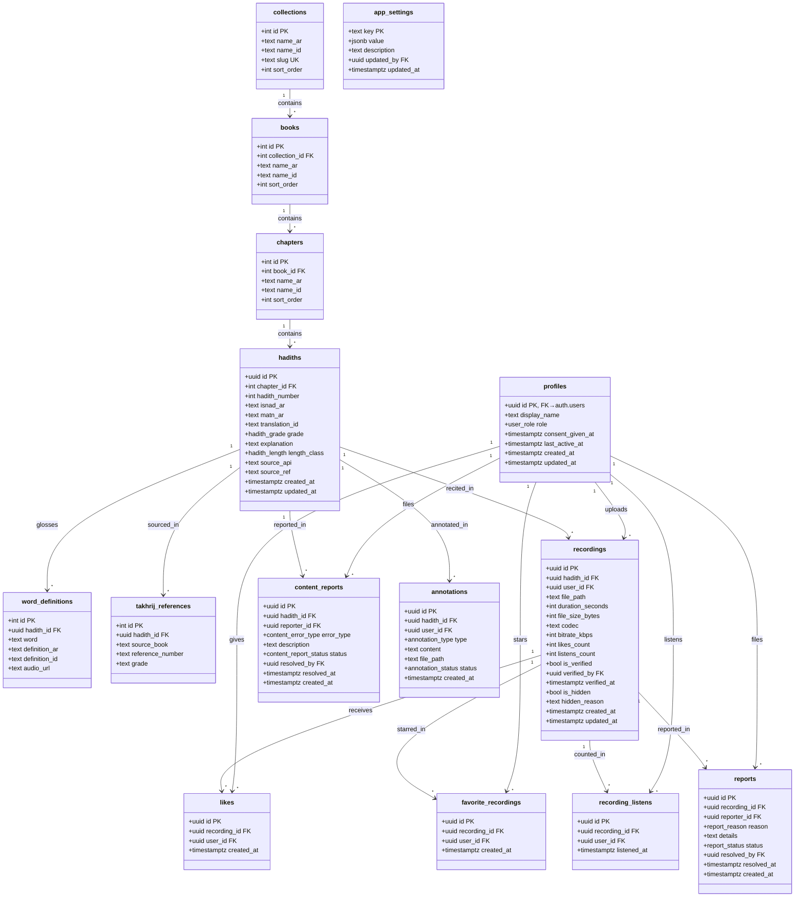

# Data Model — نموذج البيانات

Document Version: v1.0

Project: منصة الحديث الشريف التفاعلية

Product: Interactive Hadith Memorization Platform (PWA + Supabase)

Status: Draft

Last Updated: 2026-07-23

Author: System Analyst AI

Source: Derived from SRS v1.0 (SoT-1) §4

---

## 1. نظرة عامة (Overview)

يعرّف هذا المستند نموذج بيانات منصة الحديث الشريف التفاعلية على PostgreSQL (Supabase). النموذج مشتق من كائنات البيانات الأساسية في SRS v1.0 §4.1، وينقسم منطقياً إلى ثلاث مجموعات:

1. **محتوى مرجعي (Reference Content):** `collections → books → chapters → hadiths` + `word_definitions` + `takhrij_references` — للقراءة فقط من الواجهة، تُغذّى من مصادر خارجية.
2. **تفاعل المستخدم (User-Generated):** `recordings`, `likes`, `favorite_recordings`, `recording_listens`, `reports`, `content_reports`, `annotations`.
3. **الهوية والإعدادات:** `profiles`, `app_settings`.

التنفيذ الفعلي الجاهز للنسخ: `04-database-schema.sql`. سياسات الأمان: `05-rls-policies.sql`.

---

## 2. المخطط الصنفي (Class Diagram)

---

## 3. أوصاف الكيانات (Entity Descriptions)

### 3.1 profiles

ملف المستخدم الممتد من `auth.users` — يُنشأ تلقائياً بمشغّل (Trigger) عند أول تسجيل دخول.

| Attribute | Type | Constraint | Description |
|---|---|---|---|
| id | UUID | PRIMARY KEY, FK → auth.users(id) ON DELETE CASCADE | معرّف المستخدم من Supabase Auth |
| display_name | TEXT | NOT NULL, CHECK (char_length BETWEEN 2 AND 60) | اسم العرض — يبدأ من اسم Google وقابل للتخصيص |
| role | user_role | NOT NULL, DEFAULT 'student' | الدور: `student` أو `admin` (الترقية يدوية في DB) |
| consent_given_at | TIMESTAMPTZ | NULL | وقت الموافقة الصريحة على سماعية التسجيلات (شرط أول رفع) |
| last_active_at | TIMESTAMPTZ | NULL | آخر نشاط — يغذي حساب "الطلاب النشطين" في ALG-002 |
| created_at | TIMESTAMPTZ | NOT NULL, DEFAULT now() | وقت إنشاء الملف |
| updated_at | TIMESTAMPTZ | NOT NULL, DEFAULT now() | آخر تحديث (Trigger تلقائي) |

### 3.2 collections

أعلى مستوى هرمي: المجموعة الحديثية (مثل: صحيح البخاري، صحيح مسلم).

| Attribute | Type | Constraint | Description |
|---|---|---|---|
| id | INT | PRIMARY KEY (GENERATED ALWAYS AS IDENTITY) | معرّف المجموعة |
| name_ar | TEXT | NOT NULL | الاسم العربي |
| name_id | TEXT | NULL | الاسم الإندونيسي |
| slug | TEXT | UNIQUE, NOT NULL | معرّف نصي صديق للمسارات |
| sort_order | INT | NOT NULL, DEFAULT 0 | ترتيب العرض |
| hadith_count | INT | NOT NULL, DEFAULT 0 | **مشتقّ** — مجموع أحاديث كتب المجموعة (`20-counts.sql`) |
| book_count | INT | NOT NULL, DEFAULT 0 | **مشتقّ** — عدد كتب المجموعة |

> **لماذا عمود مشتقّ في مخطط مُطبَّع؟** [FIX UI-07] بعد [FIX PERF-01] لم تعد
> الواجهة تجلب الأحاديث عند الإقلاع (67MB لكل زيارة)، فصار عدّها في المتصفح
> مستحيلاً. البديل الوحيد جلب ٣٥ ألف صفّ لعرض رقم واحد. الأعمدة تُحدَّث
> بمشغّلات على مستوى **الجملة** لا الصفّ، فاستيراد دفعة كاملة يعيد الحساب
> مرةً واحدة. **لا تُكتب هذه الأعمدة يدوياً أبداً** — `SELECT recount_hadiths();`
> هو الطريق الوحيد لإعادة ضبطها.

### 3.3 books

المستوى الثاني: الكتاب داخل المجموعة (كتاب العلم، كتاب الصلاة…).

| Attribute | Type | Constraint | Description |
|---|---|---|---|
| id | INT | PRIMARY KEY (IDENTITY) | معرّف الكتاب |
| collection_id | INT | NOT NULL, FK → collections(id) ON DELETE CASCADE | المجموعة الأم |
| name_ar | TEXT | NOT NULL | الاسم العربي |
| name_id | TEXT | NULL | الاسم الإندونيسي |
| sort_order | INT | NOT NULL, DEFAULT 0 | ترتيب العرض |
| hadith_count | INT | NOT NULL, DEFAULT 0 | **مشتقّ** — مجموع أحاديث أبواب الكتاب (`20-counts.sql`) |

### 3.4 chapters

المستوى الثالث: الباب داخل الكتاب.

| Attribute | Type | Constraint | Description |
|---|---|---|---|
| id | INT | PRIMARY KEY (IDENTITY) | معرّف الباب |
| book_id | INT | NOT NULL, FK → books(id) ON DELETE CASCADE | الكتاب الأم |
| name_ar | TEXT | NOT NULL | اسم الباب العربي |
| name_id | TEXT | NULL | الاسم الإندونيسي |
| sort_order | INT | NOT NULL, DEFAULT 0 | ترتيب العرض |
| hadith_count | INT | NOT NULL, DEFAULT 0 | **مشتقّ** — عدد أحاديث الباب (`20-counts.sql`) |

### 3.5 hadiths

الكيان المركزي: نص الحديث ومحتواه العلمي.

| Attribute | Type | Constraint | Description |
|---|---|---|---|
| id | UUID | PRIMARY KEY, DEFAULT gen_random_uuid() | معرّف الحديث |
| chapter_id | INT | NOT NULL, FK → chapters(id) ON DELETE CASCADE | الباب الأم |
| hadith_number | INT | NOT NULL | رقم الحديث داخل الباب/الكتاب |
| isnad_ar | TEXT | NOT NULL | الإسناد (يُعرض باهتاً) |
| matn_ar | TEXT | NOT NULL | المتن المشكول (يُعرض بارزاً) |
| translation_id | TEXT | NULL | الترجمة الإندونيسية المعتمدة |
| grade | hadith_grade | NULL | الدرجة: `sahih`/`hasan`/`daif` |
| explanation | TEXT | NULL | الشرح الميسر والفوائد |
| length_class | hadith_length | NOT NULL, DEFAULT 'short' | تصنيف الطول: `short` (≤30ث) أو `long` (≤3د) — يحدد قيود التسجيل |
| source_api | TEXT | NOT NULL | المصدر الخارجي (مثل `hadithenc`) — للتتبع والترخيص |
| source_ref | TEXT | NULL | مرجع الحديث عند المصدر |
| created_at | TIMESTAMPTZ | NOT NULL, DEFAULT now() | وقت الإدراج |
| updated_at | TIMESTAMPTZ | NOT NULL, DEFAULT now() | آخر تحديث (Trigger) |

**Unique:** `(chapter_id, hadith_number)` — لا تكرار لرقم حديث داخل الباب نفسه.

### 3.6 word_definitions

غريب الكلمات المرتبط بالحديث — يغذي النوافذ المنبثقة التفاعلية (UC-003).

| Attribute | Type | Constraint | Description |
|---|---|---|---|
| id | INT | PRIMARY KEY (IDENTITY) | المعرّف |
| hadith_id | UUID | NOT NULL, FK → hadiths(id) ON DELETE CASCADE | الحديث الأم |
| word | TEXT | NOT NULL | الكلمة الغريبة كما تظهر في المتن |
| definition_ar | TEXT | NOT NULL | المعنى اللغوي (من كتب الغريب) |
| definition_id | TEXT | NULL | المعنى بالإندونيسية |
| audio_url | TEXT | NULL | رابط نطق الكلمة (اختياري) |

### 3.7 takhrij_references

شواهد التخريج: أين أُخرج الحديث في الكتب الأخرى.

| Attribute | Type | Constraint | Description |
|---|---|---|---|
| id | INT | PRIMARY KEY (IDENTITY) | المعرّف |
| hadith_id | UUID | NOT NULL, FK → hadiths(id) ON DELETE CASCADE | الحديث الأم |
| source_book | TEXT | NOT NULL | الكتاب المرجعي (البخاري، مسلم، الترمذي…) |
| reference_number | TEXT | NULL | رقم/موضع الحديث في المصدر |
| grade | TEXT | NULL | درجة الشاهد إن اختلفت |

### 3.8 recordings

التسجيلات الصوتية للطلاب — جوهر النظام التشاركي.

| Attribute | Type | Constraint | Description |
|---|---|---|---|
| id | UUID | PRIMARY KEY, DEFAULT gen_random_uuid() | معرّف التسجيل |
| hadith_id | UUID | NOT NULL, FK → hadiths(id) ON DELETE CASCADE | الحديث المقروء |
| user_id | UUID | NOT NULL, FK → profiles(id) ON DELETE CASCADE | صاحب التسجيل |
| file_path | TEXT | NOT NULL | مسار الملف في Storage: `audio/hadith_{id}/user_{id}.opus` |
| duration_seconds | INT | NOT NULL, CHECK (> 0 AND ≤ 180) | المدة بالثواني |
| file_size_bytes | INT | NOT NULL, CHECK (> 0 AND ≤ 5242880) | الحجم بالبايت بعد الضغط |
| codec | TEXT | NOT NULL, DEFAULT 'opus' | الترميز: `opus` أو `aac` |
| bitrate_kbps | INT | NOT NULL, CHECK (BETWEEN 16 AND 64) | معدل البت (المعتمد 24–32) |
| likes_count | INT | NOT NULL, DEFAULT 0, CHECK (≥ 0) | عدّاد اللايكات — يُعدَّل عبر RPC فقط |
| listens_count | INT | NOT NULL, DEFAULT 0, CHECK (≥ 0) | عدّاد الاستماع — يُعدَّل عبر RPC فقط |
| is_verified | BOOLEAN | NOT NULL, DEFAULT false | شارة ✅ المعتمد |
| verified_by | UUID | NULL, FK → profiles(id) | من اعتمده (مشرف) |
| verified_at | TIMESTAMPTZ | NULL | وقت الاعتماد |
| is_hidden | BOOLEAN | NOT NULL, DEFAULT false | إخفاء (تلقائي بعتبة أو يدوي) |
| hidden_reason | TEXT | NULL | سبب الإخفاء |
| created_at | TIMESTAMPTZ | NOT NULL, DEFAULT now() | وقت الرفع |
| updated_at | TIMESTAMPTZ | NOT NULL, DEFAULT now() | آخر تحديث (Trigger) |

**Unique:** `(hadith_id, user_id)` — قاعدة التسجيل الواحد (ALG-004).

### 3.9 likes

إعجاب مستخدم بتسجيل — قناة التقييم العام.

| Attribute | Type | Constraint | Description |
|---|---|---|---|
| id | UUID | PRIMARY KEY, DEFAULT gen_random_uuid() | المعرّف |
| recording_id | UUID | NOT NULL, FK → recordings(id) ON DELETE CASCADE | التسجيل |
| user_id | UUID | NOT NULL, FK → profiles(id) ON DELETE CASCADE | المعجِب |
| created_at | TIMESTAMPTZ | NOT NULL, DEFAULT now() | وقت الإعجاب |

**Unique:** `(recording_id, user_id)` — إعجاب واحد فقط لكل مستخدم لكل تسجيل.

### 3.10 favorite_recordings

نجمة التفضيل الشخصي — قناة خاصة بحت لا أثر لها على التقييم العام (ALG-006).

| Attribute | Type | Constraint | Description |
|---|---|---|---|
| id | UUID | PRIMARY KEY, DEFAULT gen_random_uuid() | المعرّف |
| recording_id | UUID | NOT NULL, FK → recordings(id) ON DELETE CASCADE | التسجيل المفضّل |
| user_id | UUID | NOT NULL, FK → profiles(id) ON DELETE CASCADE | المفضِّل |
| created_at | TIMESTAMPTZ | NOT NULL, DEFAULT now() | وقت التفضيل |

**Unique:** `(recording_id, user_id)`. لا حد أقصى لعدد النجوم لنفس الحديث.

### 3.11 recording_listens

سجل الاستماعات المحتسبة — يغذي العداد الذكي (ALG-003) ويمنع التكرار.

| Attribute | Type | Constraint | Description |
|---|---|---|---|
| id | UUID | PRIMARY KEY, DEFAULT gen_random_uuid() | المعرّف |
| recording_id | UUID | NOT NULL, FK → recordings(id) ON DELETE CASCADE | التسجيل |
| user_id | UUID | NULL, FK → profiles(id) ON DELETE CASCADE | المستمع (NULL للزائر إن سُمح) |
| listened_at | TIMESTAMPTZ | NOT NULL, DEFAULT now() | وقت الاحتساب |

**Unique:** `(recording_id, user_id)` — استماع محتسب واحد لكل مستخدم لكل تسجيل.

### 3.12 reports

البلاغات الصوتية على التسجيلات — تعمل بعتبات ALG-002.

| Attribute | Type | Constraint | Description |
|---|---|---|---|
| id | UUID | PRIMARY KEY, DEFAULT gen_random_uuid() | المعرّف |
| recording_id | UUID | NOT NULL, FK → recordings(id) ON DELETE CASCADE | التسجيل المُبلَّغ عنه |
| reporter_id | UUID | NOT NULL, FK → profiles(id) ON DELETE CASCADE | المبلِّغ |
| reason | report_reason | NOT NULL | السبب: `incorrect_recitation` / `poor_quality` / `inappropriate` / `other` |
| details | TEXT | NULL, CHECK (char_length ≤ 500) | وصف اختياري (مطهَّر XSS) |
| status | report_status | NOT NULL, DEFAULT 'open' | `open` / `reviewing` / `resolved` / `dismissed` |
| resolved_by | UUID | NULL, FK → profiles(id) | المشرف المعالِج |
| resolved_at | TIMESTAMPTZ | NULL | وقت المعالجة |
| created_at | TIMESTAMPTZ | NOT NULL, DEFAULT now() | وقت البلاغ |

**Unique:** `(recording_id, reporter_id)` — بلاغ واحد لكل مستخدم لكل تسجيل.

### 3.13 content_reports

بلاغات أخطاء المحتوى العلمي — قناة منفصلة بلا عتبة عددية.

| Attribute | Type | Constraint | Description |
|---|---|---|---|
| id | UUID | PRIMARY KEY, DEFAULT gen_random_uuid() | المعرّف |
| hadith_id | UUID | NOT NULL, FK → hadiths(id) ON DELETE CASCADE | الحديث المُبلَّغ عنه |
| reporter_id | UUID | NOT NULL, FK → profiles(id) ON DELETE CASCADE | المبلِّغ |
| error_type | content_error_type | NOT NULL | `tashkeel` / `translation` / `isnad` / `takhrij` / `other` |
| description | TEXT | NOT NULL, CHECK (char_length ≤ 1000) | وصف الخطأ (مطهَّر XSS) |
| status | content_report_status | NOT NULL, DEFAULT 'open' | `open` / `in_progress` / `resolved` / `dismissed` |
| resolved_by | UUID | NULL, FK → profiles(id) | المشرف المعالِج |
| resolved_at | TIMESTAMPTZ | NULL | وقت المعالجة |
| created_at | TIMESTAMPTZ | NOT NULL, DEFAULT now() | وقت البلاغ |

### 3.14 app_settings

إعدادات التشغيل القابلة للتعديل من لوحة التحكم — مفتاح تغيير السلوك دون نشر كود.

| Attribute | Type | Constraint | Description |
|---|---|---|---|
| key | TEXT | PRIMARY KEY | مفتاح الإعداد (انظر الجدول أدناه) |
| value | JSONB | NOT NULL | قيمة الإعداد |
| description | TEXT | NULL | وصف يظهر في لوحة التحكم |
| updated_by | UUID | NULL, FK → profiles(id) | آخر مشرف عدّله |
| updated_at | TIMESTAMPTZ | NOT NULL, DEFAULT now() | وقت آخر تعديل |

**القيم الافتراضية المزروعة (Seeds):**

| key | value | الوصف |
|---|---|---|
| `upload_enabled` | `true` | مفتاح الرفع العام (Spec §6-د) |
| `report_alert_ratio` | `0.15` | نسبة عتبة تنبيه الإدارة |
| `report_alert_min` | `2` | الحد الأدنى المطلق لعتبة التنبيه |
| `report_hide_ratio` | `0.40` | نسبة عتبة الإخفاء التلقائي |
| `report_hide_min` | `4` | الحد الأدنى المطلق لعتبة الإخفاء |
| `community_best_min_likes` | `3` | حد تفعيل شارة "أفضل تسجيل" |
| `active_users_window_days` | `30` | نافذة احتساب الطلاب النشطين |
| `rate_limit_uploads_per_hour` | `5` | حد الرفع لكل طالب (ALG-005) |
| `listen_count_threshold_seconds` | `5` | عتبة العداد الذكي (ALG-003) |

### 3.15 annotations (جاهزة لمرحلة لاحقة)

البنية التحتية للفوائد المكتوبة/الصوتية (Spec §8-3) — **بدون واجهة في v1**، مفعّلة RLS ومقيدة بـ `admin` والمالك حتى تُفعَّل رسمياً.

| Attribute | Type | Constraint | Description |
|---|---|---|---|
| id | UUID | PRIMARY KEY, DEFAULT gen_random_uuid() | المعرّف |
| hadith_id | UUID | NOT NULL, FK → hadiths(id) ON DELETE CASCADE | الحديث |
| user_id | UUID | NOT NULL, FK → profiles(id) ON DELETE CASCADE | الكاتب |
| type | annotation_type | NOT NULL | `text` / `audio` |
| content | TEXT | NULL | النص (للنوع text) |
| file_path | TEXT | NULL | مسار الصوت (للنوع audio) |
| status | annotation_status | NOT NULL, DEFAULT 'pending' | `pending` / `approved` / `rejected` |
| created_at | TIMESTAMPTZ | NOT NULL, DEFAULT now() | وقت الإضافة |

**CHECK:** `(type = 'text' AND content IS NOT NULL) OR (type = 'audio' AND file_path IS NOT NULL)`.

---

## 4. العلاقات (Relationships)

| Relationship | Type | Cardinality | Description |
|---|---|---|---|
| collections → books | One-to-Many | 1:N | مجموعة تحوي كتباً |
| books → chapters | One-to-Many | 1:N | كتاب يحوي أبواباً |
| chapters → hadiths | One-to-Many | 1:N | باب يحوي أحاديث |
| hadiths → word_definitions | One-to-Many | 1:N | غريب الحديث |
| hadiths → takhrij_references | One-to-Many | 1:N | شواهد الحديث |
| hadiths → recordings | One-to-Many | 1:N | قراءات الحديث |
| profiles → recordings | One-to-Many | 1:N | تسجيلات الطالب (واحد كحد أقصى لكل حديث) |
| recordings → likes / favorites / listens / reports | One-to-Many | 1:N | تفاعلات التسجيل — كلها CASCADE بحذف التسجيل |
| profiles → reports / content_reports | One-to-Many | 1:N | بلاغات المستخدم |

---

## 5. قواعد العمل على مستوى البيانات (Business Rules)

### 5.1 قواعد المحتوى المرجعي

* الهرمية ثابتة رباعية المستويات (SRS F001): لا يُقبل حديث بلا `chapter_id`، ولا باب بلا `book_id`، ولا كتاب بلا `collection_id`.
* `(chapter_id, hadith_number)` فريد — يمنع ازدواج الترقيم عند إعادة الاستيراد.
* جداول المحتوى المرجعي لا تقبل الكتابة إلا بدور الخدمة (Service Role) — انظر `05-rls-policies.sql`.

### 5.2 قواعد التسجيلات

* تسجيل واحد لكل طالب لكل حديث: `UNIQUE(hadith_id, user_id)` (ALG-004).
* العدّادات (`likes_count`, `listens_count`) تُعدَّل حصرياً عبر RPCs `toggle_like` / `register_listen` داخل معاملات — ممنوع التعديل المباشر عبر RLS.
* الاعتماد يتطلب دور `admin`: يفرضه RPC `admin_verify_recording` + RLS.
* الاستبدال = حذف الصف القديم (يتبعه CASCADE لكل التفاعلات) + إدراج صف جديد + حذف الملف القديم من Storage — ذرّياً (انظر `system-logics/sys_uc_008.md`).

### 5.3 قواعد التفاعل

* إعجاب واحد لكل زوج (تسجيل، مستخدم)؛ نجمة واحدة لكل زوج؛ استماع محتسب واحد لكل زوج.
* النجمة والإعجاب مستقلان تماماً (ALG-006) — لا يوجد أي Trigger يربط بينهما.
* بلاغ واحد لكل زوج (تسجيل، مبلِّغ).

### 5.4 قواعد الاحتفاظ

* حذف `profiles` يتبعه CASCADE لتسجيلاته وتفاعلاته (EC-001).
* حذف حديث يتبعه CASCADE لتسجيلاته وبلاغاته وغريبه وشواهده (EC-002).
* البلاغات المحلولة تُحفظ طوال الفصل ثم تُؤرشف (SRS §4.3).

---

## 6. الفهارس (Indexes)

| Table | Index | Columns | Purpose |
|---|---|---|---|
| books | idx_books_collection | collection_id | قوائم كتب المجموعة |
| chapters | idx_chapters_book | book_id | قوائم أبواب الكتاب |
| hadiths | idx_hadiths_chapter | chapter_id, hadith_number | قوائم أحاديث الباب مرتبة |
| word_definitions | idx_worddefs_hadith | hadith_id | جلب غريب الحديث |
| takhrij_references | idx_takhrij_hadith | hadith_id | جلب شواهد الحديث |
| recordings | idx_recordings_hadith_visible | hadith_id WHERE is_hidden = false | قائمة قرّاء الحديث الظاهرة (ALG-001) |
| recordings | idx_recordings_user | user_id | تسجيلات الطالب (ملفه/حذفه) |
| recordings | idx_recordings_likes | hadith_id, likes_count DESC | فرز "الأعلى تقييماً" |
| likes | idx_likes_user | user_id | تفاعلات المستخدم |
| favorite_recordings | idx_fav_user | user_id, recording_id | الطبقة 1 في ALG-001 + فلتر المفضلة |
| recording_listens | idx_listens_recording | recording_id | فحص الاحتساب المسبق |
| reports | idx_reports_status | status, created_at DESC | قائمة انتظار المشرف |
| reports | idx_reports_recording | recording_id | عدّ بلاغات تسجيل (ALG-002) |
| content_reports | idx_content_reports_status | status, created_at DESC | قائمة انتظار المحتوى |
| profiles | idx_profiles_active | last_active_at | حساب الطلاب النشطين (ALG-002) |

---

## 7. الأنواع المخصصة (Enums)

| Enum | Values | الاستخدام |
|---|---|---|
| user_role | `student`, `admin` | profiles.role |
| hadith_grade | `sahih`, `hasan`, `daif` | hadiths.grade |
| hadith_length | `short`, `long` | hadiths.length_class — يحدد قيود التسجيل |
| report_reason | `incorrect_recitation`, `poor_quality`, `inappropriate`, `other` | reports.reason |
| report_status | `open`, `reviewing`, `resolved`, `dismissed` | reports.status |
| content_error_type | `tashkeel`, `translation`, `isnad`, `takhrij`, `other` | content_reports.error_type |
| content_report_status | `open`, `in_progress`, `resolved`, `dismissed` | content_reports.status |
| annotation_type | `text`, `audio` | annotations.type |
| annotation_status | `pending`, `approved`, `rejected` | annotations.status |

---

## 8. مصفوفة التتبع (Traceability)

| Entity | SRS Reference | Feature | UC |
|---|---|---|---|
| profiles | §4.1, F007 | F007 | UC-001 |
| collections / books / chapters | §4.1, F001 | F001 | UC-002 |
| hadiths | §4.1, F002 | F002 | UC-003 |
| word_definitions | §4.1, F002 | F002 | UC-003 |
| takhrij_references | §4.1, F002 | F002 | UC-003 |
| recordings | §4.1, F003/F004 | F003, F004 | UC-004…UC-009 |
| likes | §4.1, F005 | F005 | UC-006 |
| favorite_recordings | §4.1, F005 | F005 | UC-007 |
| recording_listens | §4.1, F003 | F003 | UC-004 |
| reports | §4.1, F006 | F006 | UC-010, UC-012 |
| content_reports | §4.1, F006 | F006 | UC-011, UC-012 |
| app_settings | §4.1, F006/F008 | F006, F008 | UC-013 |
| annotations | §10 (Future) | مستقبلي | — |
