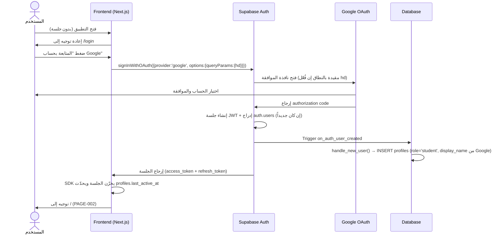

# Auth Flow — تدفق المصادقة والأدوار

Document Version: v1.0

Project: منصة الحديث الشريف التفاعلية

Product: Interactive Hadith Memorization Platform (PWA + Supabase)

Status: Draft

Last Updated: 2026-07-23

Author: System Analyst AI

Source: Derived from SRS v1.0 §F007 + SoT-0 §7

---

## 1. قرار التصميم (Design Decision)

**لا منطق مصادقة مخصص إطلاقاً.** المصادقة الوحيدة هي Google OAuth المُفعَّل مباشرة من Supabase Auth:

* لا نماذج تسجيل/دخول بكلمات مرور.
* لا إدارة استرجاع كلمات مرور.
* لا نظام أكواد دعوة مخصص — تقييد «خاص بالفصل الدراسي» يتحقق بمعامل النطاق الجامعي (`hd`).
* الجلسات تُدار بالكامل عبر Supabase SDK (JWT) وسياسات RLS تعتمد `auth.uid()` مباشرة.

---

## 2. إعداد Google OAuth في Supabase (Setup Checklist)

| # | الخطوة | المكان | ملاحظات |
|---|---|---|---|
| 1 | إنشاء مشروع Google Cloud + تفعيل OAuth Consent Screen | console.cloud.google.com | نوع الشاشة: External (أو Internal إن كانت الجامعة على Workspace — يصبح تقييد النطاق تلقائياً) |
| 2 | إنشاء OAuth Client ID (Web) | Google Cloud → Credentials | Authorized redirect URI: `https://<project>.supabase.co/auth/v1/callback` |
| 3 | لصق Client ID + Secret | Supabase Dashboard → Authentication → Providers → Google | تفعيل المزوّد |
| 4 | ضبط Redirect URLs للتطبيق | Supabase Dashboard → Authentication → URL Configuration | Site URL + `https://<app>.vercel.app/auth/callback` |
| 5 | (اختياري) تقييد النطاق الجامعي | استدعاء `signInWithOAuth` من العميل | `queryParams: { hd: 'student.univ.ac.id' }` — يُمرَّر لنافذة Google |
| 6 | طبقة تحقق إضافية (دفاع بعمق) | مشغّل `handle_new_user` | انظر §4 — رفض النطاق غير المطابق حتى لو تجاوز واجهة Google |

---

## 3. تدفق الجلسة (Session Flow)

### 3.1 أول تسجيل دخول



### 3.2 الدخول بجلسة قائمة

```text
فتح التطبيق → SDK يسترجع الجلسة من التخزين المحلي
  → صالحة: دخول مباشر (تخطي /login) + تحديث last_active_at
  → منتهية: محاولة refresh تلقائية → فشل → /login
```

### 3.3 تسجيل الخروج

```text
زر الخروج (PAGE-006) → supabase.auth.signOut() → مسح الجلسة محلياً → /login
```

---

## 4. نموذج الأدوار (Roles Model)

| الدور | القيمة في DB | كيفية الحصول عليه | الصلاحيات الإضافية |
|---|---|---|---|
| طالب | `student` | **الافتراضي** — يُسند تلقائياً بمشغّل `handle_new_user` لكل حساب جديد | كل ميزات الطلاب (F001–F006) |
| مشرف | `admin` | **تعديل يدوي مباشر** في جدول `profiles` من لوحة Supabase (عملية لمرة واحدة لحساب الأستاذ) | + لوحة التحكم الكاملة (F008) |

**قواعد صارمة:**

1. **لا واجهة إدارة أدوار** — قرار واعٍ لمشروع بحجم فصل واحد (SRS §F007).
2. **منع الترقية الذاتية:** سياسة `profiles_update_own` تمنع أي مستخدم من تعديل عمود `role` الخاص به (انظر `05-rls-policies.sql`).
3. **التحقق من المشرف يتم خادمياً فقط** عبر دالة `is_admin()` (SECURITY DEFINER) — لا يُعتمد على أي علم من العميل.
4. **حماية `/admin/*` مزدوجة:** Middleware في Next.js يفحص الدور + RLS ترفض البيانات لغير المشرف.

---

## 5. تقييد النطاق الجامعي (University Domain Restriction)

### الطبقة 1 — الواجهة (أساسية)

تمرير `hd` عند بدء OAuth يجعل نافذة Google تعرض حسابات النطاق الجامعي فقط:

```typescript
await supabase.auth.signInWithOAuth({
  provider: 'google',
  options: {
    redirectTo: `${location.origin}/auth/callback`,
    queryParams: { hd: 'student.univ.ac.id' },  // نطاق الجامعة — قيمة إعداد لا كود
  },
});
```

### الطبقة 2 — قاعدة البيانات (دفاع بعمق)

حتى لو تجاوز مستخدم واجهة Google بحساب خارجي، يُرفض إنشاء ملفه:

```sql
-- امتداد اختياري لمشغّل handle_new_user (يُفعَّل عند تفعيل تقييد النطاق)
IF NEW.email NOT LIKE '%@student.univ.ac.id' THEN
    RAISE EXCEPTION 'domain_not_allowed';
END IF;
```

> القرار النهائي بتفعيل التقييد من عدمه (واسم النطاق) إعداد تشغيلي يوثَّق عند النشر — انظر `18-open-tasks.md` (T-05).

---

## 6. دورة حياة الملف الشخصي (Profile Lifecycle)

| الحدث | الآلية | النتيجة |
|---|---|---|
| أول دخول | Trigger `on_auth_user_created` → `handle_new_user()` | صف `profiles`: دور `student`، اسم العرض = اسم Google |
| كل نشاط | تحديث دوري من العميل بعد العمليات الرئيسية | `last_active_at` محدّث (يغذي ALG-002) |
| تخصيص الاسم | تحرير من PAGE-006 | `display_name` جديد (الاسم الحقيقي يبقى للمشرف) |
| الموافقة على النشر | نافذة أول رفع (UC-008) | `consent_given_at` موثقة — شرط الرفع |
| حذف الحساب | حذف من `auth.users` | CASCADE يحذف الملف وكل تسجيلاته وتفاعلاته (EC-001) |

---

## 7. الخصوصية والشفافية (Privacy & Transparency)

* **للطلاب:** يظهر `display_name` فقط في كل الواجهات العامة (قائمة القراء، المشغل).
* **للمشرف:** تعرض لوحة التحكم دائماً الاسم الحقيقي والبريد المرتبط بكل حساب (من `auth.users` عبر دالة SECURITY DEFINER خاصة بالمشرف — `admin_list_users`)، بصرف النظر عن اسم العرض — ضماناً للمساءلة (SoT-0 §9-د).
* **الجلسة:** JWT موقّع من Supabase؛ لا تُخزّن أي أسرار في العميل سوى رموز SDK القياسية.

---

## 8. حالات الخطأ (Error States)

| الحالة | الرسالة للمستخدم | السلوك |
|---|---|---|
| إلغاء نافذة Google | — (بلا رسالة، حالة محايدة) | بقاء في `/login` |
| حساب خارج النطاق (hd مفعّل) | «يُرجى استخدام البريد الجامعي للدخول» | رفض + بقاء في `/login` |
| فشل الشبكة أثناء OAuth | «تعذّر الاتصال، تحقق من الإنترنت وحاول مجدداً» | زر إعادة المحاولة |
| انتهاء الجلسة | — | إعادة توجيه صامتة إلى `/login` عند أول طلب مرفوض 401 |

---

## 9. مصفوفة التتبع (Traceability)

| العنصر | المرجع |
|---|---|
| UC-001 | `user-flows/userflow_uc_001.md` |
| sys_uc_001 | `system-logics/sys_uc_001.md` |
| Trigger الإنشاء | `04-database-schema.sql` §7.2 |
| سياسة منع الترقية الذاتية | `05-rls-policies.sql` §1 |
| SRS F007 | `01-srs.md` §3 |
| SoT-0 §7 | المصادقة في وثيقة الرؤية |
| حالات الاختبار | TC-F007-001…004 في `16-test-cases.md` |

---

## 10. سجل المراجعات

| Version | Date | Author | Description |
|---|---|---|---|
| 1.0 | 2026-07-23 | System Analyst AI | الإنشاء الأولي |
