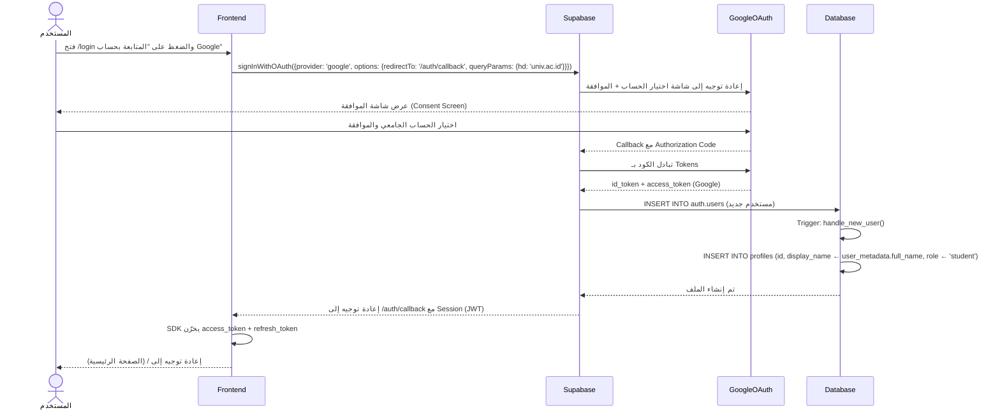
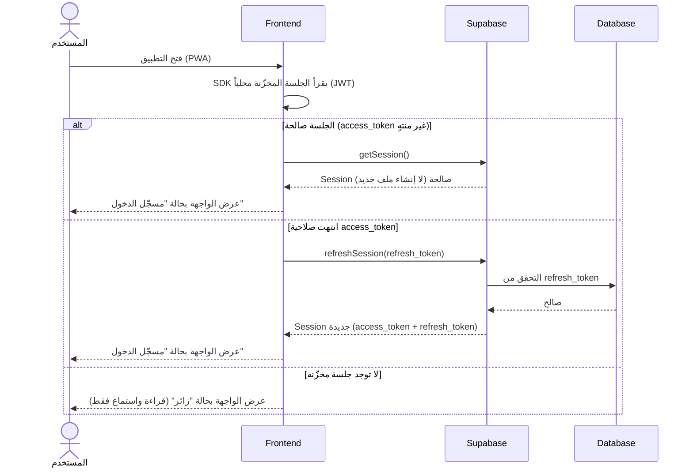
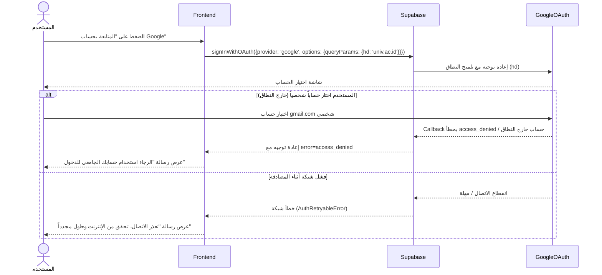

# System Logic: UC-001 تسجيل الدخول عبر Google OAuth

Document Version: v1.0

Use Case ID: UC-001

Use Case Name: تسجيل الدخول عبر Google OAuth

Status: Draft

Last Updated: 2026-07-23

Author: System Analyst AI

---

## 1. Overview

يعرّف هذا المستند منطق النظام لتسجيل الدخول عبر Google OAuth في منصة الحديث التفاعلية. المصادقة تتم حصرياً عبر Supabase Auth (لا كلمات مرور ولا نماذج تسجيل)، مع تقييد اختياري بنطاق الجامعة عبر معامل `hd`، وإنشاء تلقائي لسطر `profiles` عند أول دخول عبر Database Trigger (`handle_new_user`) بالدور الافتراضي `student`. يغطي هذا المستند ثلاثة تدفقات: الدخول الأول (مع إنشاء الملف)، استعادة الجلسة للمستخدم العائد، ورفض الدخول من خارج النطاق الجامعي.

---

## 2. Sequence Diagram

### 2.1 تسجيل الدخول الأول (First Login Flow)



### 2.2 استعادة جلسة مستخدم عائد (Returning Session Flow)



### 2.3 رفض الدخول من خارج النطاق الجامعي (Domain Rejection Flow)



---

## 3. API Contract

### 3.1 بدء مصادقة OAuth — Supabase Auth `signInWithOAuth`

بدء تدفق Google OAuth من الواجهة عبر Supabase JS SDK. لا يوجد Backend مخصص؛ الاستدعاء مباشر من العميل إلى Supabase Auth.

**Parameters:**

| Parameter | Type | Required | Description |
| --- | --- | --- | --- |
| provider | string | Yes | ثابت: `'google'` |
| options.redirectTo | string | Yes | مسار الاسترجاع في التطبيق: `/auth/callback` |
| options.queryParams.hd | string | No | تقييد اختياري بنطاق الجامعة (مثال: `'univ.ac.id'`) — إعداد لا كود |

**Success Response (200 OK — بعد اكتمال الـ Callback):**

```json
{
  "success": true,
  "data": {
    "session": {
      "access_token": "eyJhbGciOiJIUzI1NiIsInR5cCI6IkpXVCJ9...",
      "refresh_token": "v1.MR5xT0k3n...",
      "token_type": "bearer",
      "expires_in": 3600,
      "user": {
        "id": "3f8a2c1e-7b4d-4e2a-9c5f-1a2b3c4d5e6f",
        "email": "ahmad.student@univ.ac.id",
        "user_metadata": {
          "full_name": "أحمد عبد الله",
          "avatar_url": "https://lh3.googleusercontent.com/a/..."
        }
      }
    }
  },
  "message": "تم تسجيل الدخول بنجاح",
  "errors": []
}
```

**Error Response (401 Unauthorized — حساب خارج النطاق):**

```json
{
  "success": false,
  "data": null,
  "message": "الرجاء استخدام حسابك الجامعي للدخول",
  "errors": [
    {
      "code": "access_denied",
      "detail": "حساب Google المختار لا ينتمي إلى نطاق الجامعة المعتمد"
    }
  ]
}
```

**Error Response (500 — فشل شبكة / خطأ مزود):**

```json
{
  "success": false,
  "data": null,
  "message": "تعذر إكمال تسجيل الدخول، حاول مرة أخرى",
  "errors": [
    {
      "code": "auth_provider_error",
      "detail": "فشل الاتصال بمزود المصادقة"
    }
  ]
}
```

---

### 3.2 كائن الجلسة (Session Object Shape)

الشكل المعتمد لكائن الجلسة الذي يديره Supabase SDK وتعتمد عليه سياسات RLS عبر `auth.uid()`.

| Field | Type | Description |
| --- | --- | --- |
| access_token | string (JWT) | رمز الوصول — يحمل `sub` = معرّف المستخدم و`role` |
| refresh_token | string | رمز التجديد — يُدار تلقائياً بواسطة SDK |
| expires_in | integer | مدة صلاحية رمز الوصول بالثواني (3600) |
| user.id | uuid | معرّف المستخدم = `profiles.id` |
| user.email | string | البريد الجامعي |
| user.user_metadata.full_name | string | الاسم الحقيقي من Google — يغذي `profiles.display_name` عند الإنشاء |

---

## 4. Business Rules

| Rule | Description |
| --- | --- |
| BR-001 | تسجيل الدخول حصري عبر Google OAuth من Supabase Auth — لا كلمات مرور ولا نماذج تسجيل (SRS F007) |
| BR-002 | سطر `profiles` يُنشأ تلقائياً عبر Trigger `handle_new_user` على `auth.users` بالدور الافتراضي `student`، و`display_name` من `user_metadata.full_name` |
| BR-003 | تقييد النطاق الجامعي عبر معامل `hd` اختياري (إعداد لا كود)؛ حساب خارج النطاق يُرفض برسالة عربية واضحة |
| BR-004 | دور `admin` يُمنح بتعديل يدوي مباشر في قاعدة البيانات فقط — لا توجد واجهة إدارة أدوار |
| BR-005 | الجلسات تُدار بالكامل عبر Supabase SDK (JWT)، وسياسات RLS تعتمد `auth.uid()` مباشرة |
| BR-006 | الزائر (بلا جلسة) يتصفح ويستمع فقط؛ كل تفاعل (إعجاب/نجمة/تسجيل/بلاغ) يتطلب جلسة صالحة |

---

## 5. Traceability

| User Flow | Requirement | API Endpoints |
| --- | --- | --- |
| userflow_uc_001.md | F007 | Supabase Auth `signInWithOAuth`, Auth Callback `/auth/callback`, Trigger `handle_new_user` |

---

## 6. سجل المراجعات

| Version | Date | Author | Description |
| --- | --- | --- | --- |
| 1.0 | 2026-07-23 | System Analyst AI | الإنشاء الأولي لمنطق UC-001 اشتقاقاً من SRS F007 و06-auth-flow.md |
