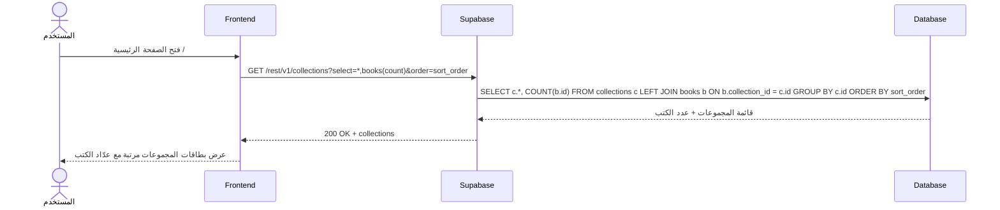
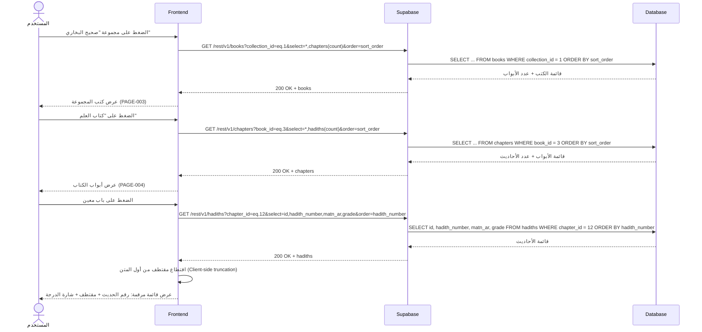
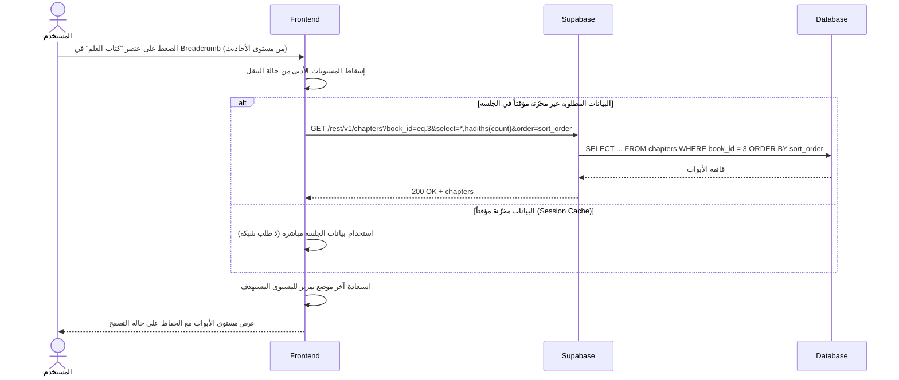

# System Logic: UC-002 تصفح الهرمية

Document Version: v1.0

Use Case ID: UC-002

Use Case Name: تصفح الهرمية

Status: Draft

Last Updated: 2026-07-23

Author: System Analyst AI

---

## 1. Overview

يعرّف هذا المستند منطق النظام للتنقل الهرمي عبر المكتبة الحديثية بالتسلسل الثابت: المجموعة (`collections`) ← الكتاب (`books`) ← الباب (`chapters`) ← الحديث (`hadiths`). كل القراءات محتوى مرجعي للقراءة فقط وتتم عبر PostgREST auto-API مباشرة (لا RPC ولا كتابة)، مرتبة بـ `sort_order` (الأحاديث بـ `hadith_number`)، مع Breadcrumb يتيح القفز لأي مستوى أعلى بنقرة واحدة.

---

## 2. Sequence Diagram

### 2.1 تحميل قائمة المجموعات (Load Collections List)



### 2.2 التنقل المتدرج (Drill-Down Cascade)



### 2.3 القفز عبر Breadcrumb (Breadcrumb Jump)



---

## 3. API Contract

### 3.1 GET /rest/v1/collections

جلب قائمة المجموعات الحديثية مرتبة مع عدد الكتب في كل مجموعة.

**Query Parameters:**

| Parameter | Type | Required | Description |
| --- | --- | --- | --- |
| select | string | Yes | `*,books(count)` — كل الأعمدة + عدد الكتب |
| order | string | Yes | `sort_order` — ترتيب العرض المعتمد |

**Success Response (200 OK):**

```json
{
  "success": true,
  "data": [
    {
      "id": 1,
      "name_ar": "صحيح البخاري",
      "name_id": "Shahih al-Bukhari",
      "slug": "sahih-bukhari",
      "sort_order": 1,
      "books": [
        { "count": 97 }
      ]
    },
    {
      "id": 2,
      "name_ar": "صحيح مسلم",
      "name_id": "Shahih Muslim",
      "slug": "sahih-muslim",
      "sort_order": 2,
      "books": [
        { "count": 56 }
      ]
    }
  ],
  "message": "تم تحميل المجموعات بنجاح",
  "errors": []
}
```

**Error Response (500 Internal Server Error):**

```json
{
  "success": false,
  "data": null,
  "message": "تعذر تحميل المكتبة، حاول مرة أخرى",
  "errors": []
}
```

---

### 3.2 GET /rest/v1/books

جلب كتب مجموعة محددة مع عدد الأبواب في كل كتاب.

**Query Parameters:**

| Parameter | Type | Required | Description |
| --- | --- | --- | --- |
| collection_id | string (filter) | Yes | `eq.<id>` — معرّف المجموعة الأم |
| select | string | Yes | `*,chapters(count)` |
| order | string | Yes | `sort_order` |

**Success Response (200 OK):**

```json
{
  "success": true,
  "data": [
    {
      "id": 1,
      "collection_id": 1,
      "name_ar": "كتاب بدء الوحي",
      "name_id": "Kitab Permulaan Wahyu",
      "sort_order": 1,
      "chapters": [
        { "count": 1 }
      ]
    },
    {
      "id": 3,
      "collection_id": 1,
      "name_ar": "كتاب العلم",
      "name_id": "Kitab Ilmu",
      "sort_order": 3,
      "chapters": [
        { "count": 21 }
      ]
    }
  ],
  "message": "تم تحميل الكتب بنجاح",
  "errors": []
}
```

---

### 3.3 GET /rest/v1/chapters

جلب أبواب كتاب محدد مع عدد الأحاديث في كل باب.

**Query Parameters:**

| Parameter | Type | Required | Description |
| --- | --- | --- | --- |
| book_id | string (filter) | Yes | `eq.<id>` — معرّف الكتاب الأم |
| select | string | Yes | `*,hadiths(count)` |
| order | string | Yes | `sort_order` |

**Success Response (200 OK):**

```json
{
  "success": true,
  "data": [
    {
      "id": 12,
      "book_id": 3,
      "name_ar": "باب فضل العلم",
      "name_id": "Bab Keutamaan Ilmu",
      "sort_order": 1,
      "hadiths": [
        { "count": 8 }
      ]
    }
  ],
  "message": "تم تحميل الأبواب بنجاح",
  "errors": []
}
```

---

### 3.4 GET /rest/v1/hadiths

جلب أحاديث باب محدد كقائمة مرقمة. يُجلب `matn_ar` كاملاً ويُقتطع منه مقتطف (Excerpt) على جهاز العميل (Client-side truncation) لتقليل منطق الخادم.

**Query Parameters:**

| Parameter | Type | Required | Description |
| --- | --- | --- | --- |
| chapter_id | string (filter) | Yes | `eq.<id>` — معرّف الباب الأم |
| select | string | Yes | `id,hadith_number,matn_ar,grade` — حقول القائمة فقط |
| order | string | Yes | `hadith_number` — ترقيم ثابت داخل الباب |

**Success Response (200 OK):**

```json
{
  "success": true,
  "data": [
    {
      "id": "a1b2c3d4-1111-4e2a-9c5f-1a2b3c4d5e6f",
      "hadith_number": 1,
      "matn_ar": "إِنَّمَا الأَعْمَالُ بِالنِّيَّاتِ، وَإِنَّمَا لِكُلِّ امْرِئٍ مَا نَوَى...",
      "grade": "sahih"
    },
    {
      "id": "a1b2c3d4-2222-4e2a-9c5f-1a2b3c4d5e6f",
      "hadith_number": 2,
      "matn_ar": "بُنِيَ الإِسْلَامُ عَلَى خَمْسٍ: شَهَادَةِ أَنْ لَا إِلَهَ إِلَّا اللَّهُ...",
      "grade": "sahih"
    }
  ],
  "message": "تم تحميل الأحاديث بنجاح",
  "errors": []
}
```

**Error Response (500 Internal Server Error):**

```json
{
  "success": false,
  "data": null,
  "message": "تعذر تحميل قائمة الأحاديث، حاول مرة أخرى",
  "errors": []
}
```

---

## 4. Business Rules

| Rule | Description |
| --- | --- |
| BR-001 | التسلسل الهرمي ثابت رباعي المستويات ولا يمكن تجاوز مستوى: لا حديث بلا `chapter_id` ولا باب بلا `book_id` ولا كتاب بلا `collection_id` (SRS F001) |
| BR-002 | كل قراءات الهرمية عبر PostgREST للقراءة فقط لجميع الأدوار بما فيها المشرف — التعديل من مصدر البيانات الخارجي فقط |
| BR-003 | المستويات الفارغة تُعرض مع مؤشر "فارغ" ولا تُخفى (المحتوى يُستورد من مصادر خارجية قد تكتمل لاحقاً) |
| BR-004 | مقتطف الحديث في القائمة يُشتق من `matn_ar` باقتطاع على جهاز العميل — لا حقل excerpt منفصل في قاعدة البيانات |
| BR-005 | ترتيب المستويات بـ `sort_order`، وترتيب الأحاديث بـ `hadith_number`، مع فهارس داعمة (`idx_books_collection`, `idx_chapters_book`, `idx_hadiths_chapter`) |
| BR-006 | الـ Breadcrumb يعكس المسار الكامل ويتيح القفز لأي مستوى أعلى بنقرة واحدة مع الحفاظ على آخر موضع تصفح ضمن الجلسة |

---

## 5. Traceability

| User Flow | Requirement | API Endpoints |
| --- | --- | --- |
| userflow_uc_002.md | F001 | GET /rest/v1/collections, GET /rest/v1/books, GET /rest/v1/chapters, GET /rest/v1/hadiths |

---

## 6. سجل المراجعات

| Version | Date | Author | Description |
| --- | --- | --- | --- |
| 1.0 | 2026-07-23 | System Analyst AI | الإنشاء الأولي لمنطق UC-002 اشتقاقاً من SRS F001 و03-data-model.md |
