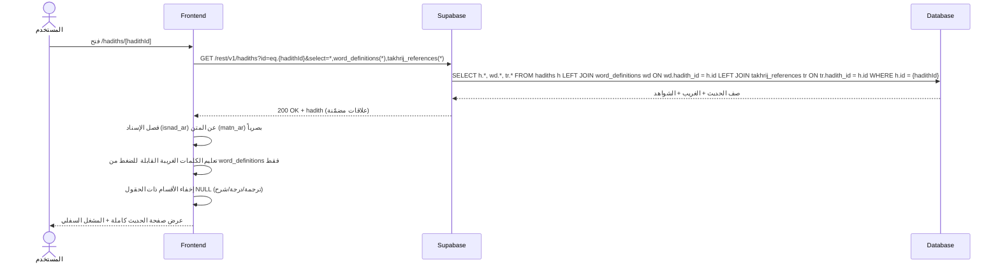
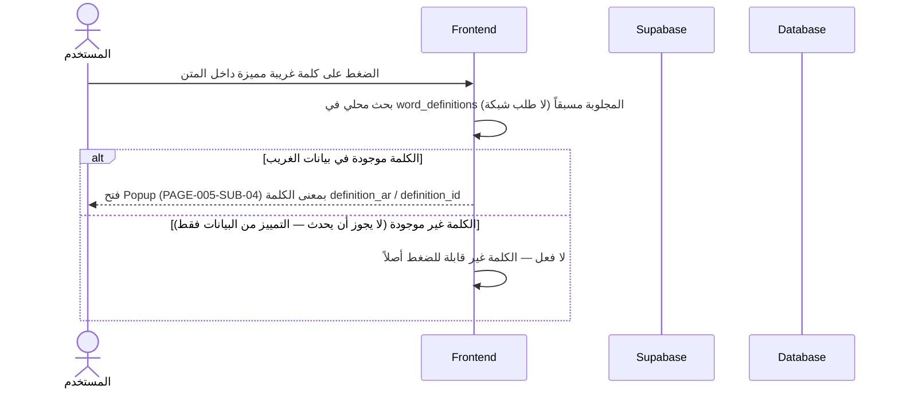
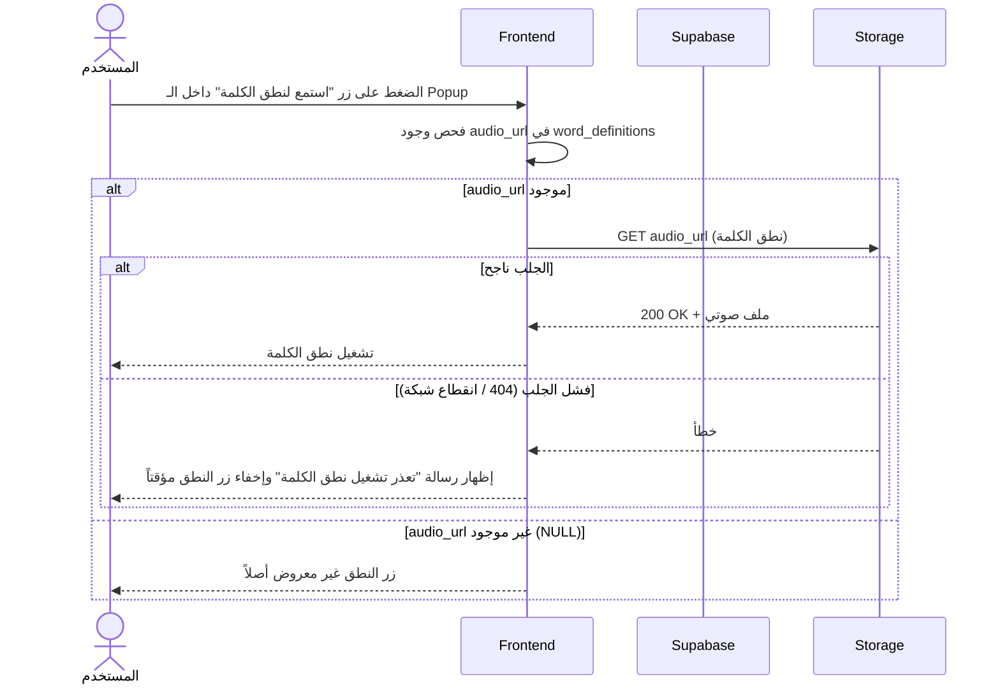

# System Logic: UC-003 عرض تفاصيل الحديث

Document Version: v1.0

Use Case ID: UC-003

Use Case Name: عرض تفاصيل الحديث

Status: Draft

Last Updated: 2026-07-23

Author: System Analyst AI

---

## 1. Overview

يعرّف هذا المستند منطق النظام لصفحة الحديث الشاملة (PAGE-005): جلب الحديث كاملاً مع علاقاته المضمّنة (`word_definitions` للغريب التفاعلي و`takhrij_references` للشواهد) في طلب PostgREST واحد، ثم عرض النص المشكول بفصل بصري بين الإسناد والمتن، والترجمة الإندونيسية المعزولة الاتجاه، والدرجة، والشرح. الغريب التفاعلي يعمل ببحث محلي في البيانات المجلوبة مسبقاً دون أي طلب شبكة إضافي، مع fallback آمن عند فشل جلب صوت نطق الكلمة.

---

## 2. Sequence Diagram

### 2.1 تحميل تفاصيل الحديث (Load Hadith Detail)



### 2.2 نافذة معنى الكلمة الغريبة (Word Popup Flow)



### 2.3 فشل جلب صوت نطق الكلمة (Pronunciation Audio Fallback)



---

## 3. API Contract

### 3.1 GET /rest/v1/hadiths (تفاصيل الحديث مع العلاقات المضمّنة)

جلب صف حديث واحد كاملاً مع غريبه وشواهده في طلب واحد عبر PostgREST resource embedding.

**Query Parameters:**

| Parameter | Type | Required | Description |
| --- | --- | --- | --- |
| id | string (filter) | Yes | `eq.<uuid>` — معرّف الحديث |
| select | string | Yes | `*,word_definitions(*),takhrij_references(*)` — الصف الكامل + العلاقات المضمّنة |

**Success Response (200 OK):**

```json
{
  "success": true,
  "data": [
    {
      "id": "a1b2c3d4-1111-4e2a-9c5f-1a2b3c4d5e6f",
      "chapter_id": 12,
      "hadith_number": 1,
      "isnad_ar": "حَدَّثَنَا عُمَرُ بْنُ الْخَطَّابِ رَضِيَ اللَّهُ عَنْهُ قَالَ: سَمِعْتُ رَسُولَ اللَّهِ ﷺ يَقُولُ:",
      "matn_ar": "إِنَّمَا الأَعْمَالُ بِالنِّيَّاتِ، وَإِنَّمَا لِكُلِّ امْرِئٍ مَا نَوَى، فَمَنْ كَانَتْ هِجْرَتُهُ إِلَى اللَّهِ وَرَسُولِهِ فَهِجْرَتُهُ إِلَى اللَّهِ وَرَسُولِهِ",
      "translation_id": "Sesungguhnya setiap amal itu tergantung pada niatnya...",
      "grade": "sahih",
      "explanation": "هذا الحديث أصل عظيم في باب الأعمال كلها...",
      "length_class": "short",
      "source_api": "hadithenc",
      "source_ref": "bukhari-1",
      "created_at": "2026-01-15T08:00:00Z",
      "updated_at": "2026-01-15T08:00:00Z",
      "word_definitions": [
        {
          "id": 101,
          "hadith_id": "a1b2c3d4-1111-4e2a-9c5f-1a2b3c4d5e6f",
          "word": "النِّيَّاتِ",
          "definition_ar": "جمع نية، وهي القصد بالقلب",
          "definition_id": "Niat, kehendak hati",
          "audio_url": "https://cdn.example.com/words/niyyat.opus"
        },
        {
          "id": 102,
          "hadith_id": "a1b2c3d4-1111-4e2a-9c5f-1a2b3c4d5e6f",
          "word": "هِجْرَتُهُ",
          "definition_ar": "الانتقال وترك دار الشرك إلى دار الإسلام",
          "definition_id": "Hijrah, berpindah",
          "audio_url": null
        }
      ],
      "takhrij_references": [
        {
          "id": 201,
          "hadith_id": "a1b2c3d4-1111-4e2a-9c5f-1a2b3c4d5e6f",
          "source_book": "صحيح البخاري",
          "reference_number": "1",
          "grade": null
        },
        {
          "id": 202,
          "hadith_id": "a1b2c3d4-1111-4e2a-9c5f-1a2b3c4d5e6f",
          "source_book": "صحيح مسلم",
          "reference_number": "1907",
          "grade": null
        }
      ]
    }
  ],
  "message": "تم تحميل الحديث بنجاح",
  "errors": []
}
```

**Error Response (404 Not Found — حديث غير موجود):**

```json
{
  "success": false,
  "data": null,
  "message": "الحديث المطلوب غير موجود",
  "errors": []
}
```

**Error Response (500 Internal Server Error):**

```json
{
  "success": false,
  "data": null,
  "message": "تعذر تحميل بيانات الحديث، حاول مرة أخرى",
  "errors": []
}
```

---

## 4. Business Rules

| Rule | Description |
| --- | --- |
| BR-001 | الكلمات الغريبة القابلة للضغط تُحدَّد حصراً من بيانات `word_definitions` المرتبطة بالحديث — ممنوع أي تمييز نصي آلي خارج هذه البيانات (SRS F002) |
| BR-002 | النافذة المنبثقة للكلمة تفتح ببحث محلي في البيانات المجلوبة مسبقاً — لا طلب شبكة جديد عند الضغط على كلمة |
| BR-003 | الترجمة الإندونيسية (`translation_id`) وأي أرقام لاتينية داخل الفقرات العربية تُغلَّف بعزل اتجاه (bidi isolation) لمنع قلب الترتيب |
| BR-004 | الأقسام ذات الحقول NULL تُخفى كلياً: لا ترجمة بلا `translation_id`، ولا شارة درجة بلا `grade`، ولا قسم شرح بلا `explanation` |
| BR-005 | الفصل البصري ثابت: `isnad_ar` بلون رمادي فرعي، `matn_ar` بلون بارز وخط أوضح؛ وترتيب الأقسام: النص ← الأزرار الإجرائية ← الترجمة ← الشرح ← المشغل السفلي |
| BR-006 | زر نطق الكلمة يظهر فقط عند وجود `audio_url`، وعند فشل الجلب يُعرض fallback عربي دون كسر النافذة |
| BR-007 | زر "⚠️ الإبلاغ عن خطأ في النص" مستقل بجانب أزرار التخريج/الغريب (يغذي UC-011) |

---

## 5. Traceability

| User Flow | Requirement | API Endpoints |
| --- | --- | --- |
| userflow_uc_003.md | F002 | GET /rest/v1/hadiths?id=eq.X&select=*,word_definitions(*),takhrij_references(*) |

---

## 6. سجل المراجعات

| Version | Date | Author | Description |
| --- | --- | --- | --- |
| 1.0 | 2026-07-23 | System Analyst AI | الإنشاء الأولي لمنطق UC-003 اشتقاقاً من SRS F002 و03-data-model.md |
