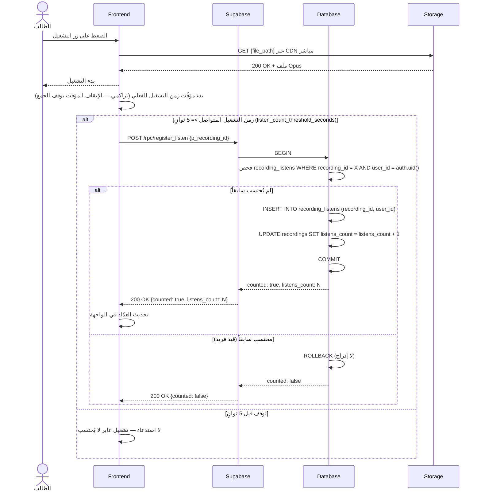
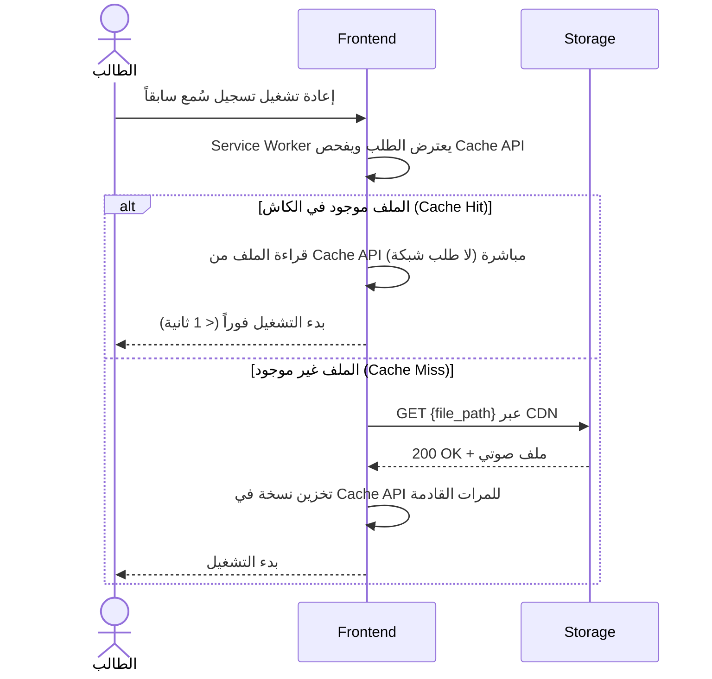

# System Logic: UC-004 الاستماع للتسجيل الافتراضي

Document Version: v1.0

Use Case ID: UC-004

Use Case Name: الاستماع للتسجيل الافتراضي

Status: Draft

Last Updated: 2026-07-23

Author: System Analyst AI

---

## 1. Overview

يعرّف هذا المستند منطق النظام لأهم تفاعل في المنصة: ضغطة واحدة على زر التشغيل الرئيسي تشغّل "الصوت الافتراضي" للحديث المحدَّد بخوارزمية الطبقات الثلاث ALG-001 (⭐ التفضيل الشخصي ← ✅ المعتمد ← الأعلى إعجاباً بحد أدنى ← الأحدث)، مع عداد الاستماع الذكي ALG-003 (5 ثوانٍ متواصلة، مرة واحدة لكل مستخدم لكل تسجيل)، والتشغيل Cache-First عبر Service Worker وCDN مباشر. دالة `get_default_recording` هي أخطر دالة في النظام وتنفيذها الدقيق موثق هنا.

---

## 2. Sequence Diagram

### 2.1 حسم التسجيل الافتراضي (Resolve Default Recording — ALG-001)

```mermaid
sequenceDiagram
    actor الطالب
    participant Frontend
    participant Supabase
    participant Database

    الطالب->>Frontend: فتح صفحة الحديث (أو الضغط على زر التشغيل الرئيسي)
    Frontend->>Supabase: POST /rpc/get_default_recording {p_hadith_id}
    Supabase->>Database: EXECUTE get_default_recording(p_hadith_id, auth.uid())
    Database->>Database: جلب visible ← recordings WHERE hadith_id = X AND is_hidden = false

    alt لا توجد تسجيلات ظاهرة
        Database-->>Supabase: NULL
        Supabase-->>Frontend: 200 OK {recording: null}
        Frontend-->>الطالب: إخفاء زر التشغيل الرئيسي
    else الطبقة 1: نجمة واحدة (favorites ∩ visible)
        Database->>Database: my_favorites ← visible ∩ favorite_recordings WHERE user_id = auth.uid()
        Database-->>Supabase: التسجيل المفضّل (selection_layer = 'favorite')
        Supabase-->>Frontend: 200 OK + recording
        Frontend-->>الطالب: تجهيز المشغل بالتسجيل المفضّل
    else الطبقة 1: عدة نجمات (favorites > 1)
        Database->>Database: default ← الأعلى likes_count بين المفضّلات
        Database-->>Supabase: التسجيل + favorites_count (selection_layer = 'favorite')
        Supabase-->>Frontend: 200 OK + recording + favorites_count
        Frontend-->>الطالب: عرض Segmented Toggle للتنقل بين نجومه
    else الطبقة 2: المعتمد ✅
        Database->>Database: verified ← visible WHERE is_verified ORDER BY verified_at DESC, likes_count DESC
        Database-->>Supabase: أحدث معتمد (selection_layer = 'verified')
        Supabase-->>Frontend: 200 OK + recording
    else الطبقة 3: الأعلى تقييماً المجتمعي
        Database->>Database: best ← argmax(visible, likes_count); min_likes ← app_settings['community_best_min_likes']
        alt best.likes_count >= min_likes
            Database-->>Supabase: best (selection_layer = 'community') + شارة "أفضل تسجيل"
            Supabase-->>Frontend: 200 OK + recording
        else دون الحد الأدنى — السقوط الأخير
            Database-->>Supabase: الأحدث رفعاً (selection_layer = 'latest')
            Supabase-->>Frontend: 200 OK + recording
        end
    end
```

### 2.2 التشغيل وعداد الاستماع الذكي (Playback + Smart Listen Counter — ALG-003)



### 2.3 التشغيل Cache-First (Service Worker Cache Hit)



---

## 3. API Contract

### 3.1 POST /rpc/get_default_recording

حسم التسجيل الافتراضي لحديث وفق ALG-001. التسجيلات المخفية (`is_hidden = true`) مستبعدة دائماً — حتى لو كانت مفضّلة أو معتمدة سابقاً.

**Request Body Parameters:**

| Parameter | Type | Required | Description |
| --- | --- | --- | --- |
| p_hadith_id | uuid | Yes | معرّف الحديث المطلوب |

**Success Response (200 OK — توجد تسجيلات):**

```json
{
  "success": true,
  "data": {
    "recording": {
      "id": "r1c2d3e4-aaaa-4e2a-9c5f-1a2b3c4d5e6f",
      "hadith_id": "a1b2c3d4-1111-4e2a-9c5f-1a2b3c4d5e6f",
      "user_id": "u1s2e3r4-bbbb-4e2a-9c5f-1a2b3c4d5e6f",
      "file_path": "audio/hadith_a1b2c3d4/user_u1s2e3r4.opus",
      "duration_seconds": 18,
      "likes_count": 25,
      "listens_count": 40,
      "is_verified": false,
      "verified_at": null,
      "created_at": "2026-07-10T09:30:00Z"
    },
    "selection_layer": "favorite",
    "favorites_count": 2
  },
  "message": "تم تحديد التسجيل الافتراضي",
  "errors": []
}
```

| Field | Type | Description |
| --- | --- | --- |
| selection_layer | enum | `'favorite'` (الطبقة 1) \| `'verified'` (الطبقة 2) \| `'community'` (الطبقة 3) \| `'latest'` (السقوط الأخير) |
| favorites_count | integer \| null | عدد نجمات المستخدم الظاهرة لهذا الحديث — يُرجَع فقط عند `selection_layer = 'favorite'` و`favorites_count > 1` لتفعيل Segmented Toggle |

**Success Response (200 OK — لا توجد تسجيلات ظاهرة):**

```json
{
  "success": true,
  "data": {
    "recording": null,
    "selection_layer": null,
    "favorites_count": null
  },
  "message": "لا توجد تسجيلات صوتية لهذا الحديث بعد",
  "errors": []
}
```

**Error Response (500 Internal Server Error):**

```json
{
  "success": false,
  "data": null,
  "message": "تعذر تحديد التسجيل الافتراضي، حاول مرة أخرى",
  "errors": []
}
```

#### SQL Implementation Sketch — `get_default_recording`

> أخطر دالة في النظام — تطابق ALG-001 حرفياً. المخفي مستبعد إطلاقاً، والزائر يبدأ من الطبقة 2.

```sql
CREATE OR REPLACE FUNCTION get_default_recording(p_hadith_id uuid)
RETURNS jsonb
LANGUAGE plpgsql
SECURITY DEFINER
AS $$
DECLARE
    v_user_id        uuid := auth.uid();          -- NULL للزائر
    v_rec            recordings%ROWTYPE;
    v_fav_count      int;
    v_min_likes      int;
BEGIN
    -- ─── الطبقة 1: ⭐ التفضيل الشخصي (الموثّقون فقط) ───
    IF v_user_id IS NOT NULL THEN
        SELECT COUNT(*) INTO v_fav_count
        FROM recordings r
        JOIN favorite_recordings f ON f.recording_id = r.id
        WHERE r.hadith_id = p_hadith_id
          AND r.is_hidden = false                  -- المخفي مستبعد دائماً
          AND f.user_id   = v_user_id;

        IF v_fav_count = 1 THEN
            SELECT r.* INTO v_rec
            FROM recordings r
            JOIN favorite_recordings f ON f.recording_id = r.id
            WHERE r.hadith_id = p_hadith_id AND r.is_hidden = false
              AND f.user_id = v_user_id
            LIMIT 1;
            RETURN jsonb_build_object(
                'recording', to_jsonb(v_rec),
                'selection_layer', 'favorite',
                'favorites_count', v_fav_count);
        END IF;

        IF v_fav_count > 1 THEN
            SELECT r.* INTO v_rec
            FROM recordings r
            JOIN favorite_recordings f ON f.recording_id = r.id
            WHERE r.hadith_id = p_hadith_id AND r.is_hidden = false
              AND f.user_id = v_user_id
            ORDER BY r.likes_count DESC            -- الأعلى لايكات بين نجومه
            LIMIT 1;
            RETURN jsonb_build_object(
                'recording', to_jsonb(v_rec),
                'selection_layer', 'favorite',
                'favorites_count', v_fav_count);   -- يفعّل Segmented Toggle
        END IF;
    END IF;

    -- ─── الطبقة 2: ✅ المعتمد ───
    SELECT r.* INTO v_rec
    FROM recordings r
    WHERE r.hadith_id = p_hadith_id
      AND r.is_hidden = false
      AND r.is_verified = true
    ORDER BY r.verified_at DESC, r.likes_count DESC  -- الأحدث اعتماداً ثم الأعلى لايكات
    LIMIT 1;
    IF FOUND THEN
        RETURN jsonb_build_object(
            'recording', to_jsonb(v_rec),
            'selection_layer', 'verified',
            'favorites_count', NULL);
    END IF;

    -- ─── الطبقة 3: الأعلى تقييماً المجتمعي ───
    SELECT (value)::int INTO v_min_likes
    FROM app_settings WHERE key = 'community_best_min_likes';   -- الافتراضي 3

    SELECT r.* INTO v_rec
    FROM recordings r
    WHERE r.hadith_id = p_hadith_id AND r.is_hidden = false
    ORDER BY r.likes_count DESC
    LIMIT 1;

    IF FOUND AND v_rec.likes_count >= v_min_likes THEN
        RETURN jsonb_build_object(
            'recording', to_jsonb(v_rec),
            'selection_layer', 'community',        -- يحمل شارة "أفضل تسجيل"
            'favorites_count', NULL);
    END IF;

    -- ─── السقوط الأخير: الأحدث ───
    SELECT r.* INTO v_rec
    FROM recordings r
    WHERE r.hadith_id = p_hadith_id AND r.is_hidden = false
    ORDER BY r.created_at DESC
    LIMIT 1;

    IF FOUND THEN
        RETURN jsonb_build_object(
            'recording', to_jsonb(v_rec),
            'selection_layer', 'latest',
            'favorites_count', NULL);
    END IF;

    -- لا توجد تسجيلات ظاهرة إطلاقاً
    RETURN jsonb_build_object(
        'recording', NULL,
        'selection_layer', NULL,
        'favorites_count', NULL);
END;
$$;
```

---

### 3.2 POST /rpc/register_listen

احتساب استماع حقيقي بعد بلوغ عتبة 5 ثوانٍ متواصلة على العميل. الاحتساب مرة واحدة لكل (مستخدم، تسجيل) مدى الحياة — القيد الفريد `UNIQUE(recording_id, user_id)` هو الحارس النهائي.

**Request Body Parameters:**

| Parameter | Type | Required | Description |
| --- | --- | --- | --- |
| p_recording_id | uuid | Yes | معرّف التسجيل المستمع إليه |

**Success Response (200 OK — احتُسب الاستماع):**

```json
{
  "success": true,
  "data": {
    "counted": true,
    "listens_count": 41
  },
  "message": "تم احتساب الاستماع",
  "errors": []
}
```

**Success Response (200 OK — محتسب سابقاً):**

```json
{
  "success": true,
  "data": {
    "counted": false,
    "listens_count": 40
  },
  "message": "هذا الاستماع محتسب سابقاً",
  "errors": []
}
```

**Error Response (401 Unauthorized — زائر):**

```json
{
  "success": false,
  "data": null,
  "message": "سجّل الدخول ليُحتسب استماعك",
  "errors": []
}
```

**Error Response (404 Not Found — تسجيل غير موجود):**

```json
{
  "success": false,
  "data": null,
  "message": "التسجيل المطلوب غير موجود",
  "errors": []
}
```

---

## 4. Business Rules

| Rule | Description |
| --- | --- |
| BR-001 | التسجيل المخفي (`is_hidden = true`) لا يدخل حساب ALG-001 إطلاقاً — حتى لو كان مفضّلاً أو معتمداً سابقاً |
| BR-002 | الزائر يبدأ من الطبقة 2 مباشرة (لا طبقة تفضيل شخصي له) ويستمع دون احتساب (ALG-003 / EC-014) |
| BR-003 | الشعبية ليست الحَكَم الوحيد: الدقة العلمية (الاعتماد) والتفضيل الشخصي يسبقانها دائماً (ALG-001) |
| BR-004 | شارة "أفضل تسجيل" تُفعَّل فقط عند بلوغ `community_best_min_likes` من `app_settings` (الافتراضي 3)؛ دونها يُشغَّل الأحدث ولا شارة مجتمعية |
| BR-005 | عتبة الاستماع 5 ثوانٍ **متواصلة** من التشغيل الفعلي (`listen_count_threshold_seconds`)؛ المؤقّت يجمع الزمن التراكمي لا زمن الساعة |
| BR-006 | احتساب واحد لكل (مستخدم، تسجيل) مدى الحياة — القيد الفريد في `recording_listens` هو الحارس النهائي على الخادم |
| BR-007 | التشغيل عبر رابط CDN مباشر (لا روابط موقّعة) مع Cache-First عبر Service Worker لتقليل Bandwidth (07-storage-architecture.md) |
| BR-008 | عند تعدد نجمات المستخدم: الافتراضي هو الأعلى لايكات بينها + `favorites_count` يفعّل Segmented Toggle للتنقل اليدوي |

---

## 5. Traceability

| User Flow | Requirement | API Endpoints |
| --- | --- | --- |
| userflow_uc_004.md | F003 | POST /rpc/get_default_recording, POST /rpc/register_listen, GET Storage CDN ({file_path}) |

---

## 6. سجل المراجعات

| Version | Date | Author | Description |
| --- | --- | --- | --- |
| 1.0 | 2026-07-23 | System Analyst AI | الإنشاء الأولي لمنطق UC-004 اشتقاقاً من SRS F003 وALG-001/ALG-003 |
