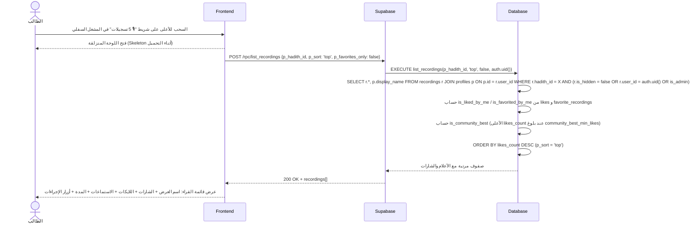
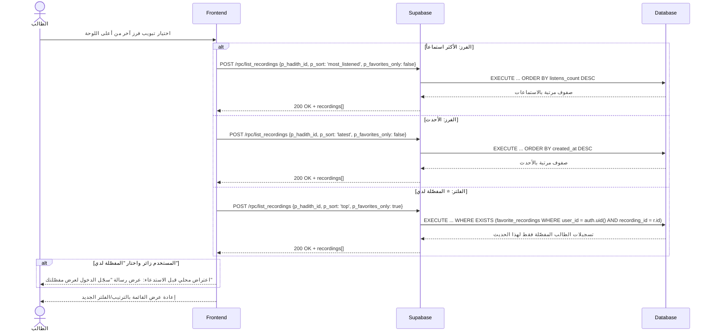

# System Logic: UC-005 استعراض وفلترة قائمة التسجيلات

Document Version: v1.0

Use Case ID: UC-005

Use Case Name: استعراض وفلترة قائمة التسجيلات

Status: Draft

Last Updated: 2026-07-23

Author: System Analyst AI

---

## 1. Overview

يعرّف هذا المستند منطق النظام للوحة المنزلقة (Bottom Sheet — PAGE-005-SUB-01) التي تعرض كل قرّاء الحديث مع خيارات الفرز الأربعة: الأعلى تقييماً (افتراضي)، الأكثر استماعاً، الأحدث، و⭐ المفضّلة لدي. الجلب عبر RPC واحد `list_recordings` يعيد الصفوف مرتبة ومزوّدة باسم العرض، والشارات (✅ المعتمد / أفضل تسجيل المجتمعي)، وأعلام تفاعل المستخدم الحالي (`is_liked_by_me`, `is_favorited_by_me`) لرسم حالة الأزرار فوراً دون طلبات إضافية.

---

## 2. Sequence Diagram

### 2.1 فتح اللوحة المنزلقة (Open Bottom Sheet — Default Sort)



### 2.2 تبديل الفرز والفلترة (Switch Sort / Favorites Filter)



---

## 3. API Contract

### 3.1 POST /rpc/list_recordings

جلب قائمة تسجيلات حديث مرتبة ومفلترة، مع أعلام تفاعل المستخدم الحالي والشارات. التسجيلات المخفية مستبعدة إلا للمشرف أو المالك.

**Request Body Parameters:**

| Parameter | Type | Required | Description |
| --- | --- | --- | --- |
| p_hadith_id | uuid | Yes | معرّف الحديث |
| p_sort | enum | No | `'top'` (افتراضي — `likes_count DESC`) \| `'most_listened'` (`listens_count DESC`) \| `'latest'` (`created_at DESC`) |
| p_favorites_only | boolean | No | الافتراضي `false`؛ عند `true` يعيد تسجيلات المستخدم المفضّلة فقط (يتطلب تسجيل دخول) |

**Success Response (200 OK):**

```json
{
  "success": true,
  "data": {
    "recordings": [
      {
        "id": "r1c2d3e4-aaaa-4e2a-9c5f-1a2b3c4d5e6f",
        "user_id": "u1s2e3r4-bbbb-4e2a-9c5f-1a2b3c4d5e6f",
        "display_name": "أحمد عبد الله",
        "duration_seconds": 18,
        "likes_count": 25,
        "listens_count": 40,
        "is_verified": true,
        "verified_at": "2026-07-20T11:00:00Z",
        "created_at": "2026-07-10T09:30:00Z",
        "is_liked_by_me": true,
        "is_favorited_by_me": true,
        "is_community_best": true
      },
      {
        "id": "r1c2d3e4-cccc-4e2a-9c5f-1a2b3c4d5e6f",
        "user_id": "u1s2e3r4-dddd-4e2a-9c5f-1a2b3c4d5e6f",
        "display_name": "محمد الفاتح",
        "duration_seconds": 22,
        "likes_count": 10,
        "listens_count": 15,
        "is_verified": false,
        "verified_at": null,
        "created_at": "2026-07-18T14:00:00Z",
        "is_liked_by_me": false,
        "is_favorited_by_me": false,
        "is_community_best": false
      }
    ]
  },
  "message": "تم تحميل قائمة التسجيلات",
  "errors": []
}
```

**Output Row Shape:**

| Field | Type | Description |
| --- | --- | --- |
| id | uuid | معرّف التسجيل |
| user_id | uuid | صاحب التسجيل |
| display_name | text | اسم العرض من `profiles` |
| duration_seconds | integer | المدة بالثواني |
| likes_count | integer | عدّاد اللايكات |
| listens_count | integer | عدّاد الاستماعات |
| is_verified | boolean | شارة ✅ المعتمد |
| verified_at | timestamptz \| null | وقت الاعتماد |
| created_at | timestamptz | وقت الرفع |
| is_liked_by_me | boolean | هل أعجب المستخدم الحالي بهذا التسجيل (false للزائر) |
| is_favorited_by_me | boolean | هل فضّله المستخدم الحالي بالنجمة (false للزائر) |
| is_community_best | boolean | شارة "أفضل تسجيل" — فقط للأعلى لايكات عند بلوغ `community_best_min_likes` |

**Error Response (401 Unauthorized — فلتر المفضلة كزائر):**

```json
{
  "success": false,
  "data": null,
  "message": "سجّل الدخول لعرض مفضّلتك",
  "errors": []
}
```

**Error Response (400 Bad Request — قيمة فرز غير صالحة):**

```json
{
  "success": false,
  "data": null,
  "message": "خيار الفرز غير صالح",
  "errors": []
}
```

---

## 4. Business Rules

| Rule | Description |
| --- | --- |
| BR-001 | التسجيلات المخفية (`is_hidden = true`) مستبعدة من القائمة العامة إلا للمشرف أو مالك التسجيل (SRS F003) |
| BR-002 | تعريفات الفرز الثابتة: `top` = `likes_count DESC`، `most_listened` = `listens_count DESC`، `latest` = `created_at DESC` |
| BR-003 | شارة "أفضل تسجيل" (`is_community_best`) تُفعَّل فقط عند بلوغ `community_best_min_likes` من `app_settings` وتعتمد `likes_count` حصرياً — لا تقرأ النجوم إطلاقاً (ALG-006) |
| BR-004 | فلتر "⭐ المفضّلة لدي" (`p_favorites_only = true`) يتطلب تسجيل الدخول؛ الزائر يُرفض بـ 401 برسالة عربية |
| BR-005 | الأعلام `is_liked_by_me` / `is_favorited_by_me` تُحسب من `likes` و`favorite_recordings` للمستخدم الحالي فقط — تفضيلات الآخرين غير مرئية (RLS على favorite_recordings) |
| BR-006 | كل صف يعرض: اسم العرض، الشارات (✅/⭐/أفضل تسجيل)، اللايكات، الاستماعات، المدة، وأزرار الإجراءات (تشغيل/إعجاب/نجمة/إبلاغ/حذف للمالك) |

---

## 5. Traceability

| User Flow | Requirement | API Endpoints |
| --- | --- | --- |
| userflow_uc_005.md | F003, F005 | POST /rpc/list_recordings |

---

## 6. سجل المراجعات

| Version | Date | Author | Description |
| --- | --- | --- | --- |
| 1.0 | 2026-07-23 | System Analyst AI | الإنشاء الأولي لمنطق UC-005 اشتقاقاً من SRS F003/F005 وALG-006 |
