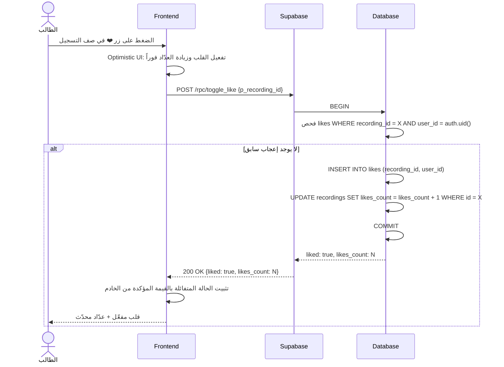
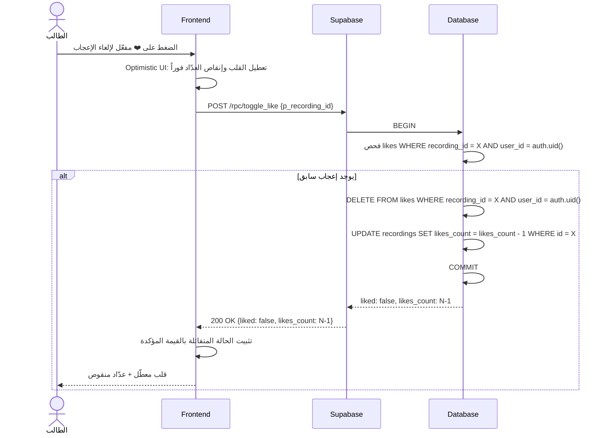
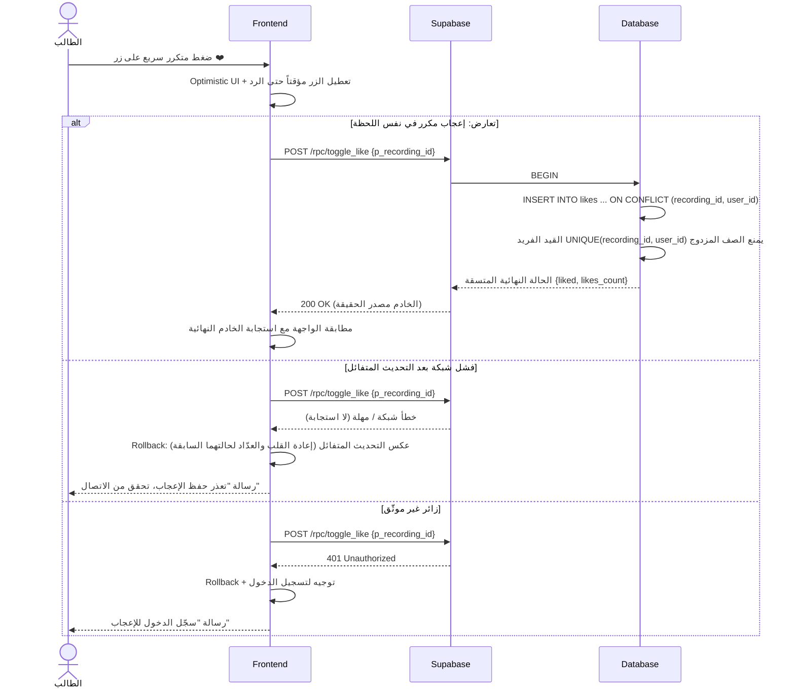

# System Logic: UC-006 الإعجاب بتسجيل صوتي

Document Version: v1.0

Use Case ID: UC-006

Use Case Name: الإعجاب بتسجيل صوتي

Status: Draft

Last Updated: 2026-07-23

Author: System Analyst AI

---

## 1. Overview

يعرّف هذا المستند منطق النظام للإعجاب العام (❤️) بتسجيل صوتي — قناة التقييم المجتمعي التي تغذي فرز "الأعلى تقييماً" وشارة "أفضل تسجيل" والطبقة 3 في ALG-001. العملية ذرّية عبر RPC `toggle_like` داخل معاملة: إدراج/حذف صف في `likes` مع تحديث `recordings.likes_count` بالتزامن، والقيد الفريد `UNIQUE(recording_id, user_id)` هو الحارس ضد الإعجاب المزدوج. الواجهة تطبق Optimistic UI مع تراجع كامل عند الفشل. الإعجاب منفصل تماماً عن النجمة (ALG-006).

---

## 2. Sequence Diagram

### 2.1 الإعجاب (Like — Atomic Transaction)



### 2.2 إلغاء الإعجاب (Unlike)



### 2.3 حارس التعارض والتراجع (Conflict Guard + Optimistic Rollback)



---

## 3. API Contract

### 3.1 POST /rpc/toggle_like

تبديل الإعجاب بتسجيل: يُعجب إن لم يكن معجباً، ويلغي إن كان معجباً. العملية ذرّية (إدراج/حذف + تحديث العدّاد في معاملة واحدة).

**Request Body Parameters:**

| Parameter | Type | Required | Description |
| --- | --- | --- | --- |
| p_recording_id | uuid | Yes | معرّف التسجيل |

**Success Response (200 OK — بعد الإعجاب):**

```json
{
  "success": true,
  "data": {
    "liked": true,
    "likes_count": 26
  },
  "message": "تم تسجيل إعجابك",
  "errors": []
}
```

**Success Response (200 OK — بعد إلغاء الإعجاب):**

```json
{
  "success": true,
  "data": {
    "liked": false,
    "likes_count": 25
  },
  "message": "تم إلغاء الإعجاب",
  "errors": []
}
```

**Error Response (401 Unauthorized — زائر):**

```json
{
  "success": false,
  "data": null,
  "message": "سجّل الدخول للإعجاب",
  "errors": []
}
```

**Error Response (404 Not Found — تسجيل غير موجود أو مخفي):**

```json
{
  "success": false,
  "data": null,
  "message": "التسجيل المطلوب غير موجود",
  "errors": []
}
```

---

## 4. Business Rules

| Rule | Description |
| --- | --- |
| BR-001 | إعجاب واحد فقط لكل زوج (تسجيل، مستخدم) — القيد الفريد `UNIQUE(recording_id, user_id)` في `likes` هو الحارس النهائي ضد الإعجاب المزدوج |
| BR-002 | العدّاد `recordings.likes_count` يُعدَّل حصرياً عبر RPC `toggle_like` داخل معاملة ذرّية — ممنوع التعديل المباشر عبر RLS (03-data-model §5.2) |
| BR-003 | نفس الدالة تبدّل الحالتين: لا إعجاب → INSERT + زيادة؛ يوجد إعجاب → DELETE + إنقاص؛ و`likes_count` مقيد بـ CHECK (≥ 0) |
| BR-004 | الإعجاب يتطلب تسجيل الدخول؛ الزائر يرى العدّادات فقط دون تفاعل (401 برسالة عربية) |
| BR-005 | الإعجاب منفصل تماماً عن النجمة (ALG-006): لا Trigger ولا منطق يربط `likes` بـ `favorite_recordings`؛ الإعجاب هو وحده الذي يغذي الفرز المجتمعي والشارات |
| BR-006 | الواجهة تطبق Optimistic UI مع Rollback كامل عند فشل الشبكة أو رفض الخادم — الاستجابة النهائية من الخادم هي مصدر الحقيقة |

---

## 5. Traceability

| User Flow | Requirement | API Endpoints |
| --- | --- | --- |
| userflow_uc_006.md | F005 | POST /rpc/toggle_like |

---

## 6. سجل المراجعات

| Version | Date | Author | Description |
| --- | --- | --- | --- |
| 1.0 | 2026-07-23 | System Analyst AI | الإنشاء الأولي لمنطق UC-006 اشتقاقاً من SRS F005 وALG-006 |
