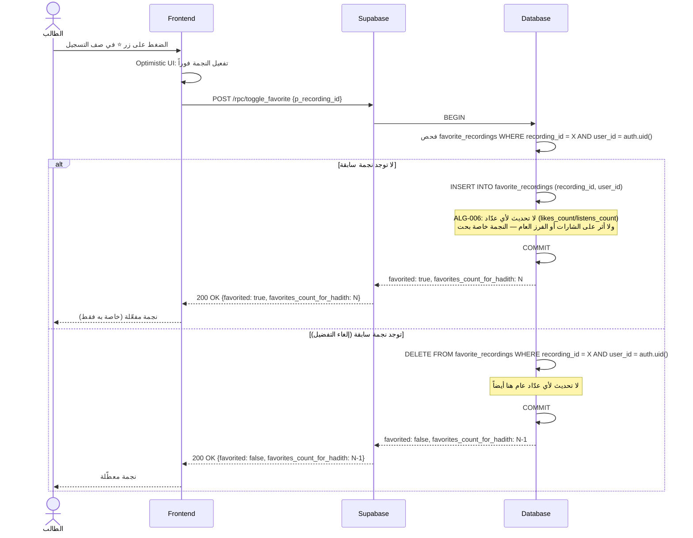
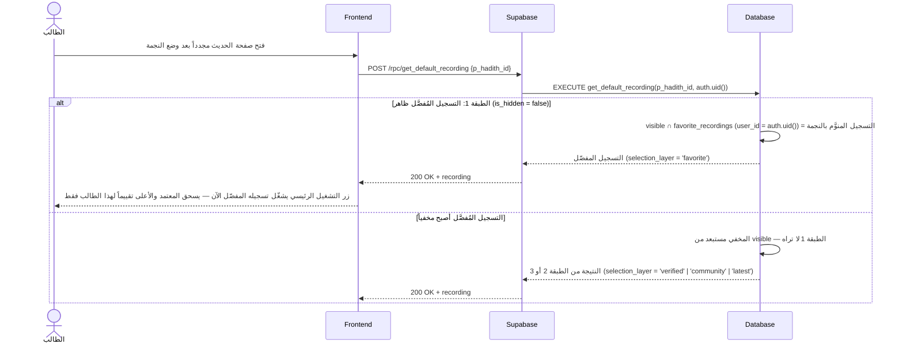
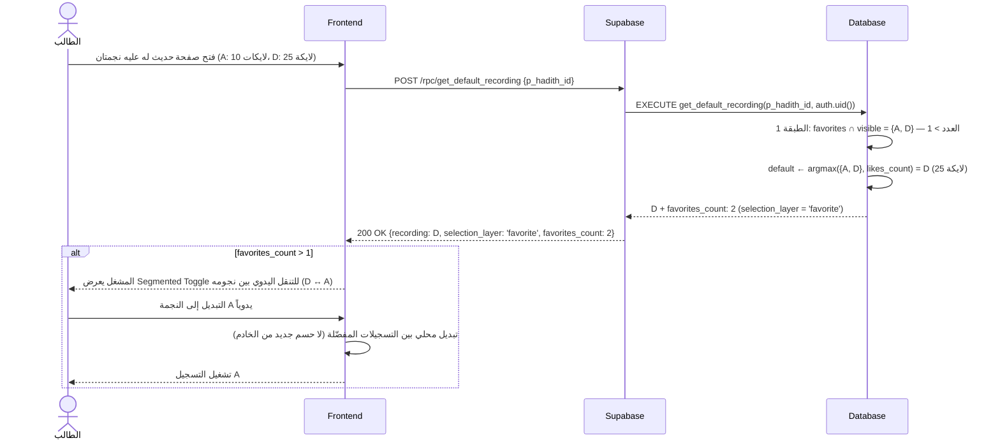

# System Logic: UC-007 تفضيل تسجيل بالنجمة

Document Version: v1.0

Use Case ID: UC-007

Use Case Name: تفضيل تسجيل بالنجمة

Status: Draft

Last Updated: 2026-07-23

Author: System Analyst AI

---

## 1. Overview

يعرّف هذا المستند منطق النظام لنجمة التفضيل الشخصي (⭐) — قناة خاصة بحت تحدد مرجع الطالب الافتراضي لكل حديث دون أي أثر على التقييم العام (ALG-006). فعل التفضيل عبر RPC `toggle_favorite` يدرج/يحذف صفاً في `favorite_recordings` فقط: **لا تحديث لأي عدّاد، ولا أثر على الشارات أو الفرز المجتمعي**. أثر النجمة الوحيد يظهر في الطبقة 1 من ALG-001 عند الحسم التالي للتسجيل الافتراضي، وفي فلتر "المفضّلة لدي" (UC-005). يُسمح بأي عدد من النجوم لنفس الحديث.

---

## 2. Sequence Diagram

### 2.1 وضع النجمة (Star — No Counter, No Public Impact)



### 2.2 أثر النجمة على الحسم التالي للافتراضي (Effect on Next Default Resolution)



### 2.3 تعدد النجمات لنفس الحديث (Multiple Stars + Segmented Toggle)



---

## 3. API Contract

### 3.1 POST /rpc/toggle_favorite

تبديل نجمة التفضيل الشخصي على تسجيل: يضيف النجمة إن لم تكن، ويزيلها إن كانت. لا يمس أي عدّاد عام — ALG-006.

**Request Body Parameters:**

| Parameter | Type | Required | Description |
| --- | --- | --- | --- |
| p_recording_id | uuid | Yes | معرّف التسجيل المُراد تفضيله |

**Success Response (200 OK — بعد وضع النجمة):**

```json
{
  "success": true,
  "data": {
    "favorited": true,
    "favorites_count_for_hadith": 2
  },
  "message": "أُضيف التسجيل إلى مفضّلتك",
  "errors": []
}
```

**Success Response (200 OK — بعد إزالة النجمة):**

```json
{
  "success": true,
  "data": {
    "favorited": false,
    "favorites_count_for_hadith": 1
  },
  "message": "أُزيل التسجيل من مفضّلتك",
  "errors": []
}
```

| Field | Type | Description |
| --- | --- | --- |
| favorited | boolean | الحالة النهائية: هل أصبح التسجيل مفضّلاً لدى المستخدم |
| favorites_count_for_hadith | integer | عدد نجمات المستخدم الحالي على تسجيلات هذا الحديث الظاهرة — يغذي قرار إظهار Segmented Toggle |

**Error Response (401 Unauthorized — زائر):**

```json
{
  "success": false,
  "data": null,
  "message": "سجّل الدخول لتفضيل التسجيلات",
  "errors": []
}
```

**Error Response (404 Not Found — تسجيل غير موجود أو مخفي):**

```json
{
  "success": false,
  "data": null,
  "message": "التسجيل المطلوب غير موجود",
  "errors": []
}
```

---

## 4. Business Rules

| Rule | Description |
| --- | --- |
| BR-001 | النجمة قناة خاصة بحت (ALG-006): `toggle_favorite` يدرج/يحذف في `favorite_recordings` فقط — لا تحديث لأي عدّاد (`likes_count`/`listens_count`) ولا أثر على شارة "أفضل تسجيل" أو الفرز العام |
| BR-002 | نجمة واحدة لكل زوج (تسجيل، مستخدم) — القيد الفريد `UNIQUE(recording_id, user_id)`؛ ولا حد أقصى لعدد النجوم لنفس الحديث |
| BR-003 | RLS على `favorite_recordings`: كل مستخدم يرى نجومه فقط (`auth.uid() = user_id`) — لا قراءة عامة لنجوم الآخرين |
| BR-004 | الأثر الوحيد للنجمة: الطبقة 1 في ALG-001 — التسجيل المفضّل الظاهر يُشغَّل افتراضياً لهذا الطالب فقط ويسحق المعتمد والأعلى تقييماً؛ وعند تعدد النجمات يُختار الأعلى لايكات بينها مع Segmented Toggle |
| BR-005 | التسجيل المفضّل الذي يصبح مخفياً (`is_hidden = true`) يخرج من الطبقة 1 فوراً ولا يُشغَّل افتراضياً |
| BR-006 | يُسمح بالجمع بكل الأشكال: إعجاب بدون نجمة، نجمة بدون إعجاب، كلاهما، أو لا شيء — كلها حالات صالحة (ALG-006) |
| BR-007 | التفضيل يتطلب تسجيل الدخول؛ الزائر يُرفض بـ 401 برسالة عربية |

---

## 5. Traceability

| User Flow | Requirement | API Endpoints |
| --- | --- | --- |
| userflow_uc_007.md | F005 | POST /rpc/toggle_favorite, POST /rpc/get_default_recording (أثر الطبقة 1) |

---

## 6. سجل المراجعات

| Version | Date | Author | Description |
| --- | --- | --- | --- |
| 1.0 | 2026-07-23 | System Analyst AI | الإنشاء الأولي لمنطق UC-007 اشتقاقاً من SRS F005 وALG-001/ALG-006 |
