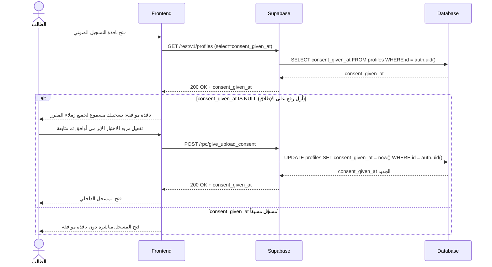
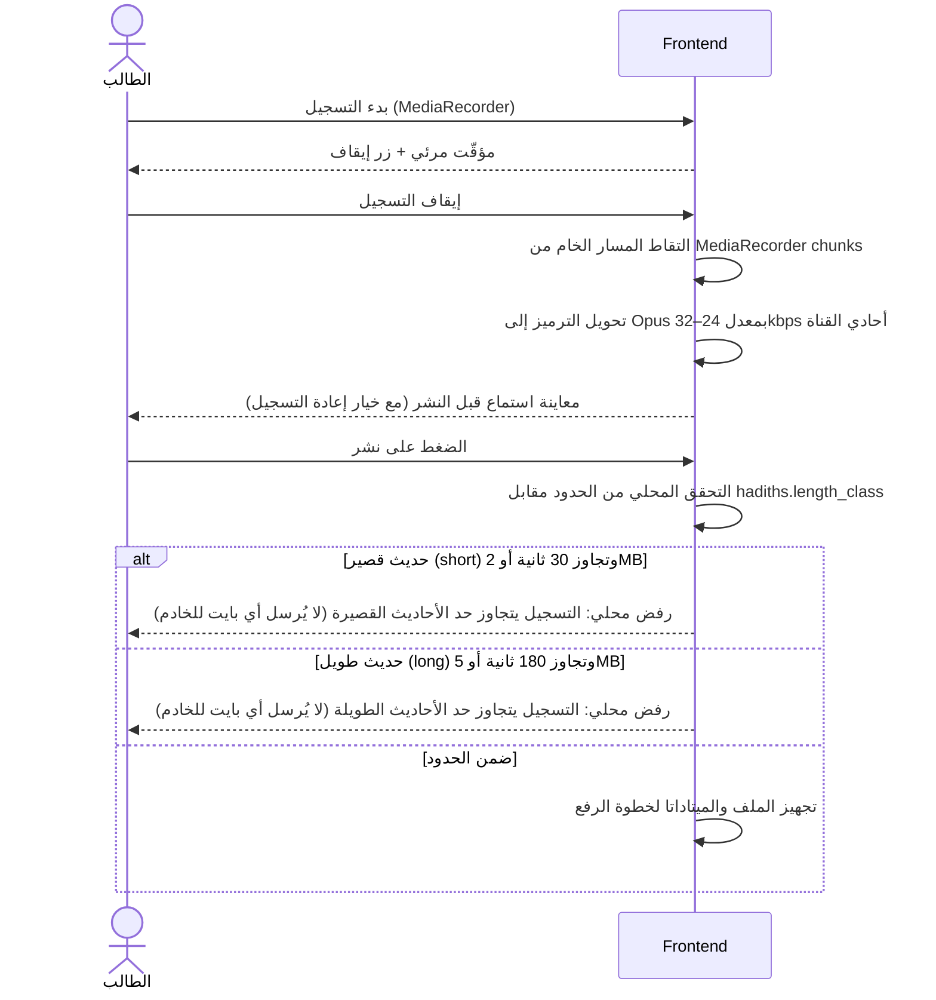
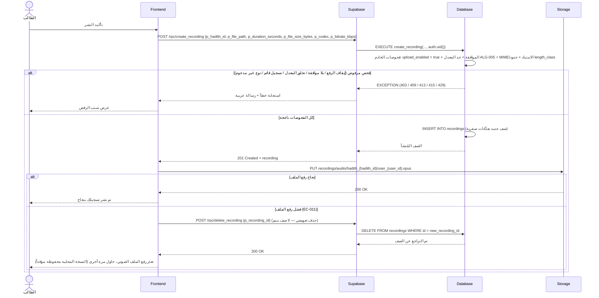
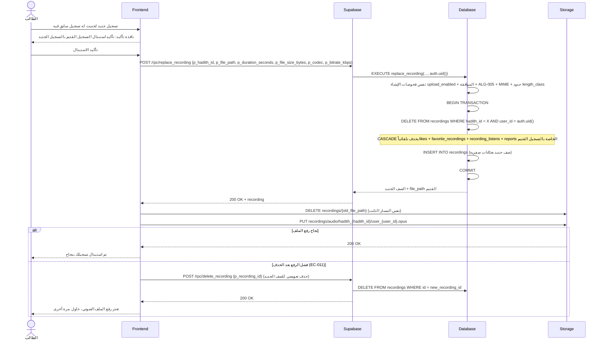

# System Logic: UC-008 تسجيل ورفع صوت جديد

Document Version: v1.0

Use Case ID: UC-008

Use Case Name: تسجيل ورفع صوت جديد

Status: Draft

Last Updated: 2026-07-23

Author: System Analyst AI

---

## 1. Overview

يعرّف هذا المستند منطق النظام لرحلة إنتاج التسجيل الصوتي كاملة: بوابة الموافقة الصريحة قبل أول رفع (تُسجَّل في `profiles.consent_given_at` عبر RPC `give_upload_consent`)، خط أنابيب الضغط الإلزامي على جهاز العميل (MediaRecorder ← تحويل Opus بمعدل 24–32kbps أحادي القناة ← تحقق محلي من حدود `hadiths.length_class` قبل إرسال أي بايت)، ثم الإنشاء عبر RPC `create_recording` بفحوصات خادم كاملة (مفتاح الرفع `upload_enabled`، الموافقة، حد المعدل ALG-005، فحص MIME)، وأخيراً الاستبدال الذرّي عبر RPC `replace_recording` وفق ALG-004 (حذف الصف القديم بكل تفاعلاته CASCADE + إدراج الجديد بعدّادات صفرية + حذف الملف القديم). قاعدة التعويض في EC-011 تضمن عدم بقاء صف بلا ملف أو ملف بلا صف.

---

## 2. Sequence Diagram

### 2.1 بوابة الموافقة الصريحة قبل أول رفع (Upload Consent Gate)



### 2.2 التسجيل وخط أنابيب الضغط على العميل (Record + Client-Side Compression)



### 2.3 إنشاء تسجيل جديد (Create — RPC create_recording)



### 2.4 استبدال تسجيل قائم (Replace — ALG-004)



---

## 3. API Contract

### 3.1 POST /rpc/give_upload_consent

توثيق الموافقة الصريحة على سماعية التسجيلات لجميع زملاء المقرر — شرط لأول رفع (F004/F007). يُستدعى مرة واحدة مدى الحياة، ويكتب الطابع الزمني في `profiles.consent_given_at`.

**Request Body Parameters:**

| Parameter | Type | Required | Description |
| --- | --- | --- | --- |
| — | — | — | لا معاملات — الهوية تُؤخذ من `auth.uid()` |

**Success Response (200 OK):**

```json
{
  "success": true,
  "data": {
    "consent_given_at": "2026-07-23T10:05:00Z"
  },
  "message": "تم تسجيل موافقتك — يمكنك الآن رفع تسجيلاتك",
  "errors": []
}
```

**Error Response (401 Unauthorized — زائر):**

```json
{
  "success": false,
  "data": null,
  "message": "سجّل الدخول لمتابعة الرفع",
  "errors": []
}
```

---

### 3.2 POST /rpc/create_recording

إنشاء صف تسجيل جديد بعد اجتياز كل فحوصات الخادم. رفع الملف نفسه يتم بعد نجاح الاستدعاء مباشرة إلى Storage بالمسار الثابت، وأي فشل رفع يُشغّل حذفاً تعويضياً للصف (EC-011).

**Request Body Parameters:**

| Parameter | Type | Required | Description |
| --- | --- | --- | --- |
| p_hadith_id | uuid | Yes | معرّف الحديث المسجَّل |
| p_file_path | text | Yes | مسار الملف المقصود — يجب أن يطابق `audio/hadith_{hadith_id}/user_{user_id}.opus` |
| p_duration_seconds | integer | Yes | المدة بالثواني (≤ 30 للقصير، ≤ 180 للطويل حسب `length_class`) |
| p_file_size_bytes | integer | Yes | الحجم بالبايت بعد الضغط (≤ 2MB للقصير، ≤ 5MB للطويل) |
| p_codec | text | Yes | الترميز: `opus` أو `aac` |
| p_bitrate_kbps | integer | Yes | معدل البت (المعتمد 24–32، والمقبول 16–64) |

**Success Response (201 Created):**

```json
{
  "success": true,
  "data": {
    "recording": {
      "id": "r8c2d3e4-1111-4e2a-9c5f-1a2b3c4d5e6f",
      "hadith_id": "a1b2c3d4-1111-4e2a-9c5f-1a2b3c4d5e6f",
      "user_id": "u1s2e3r4-bbbb-4e2a-9c5f-1a2b3c4d5e6f",
      "file_path": "audio/hadith_a1b2c3d4/user_u1s2e3r4.opus",
      "duration_seconds": 24,
      "file_size_bytes": 92160,
      "codec": "opus",
      "bitrate_kbps": 32,
      "likes_count": 0,
      "listens_count": 0,
      "is_verified": false,
      "verified_by": null,
      "verified_at": null,
      "is_hidden": false,
      "hidden_reason": null,
      "created_at": "2026-07-23T10:15:00Z",
      "updated_at": "2026-07-23T10:15:00Z"
    }
  },
  "message": "تم نشر تسجيلك بنجاح",
  "errors": []
}
```

**Error Response (401 Unauthorized — زائر):**

```json
{
  "success": false,
  "data": null,
  "message": "سجّل الدخول لتتمكن من رفع تسجيلك",
  "errors": []
}
```

**Error Response (403 Forbidden — مفتاح الرفع العام متوقف):**

```json
{
  "success": false,
  "data": null,
  "message": "الرفع متوقف مؤقتاً",
  "errors": []
}
```

**Error Response (403 Forbidden — بلا موافقة صريحة):**

```json
{
  "success": false,
  "data": null,
  "message": "الموافقة على سياسة النشر مطلوبة",
  "errors": []
}
```

**Error Response (409 Conflict — تسجيل قائم لهذا الحديث):**

```json
{
  "success": false,
  "data": null,
  "message": "لديك تسجيل سابق لهذا الحديث — استبدله بدلاً من إنشاء تسجيل جديد",
  "errors": []
}
```

**Error Response (413 Payload Too Large):**

```json
{
  "success": false,
  "data": null,
  "message": "حجم الملف يتجاوز الحد المسموح لتصنيف هذا الحديث",
  "errors": []
}
```

**Error Response (415 Unsupported Media Type):**

```json
{
  "success": false,
  "data": null,
  "message": "نوع الملف الصوتي غير مدعوم — المطلوب Opus أو AAC",
  "errors": []
}
```

**Error Response (429 Too Many Requests — ALG-005):**

```json
{
  "success": false,
  "data": null,
  "message": "تجاوزت الحد الأقصى للرفع (5 تسجيلات/ساعة). حاول لاحقاً.",
  "errors": []
}
```

**Error Response (500 Internal Server Error):**

```json
{
  "success": false,
  "data": null,
  "message": "تعذر رفع الملف الصوتي، حاول مرة أخرى",
  "errors": []
}
```

---

### 3.3 POST /rpc/replace_recording

استبدال التسجيل القائم للطالب على حديث معيّن بآخر جديد — التنفيذ الذرّي لقاعدة ALG-004. نفس معاملات `create_recording` ونفس أخطائها **عدا 409** (وجود تسجيل سابق هنا هو الحالة المتوقعة لا خطأ).

**Request Body Parameters:**

| Parameter | Type | Required | Description |
| --- | --- | --- | --- |
| p_hadith_id | uuid | Yes | معرّف الحديث صاحب التسجيل القائم |
| p_file_path | text | Yes | مسار الملف — يطابق النمط الثابت نفسه (يحل محل القديم) |
| p_duration_seconds | integer | Yes | المدة بالثواني ضمن حدود `length_class` |
| p_file_size_bytes | integer | Yes | الحجم بالبايت ضمن حدود `length_class` |
| p_codec | text | Yes | `opus` أو `aac` |
| p_bitrate_kbps | integer | Yes | معدل البت (16–64، المعتمد 24–32) |

**Success Response (200 OK):**

```json
{
  "success": true,
  "data": {
    "recording": {
      "id": "r9c2d3e4-2222-4e2a-9c5f-1a2b3c4d5e6f",
      "hadith_id": "a1b2c3d4-1111-4e2a-9c5f-1a2b3c4d5e6f",
      "user_id": "u1s2e3r4-bbbb-4e2a-9c5f-1a2b3c4d5e6f",
      "file_path": "audio/hadith_a1b2c3d4/user_u1s2e3r4.opus",
      "duration_seconds": 22,
      "file_size_bytes": 88064,
      "codec": "opus",
      "bitrate_kbps": 32,
      "likes_count": 0,
      "listens_count": 0,
      "is_verified": false,
      "verified_by": null,
      "verified_at": null,
      "is_hidden": false,
      "hidden_reason": null,
      "created_at": "2026-07-23T11:00:00Z",
      "updated_at": "2026-07-23T11:00:00Z"
    },
    "replaced_recording_id": "r8c2d3e4-1111-4e2a-9c5f-1a2b3c4d5e6f"
  },
  "message": "تم استبدال تسجيلك بنجاح",
  "errors": []
}
```

| Field | Type | Description |
| --- | --- | --- |
| replaced_recording_id | uuid | معرّف الصف القديم المحذوف (تفاعلاته أُزيلت CASCADE) — للتتبع فقط |

**Error Responses:** مطابقة لأخطاء `create_recording` أعلاه (401، 403 بالحالتين، 413، 415، 429، 500) **باستثناء 409** — لا يُرجَع في الاستبدال.

#### SQL Implementation Sketch — فحص حد المعدل (ALG-005)

> يُستدعى داخل `create_recording` و`replace_recording` قبل أي INSERT. الحد قابل للتعديل من لوحة التحكم (UC-013) دون نشر كود.

```sql
CREATE OR REPLACE FUNCTION check_upload_rate_limit(p_user_id uuid)
RETURNS void
LANGUAGE plpgsql
SECURITY DEFINER
AS $$
DECLARE
    v_limit  int;
    v_recent int;
BEGIN
    -- الحد من الإعدادات (الافتراضي 5 تسجيلات/ساعة)
    SELECT (value)::int INTO v_limit
    FROM app_settings
    WHERE key = 'rate_limit_uploads_per_hour';

    -- عدد الرفعات خلال الساعة الأخيرة (الإنشاء والاستبدال كلاهما إدراج جديد)
    SELECT COUNT(*) INTO v_recent
    FROM recordings
    WHERE user_id = p_user_id
      AND created_at >= now() - interval '1 hour';

    IF v_recent >= v_limit THEN
        RAISE EXCEPTION 'تجاوزت الحد الأقصى للرفع (% تسجيلات/ساعة). حاول لاحقاً.', v_limit
            USING ERRCODE = 'P0429';   -- يُترجَم إلى HTTP 429
    END IF;
END;
$$;
```

---

## 4. Business Rules

| Rule | Description |
| --- | --- |
| BR-001 | الرفع للطلاب الموثقين فقط؛ الموافقة الصريحة (`profiles.consent_given_at`) شرط لأول رفع وتُطلب مرة واحدة مدى الحياة (F004/F007) |
| BR-002 | الضغط إلزامي على جهاز العميل: Opus/AAC بمعدل 24–32kbps أحادي القناة قبل إرسال أي بايت (`07-storage-architecture.md`) |
| BR-003 | الحدود الفنية مشتقة من `hadiths.length_class`: قصير ≤ 30ث / ≤ 2MB؛ طويل ≤ 180ث / ≤ 5MB — الرفض محلياً قبل الرفع، والخادم يعيد الفحص (لا وثوق بالعميل) |
| BR-004 | تسجيل واحد نشط لكل (طالب، حديث): `UNIQUE(hadith_id, user_id)` هو الحارس النهائي؛ أي تكرار يُوجَّه إلى مسار الاستبدال (ALG-004) |
| BR-005 | الاستبدال ذرّي ولا يتم إلا بعد تأكيد صريح: حذف الصف القديم (CASCADE لكل اللايكات والنجوم والاستماعات والبلاغات) + إدراج الجديد بعدّادات صفرية + حذف الملف القديم من Storage (ALG-004) |
| BR-006 | حد المعدل 5 تسجيلات/ساعة لكل طالب (ALG-005) يُفحص على الخادم قبل كل إنشاء وكل استبدال، والقيمة من `app_settings.rate_limit_uploads_per_hour` |
| BR-007 | مفتاح الرفع العام: `upload_enabled = false` يوقف الإنشاء والاستبدال برسالة "الرفع متوقف مؤقتاً" مع بقاء الاستماع والتصفح مفعّلين (F008) |
| BR-008 | لا يتامى (EC-011): فشل رفع الملف بعد إدراج الصف يُشغّل حذفاً تعويضياً فورياً للصف — لا صف بلا ملف ولا ملف بلا صف |
| BR-009 | مسار الملف بصيغة ثابتة `audio/hadith_{hadith_id}/user_{user_id}.opus` في bucket `recordings` — لا يُقبل أي اسم ملف من العميل (تطهير + نمط UUID) |
| BR-010 | الخادم يفحص MIME الحقيقي والامتداد ويطابق الميتاداتا مع حدود `length_class` — فحص العميل لتحسين التجربة فقط وليس حارساً أمنياً |

---

## 5. Traceability

| User Flow | Requirement | API Endpoints |
| --- | --- | --- |
| userflow_uc_008.md | F004, F007 | POST /rpc/give_upload_consent، POST /rpc/create_recording، POST /rpc/replace_recording، POST /rpc/delete_recording (تعويض EC-011)، PUT/DELETE Storage bucket `recordings` |

---

## 6. سجل المراجعات

| Version | Date | Author | Description |
| --- | --- | --- | --- |
| 1.0 | 2026-07-23 | System Analyst AI | الإنشاء الأولي لمنطق UC-008 اشتقاقاً من SRS F004/F007 وALG-004/ALG-005 |
