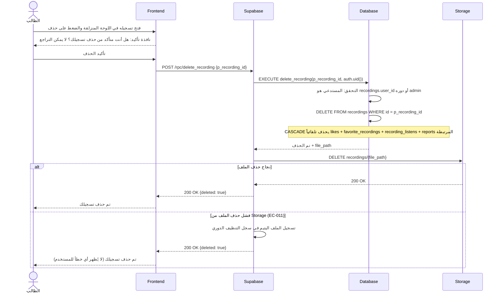
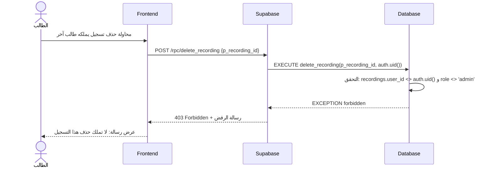

# System Logic: UC-009 حذف التسجيل الشخصي

Document Version: v1.0

Use Case ID: UC-009

Use Case Name: حذف التسجيل الشخصي

Status: Draft

Last Updated: 2026-07-23

Author: System Analyst AI

---

## 1. Overview

يعرّف هذا المستند منطق النظام لحذف التسجيل الصوتي: يملك الطالب حذف تسجيله الشخصي في أي وقت، ويملك المشرف الحذف المطلق. يتم كل شيء عبر RPC `delete_recording` الذي يتحقق من الملكية أو دور المشرف، ثم يحذف الصف من `recordings` فيتبعه CASCADE تلقائي حذف كل التفاعلات المرتبطة (`likes`, `favorite_recordings`, `recording_listens`, `reports`)، ثم يحذف الملف من Storage. فشل حذف الملف لا يفشل العملية من وجهة نظر المستخدم: يُسجَّل الملف اليتيم للتنظيف الدوري (EC-011) وتُعاد استجابة نجاح.

---

## 2. Sequence Diagram

### 2.1 حذف التسجيل الشخصي (Delete Own Recording)



### 2.2 محاولة حذف تسجيل غير مملوك (Non-Owner, Non-Admin — 403)



---

## 3. API Contract

### 3.1 POST /rpc/delete_recording

حذف تسجيل صوتي نهائياً. يُسمح للمالك أو لمن يحمل دور `admin` فقط. حذف الصف يُسقط كل التفاعلات المرتبطة عبر CASCADE، ويُتبَع بحذف الملف من Storage؛ فشل حذف الملف يُسجَّل للتنظيف الدوري (EC-011) ولا يغيّر استجابة النجاح.

**Request Body Parameters:**

| Parameter | Type | Required | Description |
| --- | --- | --- | --- |
| p_recording_id | uuid | Yes | معرّف التسجيل المراد حذفه |

**Success Response (200 OK):**

```json
{
  "success": true,
  "data": {
    "deleted": true,
    "recording_id": "r8c2d3e4-1111-4e2a-9c5f-1a2b3c4d5e6f"
  },
  "message": "تم حذف التسجيل بنجاح",
  "errors": []
}
```

**Error Response (401 Unauthorized — زائر):**

```json
{
  "success": false,
  "data": null,
  "message": "سجّل الدخول لتتمكن من حذف تسجيلك",
  "errors": []
}
```

**Error Response (403 Forbidden — غير مالك وليس مشرفاً):**

```json
{
  "success": false,
  "data": null,
  "message": "لا تملك حذف هذا التسجيل",
  "errors": []
}
```

**Error Response (404 Not Found — تسجيل غير موجود):**

```json
{
  "success": false,
  "data": null,
  "message": "التسجيل المطلوب غير موجود",
  "errors": []
}
```

---

## 4. Business Rules

| Rule | Description |
| --- | --- |
| BR-001 | الطالب يملك حذف تسجيله الشخصي في أي وقت؛ والمشرف يملك الحذف المطلق لأي تسجيل (SRS F004) |
| BR-002 | الحارس على الخادم: المستدعي = `recordings.user_id` أو `profiles.role = 'admin'` — غير ذلك 403 |
| BR-003 | حذف الصف يُسقط كل التفاعلات عبر `ON DELETE CASCADE`: `likes`، `favorite_recordings`، `recording_listens`، `reports` — لا بقايا يتيمة في قاعدة البيانات |
| BR-004 | الحذف نهائي ولا يمكن التراجع عنه — لهذا تسبقه نافذة تأكيد صريحة في الواجهة |
| BR-005 | فشل حذف ملف Storage لا يفشل العملية: يُسجَّل الملف اليتيم للتنظيف الدوري (EC-011) وتُعاد `{deleted: true}` دون إظهار خطأ للمستخدم |
| BR-006 | الحذف يتم حصرياً عبر RPC `delete_recording` — لا حذف مباشر عبر RLS، لضمان اقتران حذف الصف بحذف الملف |

---

## 5. Traceability

| User Flow | Requirement | API Endpoints |
| --- | --- | --- |
| userflow_uc_009.md | F004 | POST /rpc/delete_recording، DELETE Storage bucket `recordings` |

---

## 6. سجل المراجعات

| Version | Date | Author | Description |
| --- | --- | --- | --- |
| 1.0 | 2026-07-23 | System Analyst AI | الإنشاء الأولي لمنطق UC-009 اشتقاقاً من SRS F004 وEC-011 |
