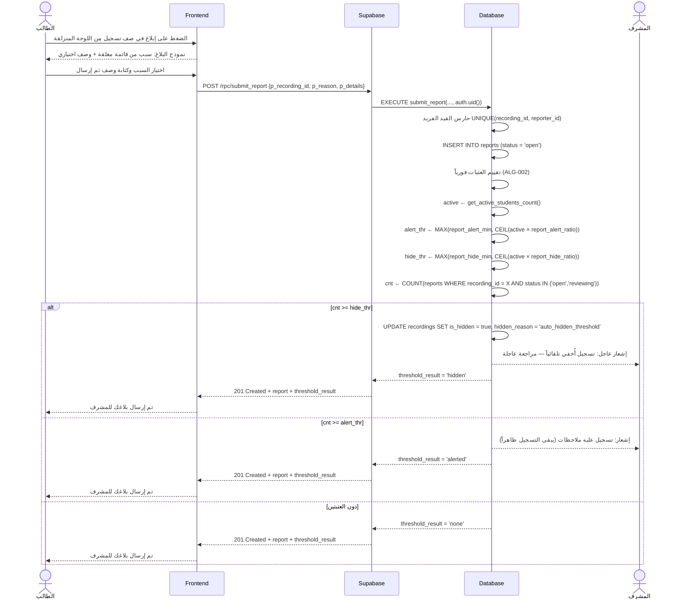
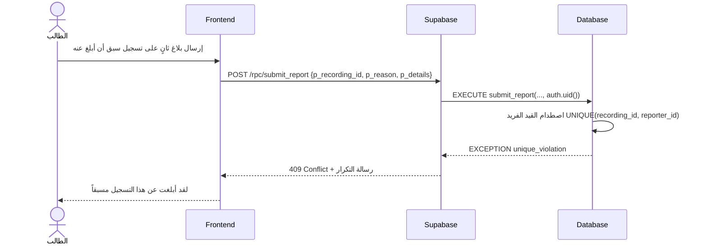

# System Logic: UC-010 الإبلاغ عن تسجيل صوتي

Document Version: v1.0

Use Case ID: UC-010

Use Case Name: الإبلاغ عن تسجيل صوتي

Status: Draft

Last Updated: 2026-07-23

Author: System Analyst AI

---

## 1. Overview

يعرّف هذا المستند منطق النظام للقناة الأولى من نظام البلاغات المزدوج (F006): الإبلاغ عن تسجيل صوتي. يُرسل الطالب بلاغاً بسبب محدد من قائمة مغلقة مع وصف اختياري عبر RPC `submit_report`، ويمنع القيد الفريد `UNIQUE(recording_id, reporter_id)` تكرار بلاغ المستخدم نفسه على التسجيل نفسه. فور الإدراج تُقيَّم عتبات ALG-002 النسبية: عتبة تنبيه = `max(report_alert_min, ceil(active × report_alert_ratio))` وعتبة إخفاء = `max(report_hide_min, ceil(active × report_hide_ratio))` حيث `active` من `get_active_students_count()`. بلوغ عتبة الإخفاء يضبط `is_hidden = true` مع `hidden_reason = 'auto_hidden_threshold'` ويُرسل تنبيهاً عاجلاً للإدارة؛ بلوغ عتبة التنبيه يُرسل إشعاراً فقط مع بقاء التسجيل ظاهراً. الإخفاء التلقائي ليس حذفاً — القرار النهائي للمشرف (UC-012).

---

## 2. Sequence Diagram

### 2.1 إرسال البلاغ وتقييم العتبات فورياً (Submit Report + ALG-002 Threshold Evaluation)



### 2.2 بلاغ مكرر على التسجيل نفسه (Duplicate Report — 409)



---

## 3. API Contract

### 3.1 POST /rpc/submit_report

إرسال بلاغ صوتي على تسجيل، مع تقييم فوري لعتبات ALG-002 وإرجاع نتيجة التقييم. البلاغات المحتسبة في العدّ هي المفتوحة وقيد المراجعة فقط (`open`, `reviewing`).

**Request Body Parameters:**

| Parameter | Type | Required | Description |
| --- | --- | --- | --- |
| p_recording_id | uuid | Yes | معرّف التسجيل المُبلَّغ عنه |
| p_reason | report_reason | Yes | السبب: `incorrect_recitation` / `poor_quality` / `inappropriate` / `other` |
| p_details | text | No | وصف اختياري (≤ 500 حرف، مُطهَّر XSS) |

**Success Response (201 Created):**

```json
{
  "success": true,
  "data": {
    "report": {
      "id": "b1c2d3e4-3333-4e2a-9c5f-1a2b3c4d5e6f",
      "recording_id": "r1c2d3e4-aaaa-4e2a-9c5f-1a2b3c4d5e6f",
      "reporter_id": "u1s2e3r4-bbbb-4e2a-9c5f-1a2b3c4d5e6f",
      "reason": "incorrect_recitation",
      "details": "خطأ في تشكيل كلمة في المتن عند الثانية 12",
      "status": "open",
      "resolved_by": null,
      "resolved_at": null,
      "created_at": "2026-07-23T12:00:00Z"
    },
    "threshold_result": "alerted"
  },
  "message": "تم إرسال بلاغك للمشرف",
  "errors": []
}
```

| Field | Type | Description |
| --- | --- | --- |
| threshold_result | enum | نتيجة تقييم ALG-002 الفوري: `'none'` (دون العتبتين) \| `'alerted'` (تنبيه الإدارة، يبقى ظاهراً) \| `'hidden'` (إخفاء تلقائي + تنبيه عاجل) |

**Error Response (401 Unauthorized — زائر):**

```json
{
  "success": false,
  "data": null,
  "message": "سجّل الدخول لتتمكن من الإبلاغ",
  "errors": []
}
```

**Error Response (404 Not Found — تسجيل غير موجود):**

```json
{
  "success": false,
  "data": null,
  "message": "التسجيل المطلوب غير موجود",
  "errors": []
}
```

**Error Response (409 Conflict — بلاغ مكرر):**

```json
{
  "success": false,
  "data": null,
  "message": "لقد أبلغت عن هذا التسجيل مسبقاً",
  "errors": []
}
```

---

### 3.2 POST /rpc/get_active_students_count

حساب عدد الطلاب النشطين المستخدم في صيغة عتبات ALG-002: حسابات `role = 'student'` التي لها نشاط خلال نافذة `active_users_window_days` يوماً (الافتراضي 30) وفق `profiles.last_active_at`.

**Request Body Parameters:**

| Parameter | Type | Required | Description |
| --- | --- | --- | --- |
| — | — | — | لا معاملات — تُستدعى داخلياً من `submit_report` ومتاحة للوحة التحكم |

**Success Response (200 OK):**

```json
{
  "success": true,
  "data": {
    "active_students_count": 20
  },
  "message": "تم حساب عدد الطلاب النشطين",
  "errors": []
}
```

**Error Response (401 Unauthorized):**

```json
{
  "success": false,
  "data": null,
  "message": "سجّل الدخول أولاً",
  "errors": []
}
```

#### SQL Implementation Sketch — تقييم العتبات (ALG-002 كاملاً)

> يُستدعى داخل `submit_report` بعد INSERT مباشرة. الصيغة: `العتبة = MAX(الحد الأدنى المطلق، CEIL(النشطون × النسبة))`.

```sql
CREATE OR REPLACE FUNCTION get_active_students_count()
RETURNS integer
LANGUAGE sql
STABLE
SECURITY DEFINER
AS $$
    SELECT COUNT(*)::integer
    FROM profiles
    WHERE role = 'student'
      AND last_active_at >= now() - (
              (SELECT (value)::int FROM app_settings
               WHERE key = 'active_users_window_days')   -- الافتراضي 30
              || ' days')::interval;
$$;

CREATE OR REPLACE FUNCTION evaluate_report_thresholds(p_recording_id uuid)
RETURNS text                                -- 'none' | 'alerted' | 'hidden'
LANGUAGE plpgsql
SECURITY DEFINER
AS $$
DECLARE
    v_active       int;
    v_count        int;
    v_alert_min    int;
    v_alert_ratio  numeric;
    v_hide_min     int;
    v_hide_ratio   numeric;
    v_alert_thr    int;
    v_hide_thr     int;
    v_is_hidden    boolean;
BEGIN
    -- قراءة الإعدادات القابلة للتعديل من لوحة التحكم
    SELECT (value)::int     INTO v_alert_min   FROM app_settings WHERE key = 'report_alert_min';    -- 2
    SELECT (value)::numeric INTO v_alert_ratio FROM app_settings WHERE key = 'report_alert_ratio';  -- 0.15
    SELECT (value)::int     INTO v_hide_min    FROM app_settings WHERE key = 'report_hide_min';     -- 4
    SELECT (value)::numeric INTO v_hide_ratio  FROM app_settings WHERE key = 'report_hide_ratio';   -- 0.40

    v_active := get_active_students_count();

    -- تُحتسب البلاغات المفتوحة وقيد المراجعة فقط؛ المحلولة والمرفوضة لا تُعاد في العدّ
    SELECT COUNT(*) INTO v_count
    FROM reports
    WHERE recording_id = p_recording_id
      AND status IN ('open', 'reviewing');

    v_alert_thr := GREATEST(v_alert_min, CEIL(v_active * v_alert_ratio));
    v_hide_thr  := GREATEST(v_hide_min,  CEIL(v_active * v_hide_ratio));

    SELECT is_hidden INTO v_is_hidden FROM recordings WHERE id = p_recording_id;

    -- عتبة الإخفاء: إخفاء تلقائي مؤقت + تنبيه عاجل (ليس حذفاً — القرار للمشرف UC-012)
    IF v_count >= v_hide_thr AND NOT v_is_hidden THEN
        UPDATE recordings
        SET is_hidden = true, hidden_reason = 'auto_hidden_threshold'
        WHERE id = p_recording_id;
        PERFORM pg_notify('admin_urgent',
            'تسجيل أُخفي تلقائياً — مراجعة عاجلة: ' || p_recording_id);
        RETURN 'hidden';
    END IF;

    -- عتبة التنبيه: إشعار فقط والتسجيل يبقى ظاهراً
    IF v_count >= v_alert_thr THEN
        PERFORM pg_notify('admin_alerts',
            'تسجيل عليه ملاحظات: ' || p_recording_id);
        RETURN 'alerted';
    END IF;

    RETURN 'none';
END;
$$;
```

---

## 4. Business Rules

| Rule | Description |
| --- | --- |
| BR-001 | بلاغ واحد لكل زوج (تسجيل، مبلِّغ): `UNIQUE(recording_id, reporter_id)` هو الحارس النهائي — التكرار يُرفض بـ 409 |
| BR-002 | العتبات نسبية لا ثابتة: `MAX(الحد الأدنى، CEIL(النشطون × النسبة))` — الحد الأدنى المطلق (2 للتنبيه، 4 للإخفاء) يمنع التلاعب في الفصول الصغيرة (ALG-002) |
| BR-003 | "الطلاب النشطون" = `role = 'student'` مع نشاط خلال `active_users_window_days` يوماً (الافتراضي 30) وفق `profiles.last_active_at` |
| BR-004 | تُحتسب في العدّ البلاغات `open` و`reviewing` فقط؛ المحلولة (`resolved`) والمرفوضة (`dismissed`) لا تُعاد في العدّ |
| BR-005 | بلوغ عتبة الإخفاء: `is_hidden = true` مع `hidden_reason = 'auto_hidden_threshold'` + تنبيه عاجل — الإخفاء يوقف التسجيل فوراً عن حساب ALG-001 |
| BR-006 | بلوغ عتبة التنبيه: إشعار للوحة التحكم فقط والتسجيل يبقى ظاهراً للجميع |
| BR-007 | الإخفاء التلقائي **ليس حذفاً**: القرار النهائي (إبقاء/إخفاء دائم/حذف/إظهار) للمشرف وحده في UC-012 |
| BR-008 | كل قيم العتبات والنسب تُقرأ من `app_settings` لحظة التقييم — تعديلها من لوحة التحكم (UC-013) يسري فوراً دون نشر كود |
| BR-009 | هذه القناة للتسجيلات الصوتية فقط؛ بلاغات أخطاء المحتوى (`content_reports`) قناة منفصلة بلا عتبة إطلاقاً (UC-011) |

---

## 5. Traceability

| User Flow | Requirement | API Endpoints |
| --- | --- | --- |
| userflow_uc_010.md | F006 | POST /rpc/submit_report، POST /rpc/get_active_students_count |

---

## 6. سجل المراجعات

| Version | Date | Author | Description |
| --- | --- | --- | --- |
| 1.0 | 2026-07-23 | System Analyst AI | الإنشاء الأولي لمنطق UC-010 اشتقاقاً من SRS F006 وALG-002 |
