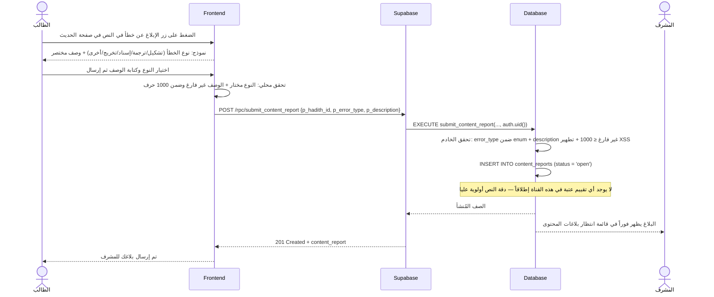
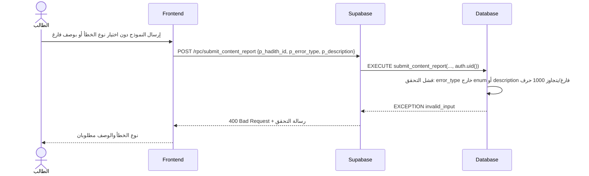

# System Logic: UC-011 الإبلاغ عن خطأ في المحتوى

Document Version: v1.0

Use Case ID: UC-011

Use Case Name: الإبلاغ عن خطأ في المحتوى

Status: Draft

Last Updated: 2026-07-23

Author: System Analyst AI

---

## 1. Overview

يعرّف هذا المستند منطق النظام للقناة الثانية من نظام البلاغات المزدوج (F006): الإبلاغ عن خطأ في المحتوى العلمي (تشكيل/ترجمة/إسناد/تخريج/أخرى). تُرسل البلاغات عبر RPC `submit_content_report` إلى جدول `content_reports` المستقل بحالة `open`، وتصل قائمة انتظار الإدارة **فوراً دون أي عتبة عددية** — دقة النص أولوية عليا. هذه القناة منفصلة تماماً عن بلاغات الصوت: لا تدخل حساب ALG-002، ولا تُخفي أي محتوى تلقائياً أبداً، والتكرار فيها مسموح (لا قيد فريد) لأن بلاغات متعددة على الخطأ نفسه ترفع أولويته. التصحيح نفسه يتم في مصدر البيانات الخارجي، ودور المنصة هو التوثيق والمتابعة حتى الحل (UC-012).

---

## 2. Sequence Diagram

### 2.1 إرسال بلاغ خطأ محتوى (Submit Content Report — No Threshold)



### 2.2 فشل التحقق من النموذج (Validation Failure — 400)



---

## 3. API Contract

### 3.1 POST /rpc/submit_content_report

إرسال بلاغ خطأ في المحتوى العلمي لحديث. يُدرج البلاغ بحالة `open` ويظهر فوراً في قائمة انتظار الإدارة — **بلا عتبة عددية وبلا إخفاء تلقائي لأي محتوى**. التكرار مسموح: لا يوجد قيد فريد على (الحديث، المبلِّغ) في هذه القناة.

**Request Body Parameters:**

| Parameter | Type | Required | Description |
| --- | --- | --- | --- |
| p_hadith_id | uuid | Yes | معرّف الحديث المُبلَّغ عن محتواه |
| p_error_type | content_error_type | Yes | نوع الخطأ: `tashkeel` / `translation` / `isnad` / `takhrij` / `other` |
| p_description | text | Yes | وصف الخطأ (إلزامي، ≤ 1000 حرف، مُطهَّر XSS) |

**Success Response (201 Created):**

```json
{
  "success": true,
  "data": {
    "content_report": {
      "id": "c1c2d3e4-4444-4e2a-9c5f-1a2b3c4d5e6f",
      "hadith_id": "a1b2c3d4-1111-4e2a-9c5f-1a2b3c4d5e6f",
      "reporter_id": "u1s2e3r4-bbbb-4e2a-9c5f-1a2b3c4d5e6f",
      "error_type": "tashkeel",
      "description": "تشكيل كلمة في أول المتن غير صحيح — الضمة مكتوبة فتحة",
      "status": "open",
      "resolved_by": null,
      "resolved_at": null,
      "created_at": "2026-07-23T13:00:00Z"
    }
  },
  "message": "تم إرسال بلاغك للمشرف",
  "errors": []
}
```

**Error Response (400 Bad Request — تحقق فاشل):**

```json
{
  "success": false,
  "data": null,
  "message": "نوع الخطأ والوصف مطلوبان",
  "errors": []
}
```

**Error Response (401 Unauthorized — زائر):**

```json
{
  "success": false,
  "data": null,
  "message": "سجّل الدخول لتتمكن من الإبلاغ",
  "errors": []
}
```

**Error Response (404 Not Found — حديث غير موجود):**

```json
{
  "success": false,
  "data": null,
  "message": "الحديث المطلوب غير موجود",
  "errors": []
}
```

---

## 4. Business Rules

| Rule | Description |
| --- | --- |
| BR-001 | قناة منفصلة تماماً عن بلاغات الصوت: جدول مستقل (`content_reports`)، نموذج مستقل، قائمة انتظار مستقلة (F006) |
| BR-002 | **لا عتبة عددية إطلاقاً في هذه القناة** — كل بلاغ يصل قائمة انتظار الإدارة فوراً؛ دقة النص أولوية عليا (ALG-002 لا تنطبق هنا) |
| BR-003 | **لا إخفاء تلقائياً أبداً**: بلاغ المحتوى لا يغيّر أي حالة ظهور للحديث أو لأي تسجيل — التصحيح يتم في مصدر البيانات الخارجي |
| BR-004 | التكرار مسموح: لا قيد فريد على (الحديث، المبلِّغ) — تعدد البلاغات على الخطأ نفسه يرفع أولويته عند المشرف |
| BR-005 | الوصف إلزامي (بخلاف بلاغات الصوت): `description` غير فارغ و≤ 1000 حرف، و`error_type` من enum مغلق — المخالف يُرفض بـ 400 |
| BR-006 | كل المدخلات النصية تُطهَّر ضد XSS على الخادم قبل الإدراج (SRS §4.4) |
| BR-007 | دور المنصة التوثيق والمتابعة فقط: نص الحديث ومحتواه العلمي لا يُعدَّلان من المنصة لأي دور بما فيه المشرف — بل من المصدر الخارجي (SRS §7) |

---

## 5. Traceability

| User Flow | Requirement | API Endpoints |
| --- | --- | --- |
| userflow_uc_011.md | F006 | POST /rpc/submit_content_report |

---

## 6. سجل المراجعات

| Version | Date | Author | Description |
| --- | --- | --- | --- |
| 1.0 | 2026-07-23 | System Analyst AI | الإنشاء الأولي لمنطق UC-011 اشتقاقاً من SRS F006 |
