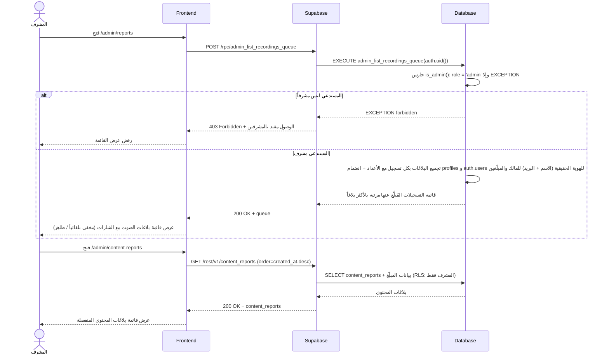
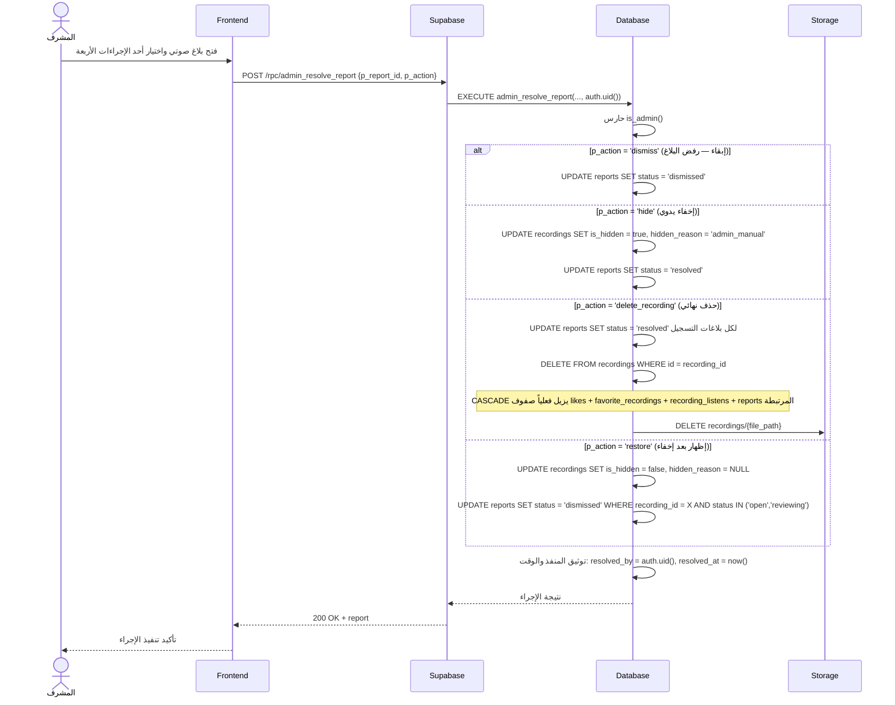
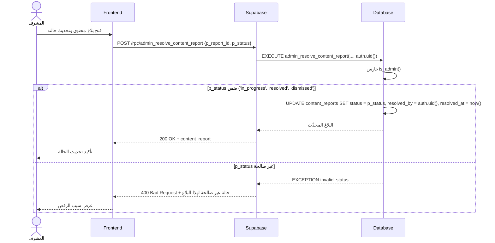

# System Logic: UC-012 مراجعة البلاغات والإشراف

Document Version: v1.0

Use Case ID: UC-012

Use Case Name: مراجعة البلاغات والإشراف

Status: Draft

Last Updated: 2026-07-23

Author: System Analyst AI

---

## 1. Overview

يعرّف هذا المستند منطق النظام لعمل المشرف على البلاغات (F008): تحميل قائمتي الانتظار (بلاغات الصوت عبر RPC `admin_list_recordings_queue` التي تجمع البلاغات بكل تسجيل مع أعداده والهوية الحقيقية للمالك والمبلّغين — الاسم والبريد — وبلاغات المحتوى عبر استعلام `content_reports` المنفصل)، ثم حل بلاغات الصوت عبر RPC `admin_resolve_report` بأربعة إجراءات (`dismiss` إبقاء / `hide` إخفاء يدوي / `delete_recording` حذف نهائي / `restore` إظهار بعد إخفاء)، وحل بلاغات المحتوى عبر RPC `admin_resolve_content_report` بتحديث الحالة (`in_progress` / `resolved` / `dismissed`). كل إجراء يوثّق منفّذه ووقته (`resolved_by = auth.uid()`, `resolved_at = now()`). الوصول محمي بحارس `is_admin()` على الخادم — غير المشرف يُرفض بـ 403.

---

## 2. Sequence Diagram

### 2.1 تحميل قوائم الانتظار (Load Moderation Queues)



### 2.2 حل بلاغ صوتي (Resolve Audio Report — 4 Actions)



### 2.3 حل بلاغ محتوى (Resolve Content Report)



---

## 3. API Contract

### 3.1 POST /rpc/admin_list_recordings_queue

قائمة انتظار بلاغات الصوت: البلاغات مجمعةً بكل تسجيل مع أعدادها، وحالة إخفاء التسجيل، والهوية الحقيقية للمالك والمبلّغين (اسم العرض + البريد) — الشفافية والمساءلة واجبة في لوحة المشرف (SRS F007/F008). الدالة `SECURITY DEFINER` لأنها تقرأ `auth.users`، ومحمية بحارس `is_admin()`.

**Request Body Parameters:**

| Parameter | Type | Required | Description |
| --- | --- | --- | --- |
| — | — | — | لا معاملات — الهوية والدور يُؤخذان من `auth.uid()` |

**Success Response (200 OK):**

```json
{
  "success": true,
  "data": {
    "queue": [
      {
        "recording_id": "r1c2d3e4-aaaa-4e2a-9c5f-1a2b3c4d5e6f",
        "hadith_id": "a1b2c3d4-1111-4e2a-9c5f-1a2b3c4d5e6f",
        "file_path": "audio/hadith_a1b2c3d4/user_u1s2e3r4.opus",
        "is_hidden": true,
        "hidden_reason": "auto_hidden_threshold",
        "open_reports_count": 5,
        "total_reports_count": 6,
        "owner": {
          "user_id": "u1s2e3r4-bbbb-4e2a-9c5f-1a2b3c4d5e6f",
          "full_name": "أحمد محمد العلي",
          "display_name": "أحمد",
          "email": "ahmad@student.univ.ac.id"
        },
        "reports": [
          {
            "id": "b1c2d3e4-3333-4e2a-9c5f-1a2b3c4d5e6f",
            "reason": "incorrect_recitation",
            "details": "خطأ في النطق عند الثانية 12",
            "status": "open",
            "created_at": "2026-07-22T09:00:00Z",
            "reporter": {
              "user_id": "u5e6f7a8-cccc-4e2a-9c5f-1a2b3c4d5e6f",
              "full_name": "سارة خالد",
              "display_name": "سارة",
              "email": "sara@student.univ.ac.id"
            }
          }
        ]
      }
    ]
  },
  "message": "تم تحميل قائمة بلاغات الصوت",
  "errors": []
}
```

**Error Response (403 Forbidden — ليس مشرفاً):**

```json
{
  "success": false,
  "data": null,
  "message": "الوصول مقيد بالمشرفين",
  "errors": []
}
```

#### SQL Implementation Sketch — `admin_list_recordings_queue`

> `SECURITY DEFINER` إلزامية للوصول إلى `auth.users` (البريد والاسم الحقيقي) — حارس `is_admin()` هو خط الدفاع الوحيد، فلا يُسمح باستدعائها خارج هذا السياق.

```sql
CREATE OR REPLACE FUNCTION admin_list_recordings_queue()
RETURNS jsonb
LANGUAGE plpgsql
SECURITY DEFINER                       -- تقرأ auth.users — مشرفون فقط
AS $$
DECLARE
    v_result jsonb;
BEGIN
    -- ─── حارس المشرف ───
    IF NOT EXISTS (SELECT 1 FROM profiles
                   WHERE id = auth.uid() AND role = 'admin') THEN
        RAISE EXCEPTION 'الوصول مقيد بالمشرفين' USING ERRCODE = 'P0003';  -- HTTP 403
    END IF;

    -- ─── تجميع البلاغات بكل تسجيل مع الهوية الحقيقية ───
    SELECT jsonb_agg(recording_block ORDER BY recording_block->>'open_reports_count' DESC)
    INTO v_result
    FROM (
        SELECT jsonb_build_object(
            'recording_id',        r.id,
            'hadith_id',           r.hadith_id,
            'file_path',           r.file_path,
            'is_hidden',           r.is_hidden,
            'hidden_reason',       r.hidden_reason,
            'open_reports_count',  COUNT(rep.id) FILTER (WHERE rep.status IN ('open','reviewing')),
            'total_reports_count', COUNT(rep.id),
            'owner', jsonb_build_object(
                'user_id',      owner_p.id,
                'full_name',    owner_u.raw_user_meta_data->>'full_name',  -- الاسم الحقيقي من Google
                'display_name', owner_p.display_name,
                'email',        owner_u.email
            ),
            'reports', COALESCE(jsonb_agg(jsonb_build_object(
                'id',         rep.id,
                'reason',     rep.reason,
                'details',    rep.details,
                'status',     rep.status,
                'created_at', rep.created_at,
                'reporter', jsonb_build_object(
                    'user_id',      rep_p.id,
                    'full_name',    rep_u.raw_user_meta_data->>'full_name',
                    'display_name', rep_p.display_name,
                    'email',        rep_u.email
                )
            ) ORDER BY rep.created_at DESC), '[]'::jsonb)
        ) AS recording_block
        FROM recordings r
        JOIN reports rep          ON rep.recording_id = r.id
        JOIN profiles owner_p     ON owner_p.id = r.user_id
        JOIN auth.users owner_u   ON owner_u.id = r.user_id
        JOIN profiles rep_p       ON rep_p.id = rep.reporter_id
        JOIN auth.users rep_u     ON rep_u.id = rep.reporter_id
        GROUP BY r.id, owner_p.id, owner_u.id, rep.id, rep_p.id, rep_u.id
    ) blocks;
    -- التجميع الفعلي يجمَّع لكل تسجيل صفاً واحداً (GROUP BY r.id) مع مصفوفة بلاغاته

    RETURN COALESCE(v_result, '[]'::jsonb);
END;
$$;
```

---

### 3.2 POST /rpc/admin_resolve_report

حل بلاغ صوتي بأحد الإجراءات الأربعة. الإجراء يؤثر في التسجيل المرتبط و/أو حالة البلاغ، ويوثَّق دائماً بـ `resolved_by = auth.uid()` و`resolved_at = now()`.

**Request Body Parameters:**

| Parameter | Type | Required | Description |
| --- | --- | --- | --- |
| p_report_id | uuid | Yes | معرّف البلاغ المراد حله |
| p_action | text | Yes | الإجراء: `'dismiss'` (إبقاء) / `'hide'` (إخفاء يدوي) / `'delete_recording'` (حذف نهائي) / `'restore'` (إظهار بعد إخفاء) |

**Success Response (200 OK — مثال: hide):**

```json
{
  "success": true,
  "data": {
    "report": {
      "id": "b1c2d3e4-3333-4e2a-9c5f-1a2b3c4d5e6f",
      "recording_id": "r1c2d3e4-aaaa-4e2a-9c5f-1a2b3c4d5e6f",
      "status": "resolved",
      "resolved_by": "a1d2m3i4-nnnn-4e2a-9c5f-1a2b3c4d5e6f",
      "resolved_at": "2026-07-23T14:30:00Z"
    },
    "action": "hide",
    "recording": {
      "id": "r1c2d3e4-aaaa-4e2a-9c5f-1a2b3c4d5e6f",
      "is_hidden": true,
      "hidden_reason": "admin_manual"
    }
  },
  "message": "تم تنفيذ الإجراء على البلاغ",
  "errors": []
}
```

| Action | Effect on recording | Effect on report(s) |
| --- | --- | --- |
| `dismiss` | لا تغيير | `status = 'dismissed'` |
| `hide` | `is_hidden = true`, `hidden_reason = 'admin_manual'` | `status = 'resolved'` |
| `delete_recording` | حذف الصف نهائياً + حذف ملف Storage (CASCADE يزيل التفاعلات والبلاغات) | `status = 'resolved'` ثم تُزال الصفوف فعلياً مع CASCADE |
| `restore` | `is_hidden = false`, `hidden_reason = NULL` | البلاغات المفتوحة/قيد المراجعة على التسجيل ← `dismissed` |

**Error Response (400 Bad Request — إجراء غير صالح):**

```json
{
  "success": false,
  "data": null,
  "message": "إجراء غير صالح لهذا البلاغ",
  "errors": []
}
```

**Error Response (403 Forbidden — ليس مشرفاً):**

```json
{
  "success": false,
  "data": null,
  "message": "الوصول مقيد بالمشرفين",
  "errors": []
}
```

**Error Response (404 Not Found — بلاغ غير موجود):**

```json
{
  "success": false,
  "data": null,
  "message": "البلاغ المطلوب غير موجود",
  "errors": []
}
```

---

### 3.3 POST /rpc/admin_resolve_content_report

تحديث حالة بلاغ محتوى في قائمة الانتظار المنفصلة — بلا أي أثر على ظهور الحديث أو التسجيلات (التصحيح في مصدر البيانات الخارجي).

**Request Body Parameters:**

| Parameter | Type | Required | Description |
| --- | --- | --- | --- |
| p_report_id | uuid | Yes | معرّف بلاغ المحتوى |
| p_status | content_report_status | Yes | الحالة الجديدة: `'in_progress'` / `'resolved'` / `'dismissed'` |

**Success Response (200 OK):**

```json
{
  "success": true,
  "data": {
    "content_report": {
      "id": "c1c2d3e4-4444-4e2a-9c5f-1a2b3c4d5e6f",
      "hadith_id": "a1b2c3d4-1111-4e2a-9c5f-1a2b3c4d5e6f",
      "status": "in_progress",
      "resolved_by": "a1d2m3i4-nnnn-4e2a-9c5f-1a2b3c4d5e6f",
      "resolved_at": "2026-07-23T15:00:00Z"
    }
  },
  "message": "تم تحديث حالة البلاغ",
  "errors": []
}
```

**Error Response (400 Bad Request — حالة غير صالحة):**

```json
{
  "success": false,
  "data": null,
  "message": "حالة غير صالحة لهذا البلاغ",
  "errors": []
}
```

**Error Response (403 Forbidden — ليس مشرفاً):**

```json
{
  "success": false,
  "data": null,
  "message": "الوصول مقيد بالمشرفين",
  "errors": []
}
```

**Error Response (404 Not Found — بلاغ غير موجود):**

```json
{
  "success": false,
  "data": null,
  "message": "البلاغ المطلوب غير موجود",
  "errors": []
}
```

---

## 4. Business Rules

| Rule | Description |
| --- | --- |
| BR-001 | الوصول لكل عمليات هذا المستند مقيد بدور `admin`: حارس `is_admin()` داخل كل RPC + سياسات RLS + حماية المسار في الواجهة — المخالف يُرفض بـ 403 (SRS F008) |
| BR-002 | لوحة المشرف تعرض دائماً الهوية الحقيقية (الاسم الكامل + البريد) لصاحب التسجيل والمبلِّغ بصرف النظر عن اسم العرض — الشفافية والمساءلة (SRS F007) |
| BR-003 | كل إجراء إداري يوثّق منفّذه ووقته: `resolved_by = auth.uid()`، `resolved_at = now()` — بلا استثناء |
| BR-004 | إجراء `hide` يضبط `hidden_reason = 'admin_manual'` لتمييزه عن الإخفاء التلقائي `'auto_hidden_threshold'` — وكلاهما يوقف التسجيل عن حساب ALG-001 فوراً |
| BR-005 | إجراء `restore` يعيد التسجيل للظهور (`is_hidden = false`) ويرفض بلاغاته المفتوحة/قيد المراجعة دفعة واحدة — وهو الحل المعتمد للإخفاء التلقائي الخاطئ |
| BR-006 | إجراء `delete_recording` نهائي: حذف الصف يُسقط كل التفاعلات والبلاغات CASCADE ويُتبَع بحذف الملف من Storage — لا تراجع |
| BR-007 | قائمتا الانتظار منفصلتان دائماً: بلاغات الصوت قد تُخفي تسجيلاً، وبلاغات المحتوى لا تُخفي شيئاً أبداً ولا تُحل إلا بتحديث الحالة (F006) |
| BR-008 | الإخفاء التلقائي (ALG-002) ليس قراراً نهائياً: مراجعة المشرف في هذا المستند هي التي تحسم (إبقاء/إخفاء دائم/حذف/إظهار) |

---

## 5. Traceability

| User Flow | Requirement | API Endpoints |
| --- | --- | --- |
| userflow_uc_012.md | F008 | POST /rpc/admin_list_recordings_queue، POST /rpc/admin_resolve_report، POST /rpc/admin_resolve_content_report، GET /rest/v1/content_reports، DELETE Storage bucket `recordings` |

---

## 6. سجل المراجعات

| Version | Date | Author | Description |
| --- | --- | --- | --- |
| 1.0 | 2026-07-23 | System Analyst AI | الإنشاء الأولي لمنطق UC-012 اشتقاقاً من SRS F008/F006 وALG-002 |
