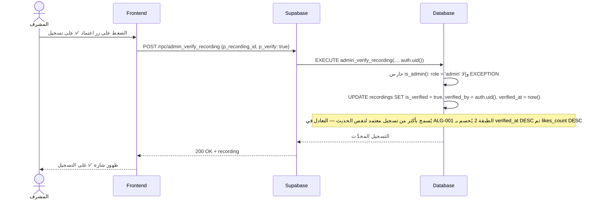
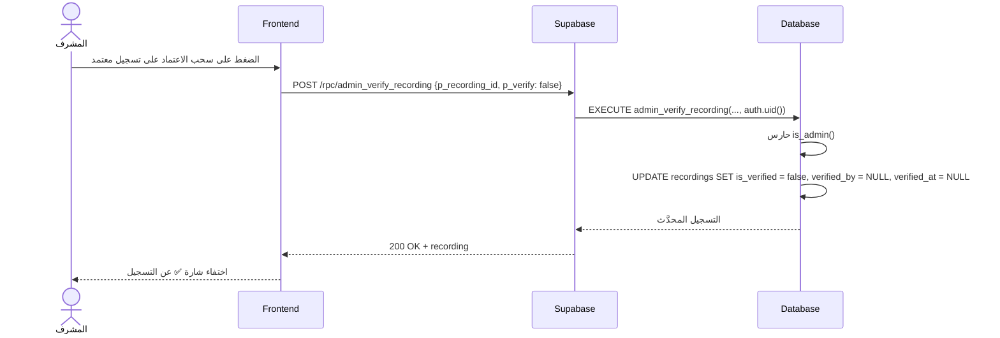
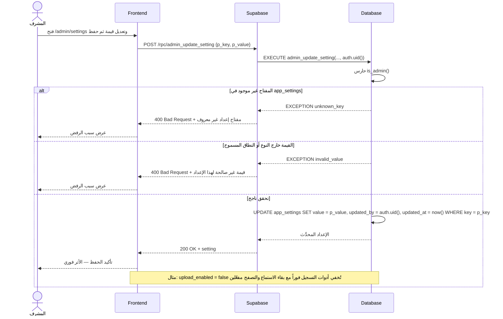

# System Logic: UC-013 اعتماد التسجيلات وإدارة الإعدادات

Document Version: v1.0

Use Case ID: UC-013

Use Case Name: اعتماد التسجيلات وإدارة الإعدادات

Status: Draft

Last Updated: 2026-07-23

Author: System Analyst AI

---

## 1. Overview

يعرّف هذا المستند منطق النظام لأداتين سياديتين في لوحة المشرف (F008): **الاعتماد ✅** عبر RPC `admin_verify_recording` — وضع شارة الدقة العلمية على تسجيل (`is_verified = true` مع `verified_by`/`verified_at`) أو سحبها (مسح الحقول الثلاثة)، مع إمكانية اعتماد أكثر من تسجيل لنفس الحديث فيُحسم التعادل في ALG-001 الطبقة 2 بـ `verified_at DESC` ثم `likes_count DESC`؛ و**إدارة الإعدادات** عبر RPC `admin_update_setting` — تعديل أي من مفاتيح `app_settings` التسعة المزروعة بعد التحقق من وجود المفتاح وصحة نوع القيمة ونطاقها، مع توثيق `updated_by`/`updated_at`، وأثر فوري دون نشر كود (مثال: `upload_enabled = false` تُخفي أدوات التسجيل فوراً مع بقاء الاستماع والتصفح مفعّلين). كلتا العمليتين محميتان بحارس `is_admin()`.

---

## 2. Sequence Diagram

### 2.1 اعتماد تسجيل (Verify Recording ✅)



### 2.2 سحب الاعتماد (Unverify Recording)



### 2.3 تعديل إعداد تشغيل (Update App Setting)



---

## 3. API Contract

### 3.1 POST /rpc/admin_verify_recording

اعتماد تسجيل بشارة ✅ أو سحب الاعتماد. الاعتماد يجعل التسجيل مرشح الطبقة 2 في ALG-001 (يسبق الشعبية)، وسحبه يعيده للتنافس العام. الاعتماد يتطلب دور `admin` ويوثَّق تلقائياً بـ `verified_by = auth.uid()` و`verified_at = now()`.

**Request Body Parameters:**

| Parameter | Type | Required | Description |
| --- | --- | --- | --- |
| p_recording_id | uuid | Yes | معرّف التسجيل المراد اعتماده أو سحب اعتماده |
| p_verify | boolean | Yes | `true` اعتماد — `false` سحب الاعتماد |

**Success Response (200 OK — اعتماد):**

```json
{
  "success": true,
  "data": {
    "recording": {
      "id": "r1c2d3e4-aaaa-4e2a-9c5f-1a2b3c4d5e6f",
      "hadith_id": "a1b2c3d4-1111-4e2a-9c5f-1a2b3c4d5e6f",
      "user_id": "u1s2e3r4-bbbb-4e2a-9c5f-1a2b3c4d5e6f",
      "is_verified": true,
      "verified_by": "a1d2m3i4-nnnn-4e2a-9c5f-1a2b3c4d5e6f",
      "verified_at": "2026-07-23T16:00:00Z",
      "updated_at": "2026-07-23T16:00:00Z"
    }
  },
  "message": "تم اعتماد التسجيل بنجاح",
  "errors": []
}
```

**Success Response (200 OK — سحب الاعتماد):**

```json
{
  "success": true,
  "data": {
    "recording": {
      "id": "r1c2d3e4-aaaa-4e2a-9c5f-1a2b3c4d5e6f",
      "hadith_id": "a1b2c3d4-1111-4e2a-9c5f-1a2b3c4d5e6f",
      "user_id": "u1s2e3r4-bbbb-4e2a-9c5f-1a2b3c4d5e6f",
      "is_verified": false,
      "verified_by": null,
      "verified_at": null,
      "updated_at": "2026-07-23T16:10:00Z"
    }
  },
  "message": "تم سحب الاعتماد من التسجيل",
  "errors": []
}
```

**Error Response (403 Forbidden — ليس مشرفاً):**

```json
{
  "success": false,
  "data": null,
  "message": "الوصول مقيد بالمشرفين",
  "errors": []
}
```

**Error Response (404 Not Found — تسجيل غير موجود):**

```json
{
  "success": false,
  "data": null,
  "message": "التسجيل المطلوب غير موجود",
  "errors": []
}
```

---

### 3.2 POST /rpc/admin_update_setting

تعديل قيمة إعداد من إعدادات التشغيل التسعة المزروعة. يتحقق الخادم من وجود المفتاح ثم من نوع القيمة ونطاقها وفق جدول التحقق أدناه، ويوثّق `updated_by = auth.uid()` و`updated_at = now()`، ويسري الأثر فوراً دون نشر كود.

**Request Body Parameters:**

| Parameter | Type | Required | Description |
| --- | --- | --- | --- |
| p_key | text | Yes | مفتاح الإعداد — يجب أن يكون أحد المفاتيح التسعة المزروعة في `app_settings` |
| p_value | jsonb | Yes | القيمة الجديدة بصيغة JSON — يُتحقق من نوعها ونطاقها حسب الجدول أدناه |

**Settings Validation Table:**

| key | JSON Type | Allowed Range | Default |
| --- | --- | --- | --- |
| upload_enabled | boolean | `true` / `false` | true |
| report_alert_ratio | number | 0 ≤ v ≤ 1 | 0.15 |
| report_alert_min | integer | v ≥ 0 | 2 |
| report_hide_ratio | number | 0 ≤ v ≤ 1 | 0.40 |
| report_hide_min | integer | v ≥ 0 | 4 |
| community_best_min_likes | integer | v ≥ 0 | 3 |
| active_users_window_days | integer | v ≥ 0 | 30 |
| rate_limit_uploads_per_hour | integer | v ≥ 0 | 5 |
| listen_count_threshold_seconds | integer | v ≥ 0 | 5 |

**Success Response (200 OK):**

```json
{
  "success": true,
  "data": {
    "setting": {
      "key": "upload_enabled",
      "value": false,
      "updated_by": "a1d2m3i4-nnnn-4e2a-9c5f-1a2b3c4d5e6f",
      "updated_at": "2026-07-23T16:30:00Z"
    }
  },
  "message": "تم تحديث الإعداد بنجاح",
  "errors": []
}
```

**Error Response (400 Bad Request — قيمة غير صالحة):**

```json
{
  "success": false,
  "data": null,
  "message": "قيمة غير صالحة لهذا الإعداد",
  "errors": []
}
```

**Error Response (400 Bad Request — مفتاح غير معروف):**

```json
{
  "success": false,
  "data": null,
  "message": "مفتاح إعداد غير معروف",
  "errors": []
}
```

**Error Response (403 Forbidden — ليس مشرفاً):**

```json
{
  "success": false,
  "data": null,
  "message": "الوصول مقيد بالمشرفين",
  "errors": []
}
```

---

## 4. Business Rules

| Rule | Description |
| --- | --- |
| BR-001 | الاعتماد وسحبه وتعديل الإعدادات مقيدة بدور `admin`: حارس `is_admin()` داخل كل RPC + سياسات RLS (SRS F008) |
| BR-002 | الاعتماد يوثَّق تلقائياً: `verified_by = auth.uid()`، `verified_at = now()`؛ والسحب يمسح الحقول الثلاثة (`is_verified`, `verified_by`, `verified_at`) |
| BR-003 | يُسمح بأكثر من تسجيل معتمد لنفس الحديث؛ عند التعادل في ALG-001 الطبقة 2 يُشغَّل الأحدث اعتماداً (`verified_at DESC`) ثم الأعلى لايكات (`likes_count DESC`) |
| BR-004 | شارة ✅ تسبق الشعبية دائماً: التسجيل المعتمد يتفوق على الأعلى لايكات في ALG-001 — الدقة العلمية مرجعية عليا فوق الشعبية (SRS F003/F008) |
| BR-005 | تعديل الإعدادات يتم حصرياً عبر RPC `admin_update_setting` لضمان توثيق `updated_by`/`updated_at` — لا تعديل مباشر على الجدول من الواجهة |
| BR-006 | يُرفض أي مفتاح خارج المفاتيح التسعة المزروعة (400 "مفتاح إعداد غير معروف") وأي قيمة خارج نوعها/نطاقها (400 "قيمة غير صالحة لهذا الإعداد"): النسب 0–1، والأعداد الصحيحة ≥ 0، والمفاتيح المنطقية boolean |
| BR-007 | أثر التعديل فوري بلا نشر كود: `upload_enabled = false` يوقف `create_recording`/`replace_recording` (UC-008) وتُخفي الواجهة أدوات التسجيل مع بقاء الاستماع والتصفح مفعّلين |
| BR-008 | قيم العتبات (`report_alert_ratio/min`, `report_hide_ratio/min`) تُقرأ لحظة تقييم ALG-002، وحد الرفع `rate_limit_uploads_per_hour` يُقرأ لحظة فحص ALG-005 — تعديلها يسري على العملية التالية مباشرة |

---

## 5. Traceability

| User Flow | Requirement | API Endpoints |
| --- | --- | --- |
| userflow_uc_013.md | F008 | POST /rpc/admin_verify_recording، POST /rpc/admin_update_setting |

---

## 6. سجل المراجعات

| Version | Date | Author | Description |
| --- | --- | --- | --- |
| 1.0 | 2026-07-23 | System Analyst AI | الإنشاء الأولي لمنطق UC-013 اشتقاقاً من SRS F008 وALG-001/ALG-002/ALG-005 |
