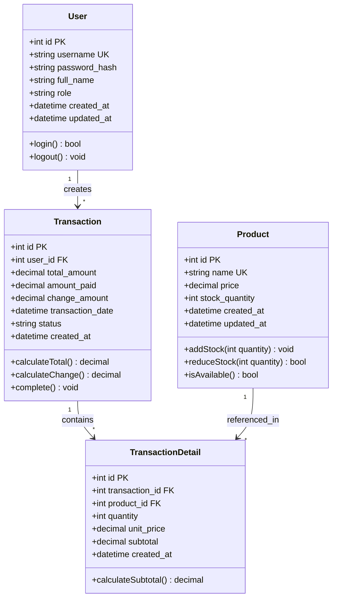

# Data Model

Document Version: v1.0

Project: Aplikasi Kasir Toko

Product: Web-Based Point of Sale (POS)

Status: Draft

Last Updated: 2026-06-16

Author: System Analyst AI

Source: Derived from SRS v0.2 (SoT-1)

---

## 1. Overview

This document defines the data model for the Aplikasi Kasir Toko (Web-Based POS) system. The model is derived from the Core Business Objects defined in SRS v0.2 Section 4.1.

---

## 2. Class Diagram



---

## 3. Entity Descriptions

### 3.1 User

Represents the Kasir (cashier) who operates the system. Single user type with full access to all features.

| Attribute | Type | Constraint | Description |
| --- | --- | --- | --- |
| id | INT | PRIMARY KEY, AUTO_INCREMENT | Unique identifier |
| username | VARCHAR(50) | UNIQUE, NOT NULL | Login username |
| password_hash | VARCHAR(255) | NOT NULL | Hashed password (bcrypt/argon2) |
| full_name | VARCHAR(100) | NOT NULL | Display name |
| role | VARCHAR(20) | NOT NULL, DEFAULT 'kasir' | User role (kasir) |
| created_at | TIMESTAMP | NOT NULL, DEFAULT NOW() | Account creation timestamp |
| updated_at | TIMESTAMP | NOT NULL, DEFAULT NOW() | Last update timestamp |

### 3.2 Product

Master data for all products available in the store. Managed by Kasir through the stock management feature (F002).

| Attribute | Type | Constraint | Description |
| --- | --- | --- | --- |
| id | INT | PRIMARY KEY, AUTO_INCREMENT | Unique identifier |
| name | VARCHAR(100) | UNIQUE, NOT NULL | Product name |
| price | DECIMAL(12,2) | NOT NULL, CHECK (price >= 0) | Selling price in IDR |
| stock_quantity | INT | NOT NULL, CHECK (stock_quantity >= 0) | Current stock count |
| created_at | TIMESTAMP | NOT NULL, DEFAULT NOW() | Record creation timestamp |
| updated_at | TIMESTAMP | NOT NULL, DEFAULT NOW() | Last update timestamp |

### 3.3 Transaction

Header record for each sales transaction. Created when Kasir completes a sale (F001).

| Attribute | Type | Constraint | Description |
| --- | --- | --- | --- |
| id | INT | PRIMARY KEY, AUTO_INCREMENT | Unique transaction ID |
| user_id | INT | FOREIGN KEY → User.id, NOT NULL | Kasir who created the transaction |
| total_amount | DECIMAL(12,2) | NOT NULL | Total amount of all items |
| amount_paid | DECIMAL(12,2) | NOT NULL | Amount paid by customer |
| change_amount | DECIMAL(12,2) | NOT NULL | Change returned to customer |
| transaction_date | TIMESTAMP | NOT NULL, DEFAULT NOW() | Transaction timestamp |
| status | VARCHAR(20) | NOT NULL, DEFAULT 'completed' | Transaction status |
| created_at | TIMESTAMP | NOT NULL, DEFAULT NOW() | Record creation timestamp |

### 3.4 TransactionDetail

Line item detail for each product in a transaction. Links Transaction to Product with quantity and pricing.

| Attribute | Type | Constraint | Description |
| --- | --- | --- | --- |
| id | INT | PRIMARY KEY, AUTO_INCREMENT | Unique detail ID |
| transaction_id | INT | FOREIGN KEY → Transaction.id, NOT NULL | Parent transaction |
| product_id | INT | FOREIGN KEY → Product.id, NOT NULL | Product reference |
| quantity | INT | NOT NULL, CHECK (quantity > 0) | Quantity purchased |
| unit_price | DECIMAL(12,2) | NOT NULL | Price at time of sale |
| subtotal | DECIMAL(12,2) | NOT NULL | quantity × unit_price |
| created_at | TIMESTAMP | NOT NULL, DEFAULT NOW() | Record creation timestamp |

---

## 4. Relationships

| Relationship | Type | Cardinality | Description |
| --- | --- | --- | --- |
| User → Transaction | One-to-Many | 1:N | One Kasir can create many transactions |
| Transaction → TransactionDetail | One-to-Many | 1:N | One transaction contains many line items |
| Product → TransactionDetail | One-to-Many | 1:N | One product can appear in many transaction details |

---

## 5. Business Rules

### 5.1 Product Rules

- Product name must be unique across the system (SRS F002).
- Price must be >= 0 (SRS Section 4.4).
- Stock quantity must be >= 0 (SRS Section 4.4).
- Product with stock = 0 cannot be added to cart (SRS F001).

### 5.2 Transaction Rules

- Quantity in TransactionDetail must be integer > 0 (SRS Section 4.4).
- Total amount is calculated from sum of all TransactionDetail.subtotal.
- Change amount = amount_paid - total_amount.
- Stock is reduced after transaction is completed (SRS F001).
- Reducing quantity below 1 automatically removes the item from cart (SRS F001).

### 5.3 Data Retention

- Transaction and TransactionDetail data: permanent storage, minimum 5 years (SRS Section 4.3).
- Product data: permanent storage (master data).
- User data: permanent storage (active accounts).

---

## 6. Indexes

| Table | Index | Columns | Purpose |
| --- | --- | --- | --- |
| product | idx_product_name | name | Fast product search by name |
| transaction | idx_transaction_date | transaction_date | Fast report queries by date |
| transaction | idx_transaction_user | user_id | Fast query by Kasir |
| transaction_detail | idx_detail_transaction | transaction_id | Fast lookup of transaction items |
| transaction_detail | idx_detail_product | product_id | Fast product sales analysis |

---

## 7. SQL DDL (PostgreSQL)

```sql
CREATE TABLE "user" (
    id SERIAL PRIMARY KEY,
    username VARCHAR(50) UNIQUE NOT NULL,
    password_hash VARCHAR(255) NOT NULL,
    full_name VARCHAR(100) NOT NULL,
    role VARCHAR(20) NOT NULL DEFAULT 'kasir',
    created_at TIMESTAMP NOT NULL DEFAULT NOW(),
    updated_at TIMESTAMP NOT NULL DEFAULT NOW()
);

CREATE TABLE product (
    id SERIAL PRIMARY KEY,
    name VARCHAR(100) UNIQUE NOT NULL,
    price DECIMAL(12,2) NOT NULL CHECK (price >= 0),
    stock_quantity INT NOT NULL CHECK (stock_quantity >= 0),
    created_at TIMESTAMP NOT NULL DEFAULT NOW(),
    updated_at TIMESTAMP NOT NULL DEFAULT NOW()
);

CREATE TABLE transaction (
    id SERIAL PRIMARY KEY,
    user_id INT NOT NULL REFERENCES "user"(id),
    total_amount DECIMAL(12,2) NOT NULL,
    amount_paid DECIMAL(12,2) NOT NULL,
    change_amount DECIMAL(12,2) NOT NULL,
    transaction_date TIMESTAMP NOT NULL DEFAULT NOW(),
    status VARCHAR(20) NOT NULL DEFAULT 'completed',
    created_at TIMESTAMP NOT NULL DEFAULT NOW()
);

CREATE TABLE transaction_detail (
    id SERIAL PRIMARY KEY,
    transaction_id INT NOT NULL REFERENCES transaction(id),
    product_id INT NOT NULL REFERENCES product(id),
    quantity INT NOT NULL CHECK (quantity > 0),
    unit_price DECIMAL(12,2) NOT NULL,
    subtotal DECIMAL(12,2) NOT NULL,
    created_at TIMESTAMP NOT NULL DEFAULT NOW()
);

CREATE INDEX idx_product_name ON product(name);
CREATE INDEX idx_transaction_date ON transaction(transaction_date);
CREATE INDEX idx_transaction_user ON transaction(user_id);
CREATE INDEX idx_detail_transaction ON transaction_detail(transaction_id);
CREATE INDEX idx_detail_product ON transaction_detail(product_id);
```

---

## 8. Traceability

| Entity | SRS Reference | Feature |
| --- | --- | --- |
| User | Section 6.2 (Security), Section 7 (Permissions) | Authentication |
| Product | Section 4.1 (Core Business Objects) | F002 (Manajemen Stok) |
| Transaction | Section 4.1 (Core Business Objects) | F001 (Pencatatan Transaksi) |
| TransactionDetail | Section 4.1 (Core Business Objects) | F001 (Pencatatan Transaksi) |
