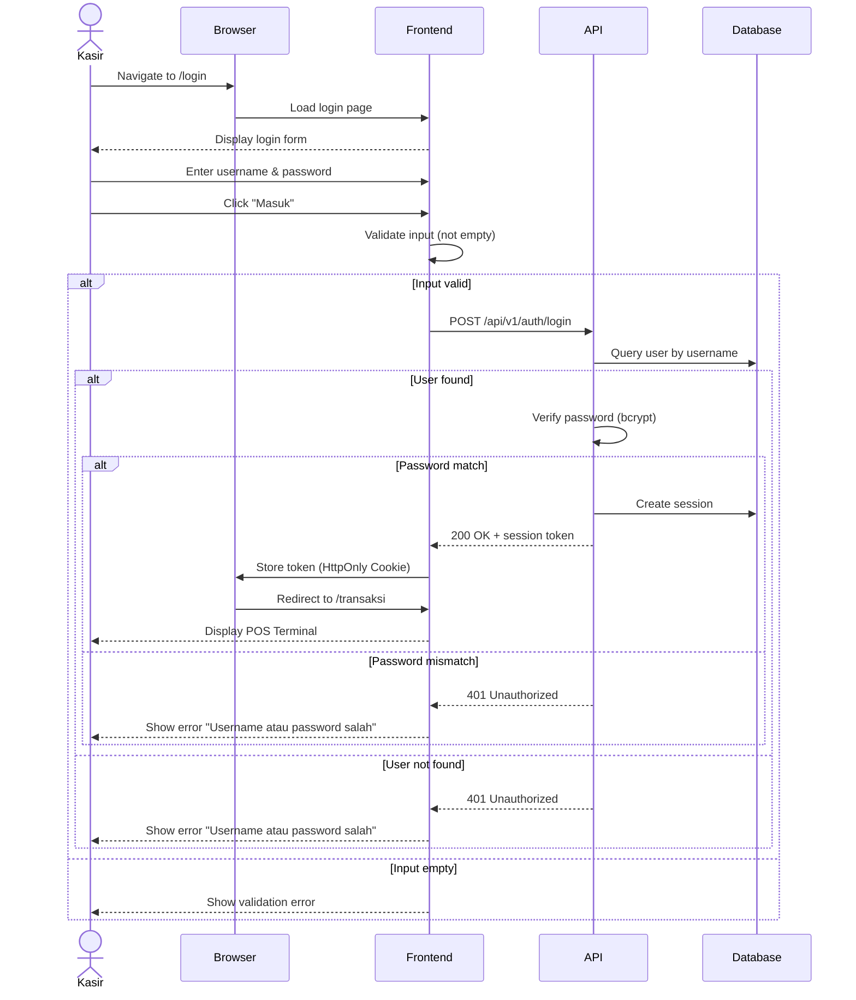

# System Logic: UC-001 User Login

Document Version: v1.0

Use Case ID: UC-001

Use Case Name: User Login

Status: Draft

Last Updated: 2026-06-16

Author: System Analyst AI

---

## 1. Overview

This document defines the system logic for user authentication, including sequence diagrams and API contracts.

---

## 2. Sequence Diagram



---

## 3. API Contract

### 3.1 POST /api/v1/auth/login

Authenticate user and create session.

**Request Headers:**

| Header | Value |
| --- | --- |
| Content-Type | application/json |

**Request Body:**

```json
{
  "username": "string (required)",
  "password": "string (required)"
}
```

**Request Example:**

```json
{
  "username": "kasir_01",
  "password": "secret123"
}
```

**Success Response (200 OK):**

```json
{
  "success": true,
  "data": {
    "token": "eyJhbGciOiJIUzI1NiIs...",
    "user": {
      "id": 1,
      "username": "kasir_01",
      "full_name": "Kasir Utama",
      "role": "kasir"
    },
    "expires_in": 86400
  },
  "message": "Login successful"
}
```

**Error Response (401 Unauthorized):**

```json
{
  "success": false,
  "data": null,
  "message": "Username atau password salah",
  "errors": []
}
```

**Error Response (400 Bad Request):**

```json
{
  "success": false,
  "data": null,
  "message": "Validation failed",
  "errors": [
    {
      "field": "username",
      "message": "Username harus diisi"
    },
    {
      "field": "password",
      "message": "Password harus diisi"
    }
  ]
}
```

---

### 3.2 POST /api/v1/auth/logout

Destroy user session.

**Request Headers:**

| Header | Value |
| --- | --- |
| Authorization | Bearer <session_token> |

**Success Response (200 OK):**

```json
{
  "success": true,
  "data": null,
  "message": "Logout successful"
}
```

---

### 3.3 GET /api/v1/auth/me

Get current authenticated user info.

**Request Headers:**

| Header | Value |
| --- | --- |
| Authorization | Bearer <session_token> |

**Success Response (200 OK):**

```json
{
  "success": true,
  "data": {
    "id": 1,
    "username": "kasir_01",
    "full_name": "Kasir Utama",
    "role": "kasir",
    "created_at": "2026-06-13T00:00:00Z"
  },
  "message": "Success"
}
```

**Error Response (401 Unauthorized):**

```json
{
  "success": false,
  "data": null,
  "message": "Sesi tidak valid atau sudah berakhir",
  "errors": []
}
```

---

## 4. Data Flow

| Step | Input | Process | Output |
| --- | --- | --- | --- |
| 1 | Username, Password | Frontend validation | Validated input |
| 2 | Validated credentials | API authentication | Session token |
| 3 | Session token | Cookie storage | HttpOnly cookie |
| 4 | Token | Subsequent requests | Authenticated API calls |

---

## 5. Security Rules

| Rule | Description |
| --- | --- |
| Password Hashing | Passwords must be hashed using bcrypt with salt rounds >= 12 |
| Token Storage | Session token stored as HttpOnly, Secure, SameSite=Strict cookie |
| Token Expiry | Session expires after 24 hours or browser close |
| Rate Limiting | Max 5 login attempts per minute per IP |

---

## 6. Traceability

| User Flow | Requirement | API Endpoint |
| --- | --- | --- |
| userflow_uc_001.md | F001 (prerequisite), NFR-6.2 | POST /api/v1/auth/login |
