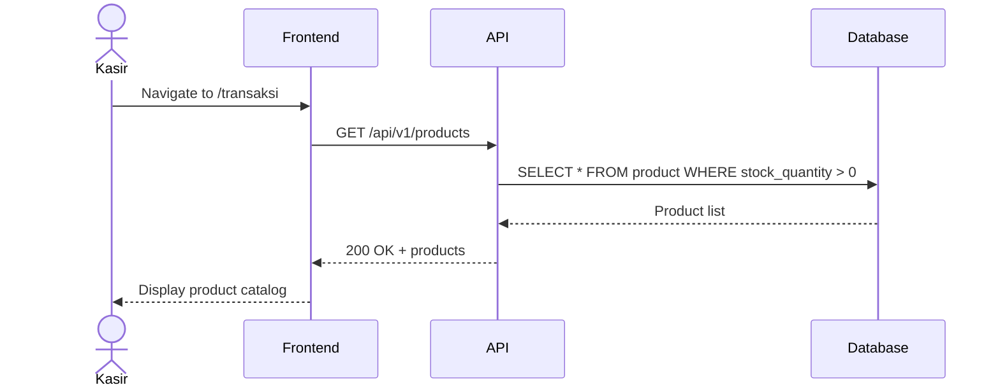
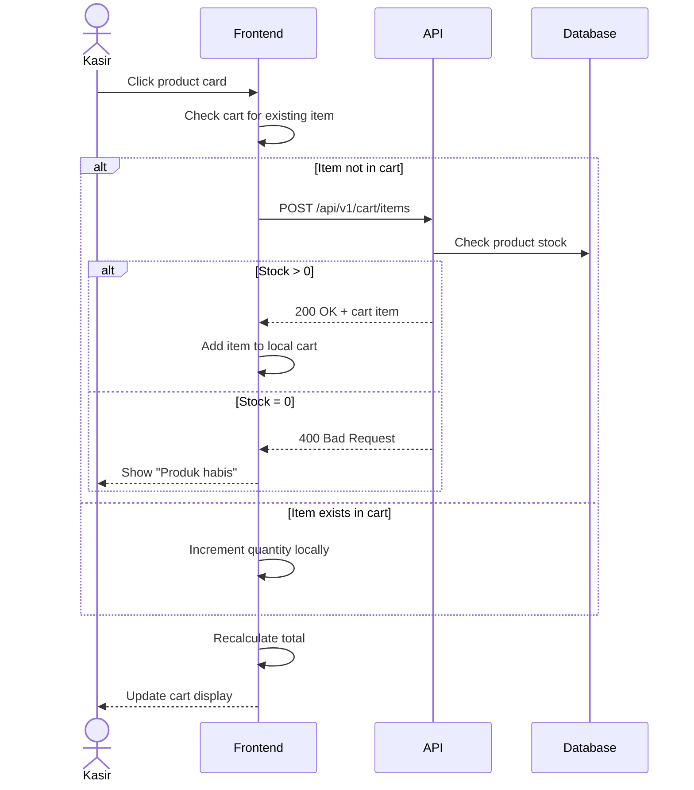
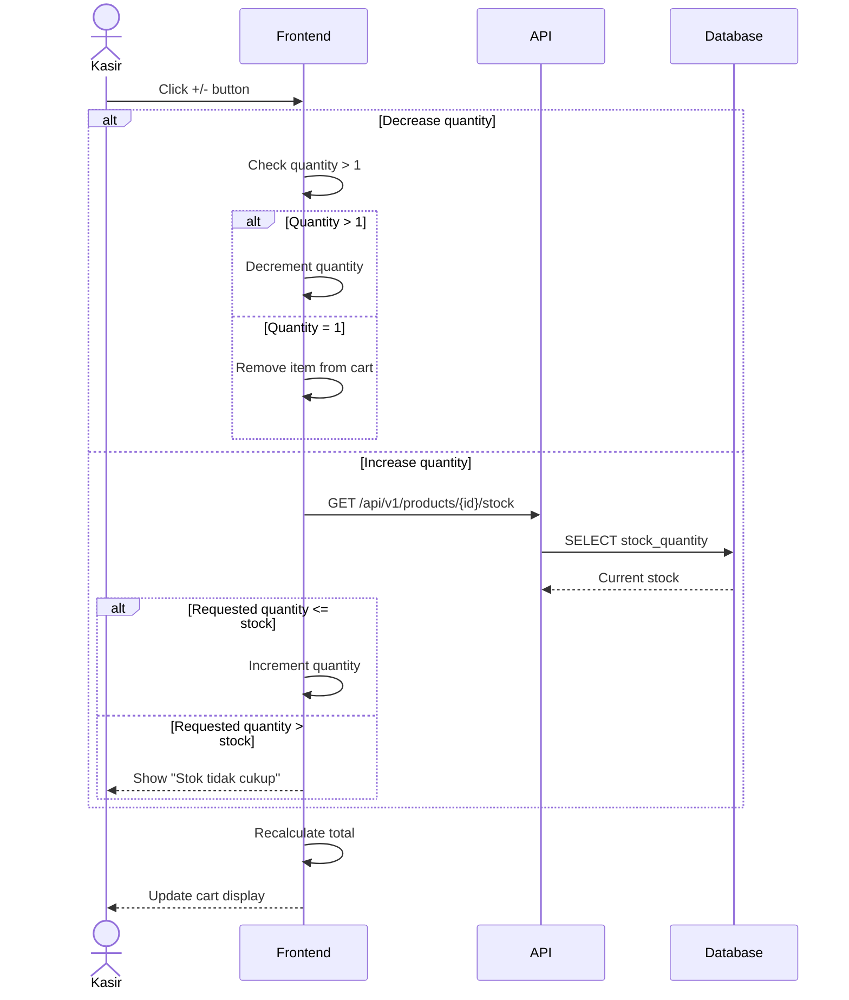
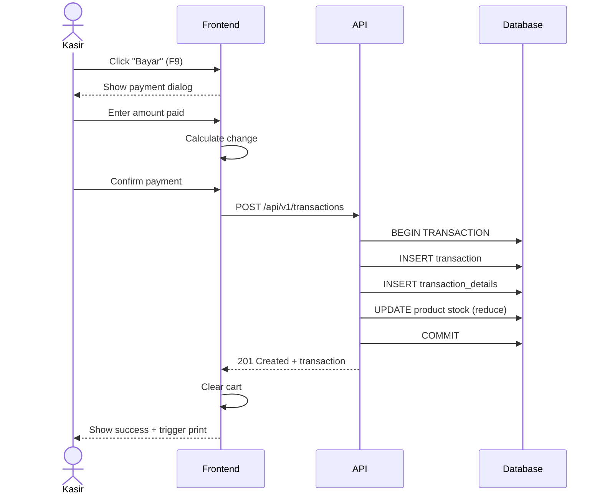

# System Logic: UC-002 Create Sales Transaction

Document Version: v1.0

Use Case ID: UC-002

Use Case Name: Create Sales Transaction

Status: Draft

Last Updated: 2026-06-16

Author: System Analyst AI

---

## 1. Overview

This document defines the system logic for creating sales transactions, including cart management and checkout flow.

---

## 2. Sequence Diagram

### 2.1 Load Product Catalog



### 2.2 Add Item to Cart



### 2.3 Update Item Quantity



### 2.4 Complete Transaction



---

## 3. API Contract

### 3.1 GET /api/v1/products

Retrieve all products for POS catalog.

**Query Parameters:**

| Parameter | Type | Required | Description |
| --- | --- | --- | --- |
| search | string | No | Search by product name |
| limit | integer | No | Max results (default: 100) |
| offset | integer | No | Pagination offset |

**Success Response (200 OK):**

```json
{
  "success": true,
  "data": {
    "products": [
      {
        "id": 1,
        "name": "Kopi Susu",
        "price": 15000,
        "stock_quantity": 50,
        "is_available": true
      }
    ],
    "total": 25,
    "limit": 100,
    "offset": 0
  },
  "message": "Success"
}
```

---

### 3.2 GET /api/v1/products/{id}/stock

Check current stock for a specific product.

**Success Response (200 OK):**

```json
{
  "success": true,
  "data": {
    "id": 1,
    "name": "Kopi Susu",
    "stock_quantity": 50,
    "is_available": true
  },
  "message": "Success"
}
```

---

### 3.3 GET /api/v1/cart

Get current cart contents (session-based).

**Success Response (200 OK):**

```json
{
  "success": true,
  "data": {
    "items": [
      {
        "product_id": 1,
        "name": "Kopi Susu",
        "price": 15000,
        "quantity": 2,
        "subtotal": 30000
      }
    ],
    "total": 30000,
    "item_count": 2
  },
  "message": "Success"
}
```

---

### 3.4 POST /api/v1/cart/items

Add item to cart.

**Request Body:**

```json
{
  "product_id": 1,
  "quantity": 1
}
```

**Success Response (201 Created):**

```json
{
  "success": true,
  "data": {
    "product_id": 1,
    "name": "Kopi Susu",
    "price": 15000,
    "quantity": 1,
    "subtotal": 15000,
    "cart_total": 15000
  },
  "message": "Item added to cart"
}
```

**Error Response (400 Bad Request):**

```json
{
  "success": false,
  "data": null,
  "message": "Stok tidak cukup",
  "errors": []
}
```

---

### 3.5 PUT /api/v1/cart/items/{product_id}

Update item quantity in cart.

**Request Body:**

```json
{
  "quantity": 3
}
```

**Success Response (200 OK):**

```json
{
  "success": true,
  "data": {
    "product_id": 1,
    "name": "Kopi Susu",
    "price": 15000,
    "quantity": 3,
    "subtotal": 45000,
    "cart_total": 45000
  },
  "message": "Cart updated"
}
```

---

### 3.6 DELETE /api/v1/cart/items/{product_id}

Remove item from cart.

**Success Response (200 OK):**

```json
{
  "success": true,
  "data": {
    "cart_total": 0,
    "item_count": 0
  },
  "message": "Item removed from cart"
}
```

---

### 3.7 DELETE /api/v1/cart

Clear all items from cart.

**Success Response (200 OK):**

```json
{
  "success": true,
  "data": {
    "cart_total": 0,
    "item_count": 0
  },
  "message": "Cart cleared"
}
```

---

### 3.8 POST /api/v1/transactions

Complete a sales transaction.

**Request Body:**

```json
{
  "amount_paid": 50000,
  "items": [
    {
      "product_id": 1,
      "quantity": 2
    },
    {
      "product_id": 3,
      "quantity": 1
    }
  ]
}
```

**Success Response (201 Created):**

```json
{
  "success": true,
  "data": {
    "id": 1001,
    "total_amount": 45000,
    "amount_paid": 50000,
    "change_amount": 5000,
    "transaction_date": "2026-06-16T10:30:00Z",
    "status": "completed",
    "items": [
      {
        "product_id": 1,
        "name": "Kopi Susu",
        "quantity": 2,
        "unit_price": 15000,
        "subtotal": 30000
      },
      {
        "product_id": 3,
        "name": "Roti Bakar",
        "quantity": 1,
        "unit_price": 15000,
        "subtotal": 15000
      }
    ]
  },
  "message": "Transaction completed"
}
```

**Error Response (400 Bad Request):**

```json
{
  "success": false,
  "data": null,
  "message": "Cart is empty",
  "errors": []
}
```

---

## 4. Business Rules

| Rule | Description |
| --- | --- |
| BR-001 | Product with stock = 0 cannot be added to cart |
| BR-002 | Quantity < 1 automatically removes item from cart |
| BR-003 | Total is calculated in real-time |
| BR-004 | Stock is reduced after transaction completes |
| BR-005 | Amount paid must be >= total amount |

---

## 5. Traceability

| User Flow | Requirement | API Endpoints |
| --- | --- | --- |
| userflow_uc_002.md | F001 | GET /products, POST /cart/items, POST /transactions |
