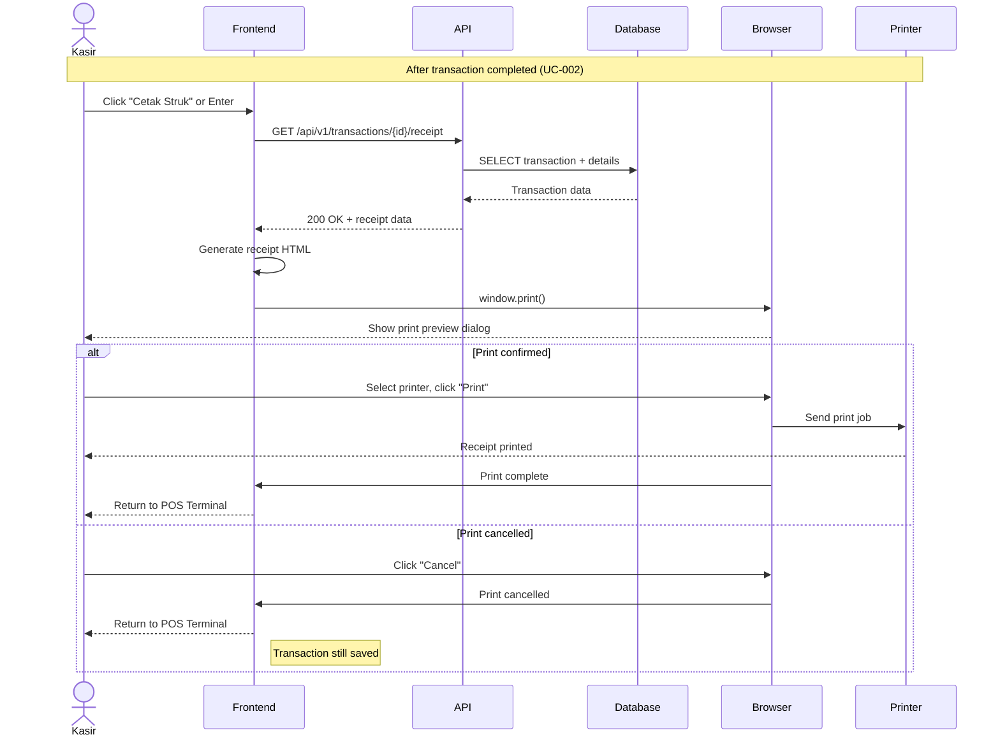

# System Logic: UC-003 Print Receipt

Document Version: v1.0

Use Case ID: UC-003

Use Case Name: Print Receipt

Status: Draft

Last Updated: 2026-06-16

Author: System Analyst AI

---

## 1. Overview

This document defines the system logic for receipt generation and printing using browser print dialog.

---

## 2. Sequence Diagram

### 2.1 Generate and Print Receipt



---

## 3. API Contract

### 3.1 GET /api/v1/transactions/{id}/receipt

Retrieve receipt data for printing.

**Path Parameters:**

| Parameter | Type | Description |
| --- | --- | --- |
| id | integer | Transaction ID |

**Success Response (200 OK):**

```json
{
  "success": true,
  "data": {
    "transaction": {
      "id": 1001,
      "transaction_date": "2026-06-16T10:30:00Z",
      "total_amount": 45000,
      "amount_paid": 50000,
      "change_amount": 5000
    },
    "store": {
      "name": "Toko Sederhana",
      "address": "Jl. Contoh No. 123",
      "phone": "081234567890"
    },
    "items": [
      {
        "name": "Kopi Susu",
        "quantity": 2,
        "unit_price": 15000,
        "subtotal": 30000
      },
      {
        "name": "Roti Bakar",
        "quantity": 1,
        "unit_price": 15000,
        "subtotal": 15000
      }
    ],
    "receipt_html": "<div class='receipt'>...</div>"
  },
  "message": "Success"
}
```

**Error Response (404 Not Found):**

```json
{
  "success": false,
  "data": null,
  "message": "Transaksi tidak ditemukan",
  "errors": []
}
```

---

## 4. Receipt HTML Template

```html
<div class="receipt" style="width: 80mm; font-family: monospace; font-size: 12px;">
  <div style="text-align: center; margin-bottom: 10px;">
    <strong>TOKO SEDERHANA</strong><br>
    Jl. Contoh No. 123<br>
    Telp: 081234567890
  </div>

  <div style="border-top: 1px dashed #000; margin: 10px 0;"></div>

  <div style="margin-bottom: 5px;">
    <span>No: #1001</span><br>
    <span>Tgl: 16/06/2026 10:30</span>
  </div>

  <div style="border-top: 1px dashed #000; margin: 10px 0;"></div>

  <table style="width: 100%; font-size: 11px;">
    <tr>
      <td>Kopi Susu x2</td>
      <td style="text-align: right;">30.000</td>
    </tr>
    <tr>
      <td>Roti Bakar x1</td>
      <td style="text-align: right;">15.000</td>
    </tr>
  </table>

  <div style="border-top: 1px dashed #000; margin: 10px 0;"></div>

  <table style="width: 100%; font-weight: bold;">
    <tr>
      <td>TOTAL</td>
      <td style="text-align: right;">45.000</td>
    </tr>
    <tr>
      <td>BAYAR</td>
      <td style="text-align: right;">50.000</td>
    </tr>
    <tr>
      <td>KEMBALI</td>
      <td style="text-align: right;">5.000</td>
    </tr>
  </table>

  <div style="border-top: 1px dashed #000; margin: 10px 0;"></div>

  <div style="text-align: center; font-size: 10px;">
    Terima kasih atas kunjungan Anda
  </div>
</div>
```

---

## 5. Business Rules

| Rule | Description |
| --- | --- |
| BR-001 | Receipt uses browser print dialog (window.print()) |
| BR-002 | Transaction remains saved even if print is cancelled |
| BR-003 | Receipt contains: store name, items, total, timestamp |

---

## 6. Traceability

| User Flow | Requirement | API Endpoint |
| --- | --- | --- |
| userflow_uc_003.md | F001 (Cetak Struk) | GET /api/v1/transactions/{id}/receipt |
