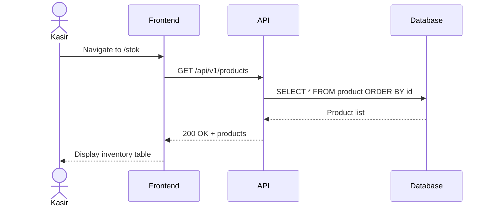
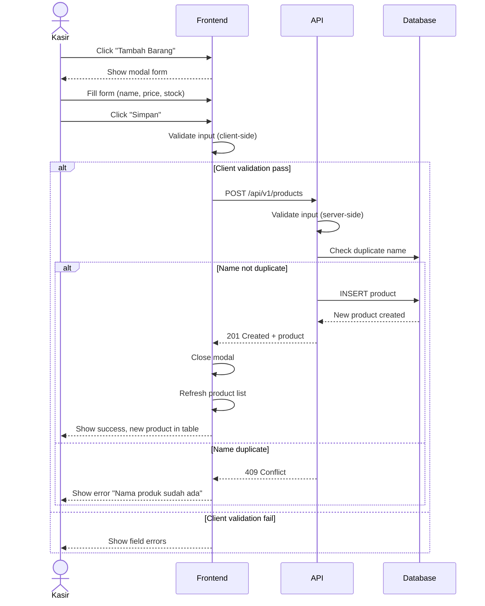

# System Logic: UC-004 Add New Product

Document Version: v1.0

Use Case ID: UC-004

Use Case Name: Add New Product

Status: Draft

Last Updated: 2026-06-16

Author: System Analyst AI

---

## 1. Overview

This document defines the system logic for adding new products to the inventory system.

---

## 2. Sequence Diagram

### 2.1 Load Inventory Page



### 2.2 Add New Product



---

## 3. API Contract

### 3.1 GET /api/v1/products

Retrieve all products (inventory view).

**Query Parameters:**

| Parameter | Type | Required | Description |
| --- | --- | --- | --- |
| search | string | No | Search by product name |
| sort | string | No | Sort field (default: id) |
| order | string | No | Sort order: asc/desc (default: desc) |
| limit | integer | No | Max results (default: 50) |
| offset | integer | No | Pagination offset |

**Success Response (200 OK):**

```json
{
  "success": true,
  "data": {
    "products": [
      {
        "id": 1,
        "name": "Kopi Susu",
        "price": 15000,
        "stock_quantity": 50,
        "created_at": "2026-06-13T00:00:00Z",
        "updated_at": "2026-06-16T10:00:00Z"
      }
    ],
    "total": 25,
    "limit": 50,
    "offset": 0
  },
  "message": "Success"
}
```

---

### 3.2 POST /api/v1/products

Create a new product.

**Request Headers:**

| Header | Value |
| --- | --- |
| Content-Type | application/json |
| Authorization | Bearer <session_token> |

**Request Body:**

```json
{
  "name": "string (required, unique)",
  "price": "number (required, >= 0)",
  "stock_quantity": "integer (required, >= 0)"
}
```

**Request Example:**

```json
{
  "name": "Teh Manis",
  "price": 10000,
  "stock_quantity": 100
}
```

**Success Response (201 Created):**

```json
{
  "success": true,
  "data": {
    "id": 26,
    "name": "Teh Manis",
    "price": 10000,
    "stock_quantity": 100,
    "created_at": "2026-06-16T10:30:00Z",
    "updated_at": "2026-06-16T10:30:00Z"
  },
  "message": "Produk berhasil ditambahkan"
}
```

**Error Response (400 Bad Request - Validation):**

```json
{
  "success": false,
  "data": null,
  "message": "Validation failed",
  "errors": [
    {
      "field": "name",
      "message": "Nama produk harus diisi"
    },
    {
      "field": "price",
      "message": "Harga jual tidak boleh negatif"
    }
  ]
}
```

**Error Response (409 Conflict - Duplicate):**

```json
{
  "success": false,
  "data": null,
  "message": "Nama produk sudah ada",
  "errors": []
}
```

---

### 3.3 GET /api/v1/products/{id}

Get single product detail.

**Success Response (200 OK):**

```json
{
  "success": true,
  "data": {
    "id": 1,
    "name": "Kopi Susu",
    "price": 15000,
    "stock_quantity": 50,
    "created_at": "2026-06-13T00:00:00Z",
    "updated_at": "2026-06-16T10:00:00Z"
  },
  "message": "Success"
}
```

---

### 3.4 PUT /api/v1/products/{id}

Update existing product.

**Request Body:**

```json
{
  "name": "string (optional)",
  "price": "number (optional, >= 0)",
  "stock_quantity": "integer (optional, >= 0)"
}
```

**Success Response (200 OK):**

```json
{
  "success": true,
  "data": {
    "id": 1,
    "name": "Kopi Susu",
    "price": 18000,
    "stock_quantity": 75,
    "updated_at": "2026-06-16T11:00:00Z"
  },
  "message": "Produk berhasil diperbarui"
}
```

---

## 4. Validation Rules

| Field | Rule | Error Message |
| --- | --- | --- |
| name | Required | "Nama produk harus diisi" |
| name | Unique | "Nama produk sudah ada" |
| name | Alphanumeric only | "Nama produk hanya boleh huruf dan angka" |
| price | Required | "Harga jual harus diisi" |
| price | >= 0 | "Harga jual tidak boleh negatif" |
| stock_quantity | Required | "Stok awal harus diisi" |
| stock_quantity | >= 0 | "Stok awal tidak boleh negatif" |

---

## 5. Business Rules

| Rule | Description |
| --- | --- |
| BR-001 | Product name must be unique |
| BR-002 | Price must be >= 0 |
| BR-003 | Initial stock must be >= 0 |
| BR-004 | All fields are required |

---

## 6. Traceability

| User Flow | Requirement | API Endpoints |
| --- | --- | --- |
| userflow_uc_004.md | F002 | GET /products, POST /products, PUT /products/{id} |
