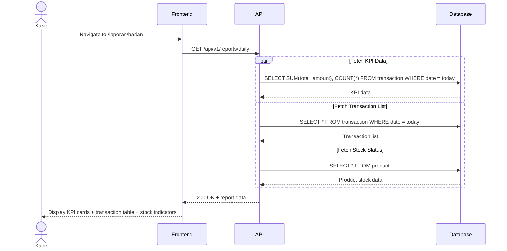
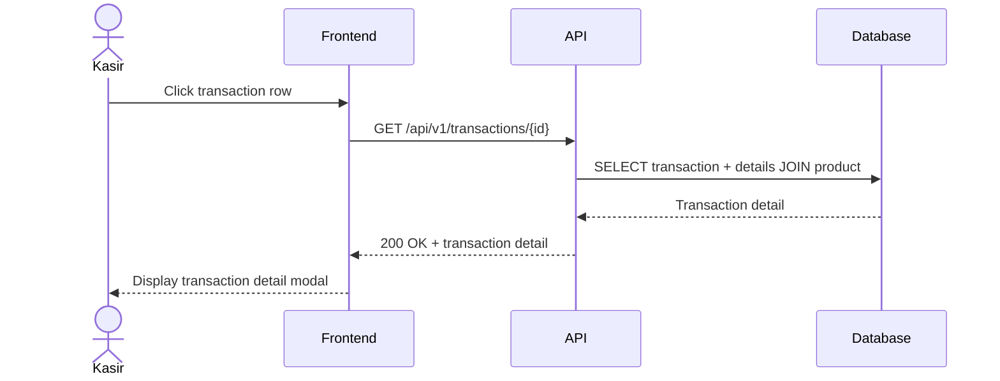

# System Logic: UC-005 View Daily Report

Document Version: v1.0

Use Case ID: UC-005

Use Case Name: View Daily Report

Status: Draft

Last Updated: 2026-06-16

Author: System Analyst AI

---

## 1. Overview

This document defines the system logic for viewing daily sales and stock reports.

---

## 2. Sequence Diagram

### 2.1 Load Daily Report



### 2.2 View Transaction Detail



---

## 3. API Contract

### 3.1 GET /api/v1/reports/daily

Get daily report summary.

**Query Parameters:**

| Parameter | Type | Required | Description |
| --- | --- | --- | --- |
| date | string | No | Date in YYYY-MM-DD format (default: today) |

**Success Response (200 OK):**

```json
{
  "success": true,
  "data": {
    "date": "2026-06-16",
    "kpi": {
      "total_revenue": 450000,
      "total_transactions": 12,
      "average_transaction": 37500,
      "total_items_sold": 35
    },
    "transactions": [
      {
        "id": 1001,
        "transaction_date": "2026-06-16T10:30:00Z",
        "total_amount": 45000,
        "amount_paid": 50000,
        "change_amount": 5000,
        "item_count": 3
      },
      {
        "id": 1002,
        "transaction_date": "2026-06-16T11:15:00Z",
        "total_amount": 25000,
        "amount_paid": 25000,
        "change_amount": 0,
        "item_count": 2
      }
    ],
    "stock_alerts": [
      {
        "product_id": 5,
        "name": "Roti Tawar",
        "stock_quantity": 3,
        "status": "low"
      },
      {
        "product_id": 8,
        "name": "Susu UHT",
        "stock_quantity": 0,
        "status": "out_of_stock"
      }
    ]
  },
  "message": "Success"
}
```

**Error Response (500 Internal Server Error):**

```json
{
  "success": false,
  "data": null,
  "message": "Gagal memuat laporan. Silakan coba lagi.",
  "errors": []
}
```

---

### 3.2 GET /api/v1/transactions/{id}

Get transaction detail (for modal view).

**Success Response (200 OK):**

```json
{
  "success": true,
  "data": {
    "id": 1001,
    "transaction_date": "2026-06-16T10:30:00Z",
    "total_amount": 45000,
    "amount_paid": 50000,
    "change_amount": 5000,
    "status": "completed",
    "items": [
      {
        "product_id": 1,
        "product_name": "Kopi Susu",
        "quantity": 2,
        "unit_price": 15000,
        "subtotal": 30000
      },
      {
        "product_id": 3,
        "product_name": "Roti Bakar",
        "quantity": 1,
        "unit_price": 15000,
        "subtotal": 15000
      }
    ]
  },
  "message": "Success"
}
```

---

## 4. Stock Alert Thresholds

| Status | Condition | Visual Indicator |
| --- | --- | --- |
| normal | stock_quantity > 5 | Green badge |
| low | 1 <= stock_quantity <= 5 | Red badge |
| out_of_stock | stock_quantity = 0 | Red badge + "Habis" label |

---

## 5. Business Rules

| Rule | Description |
| --- | --- |
| BR-001 | Daily report is aggregated from today's transactions |
| BR-002 | Data is read-only (no modifications allowed) |
| BR-003 | Products with stock <= 5 shown with red indicator |

---

## 6. Traceability

| User Flow | Requirement | API Endpoints |
| --- | --- | --- |
| userflow_uc_005.md | F003 | GET /api/v1/reports/daily, GET /api/v1/transactions/{id} |
