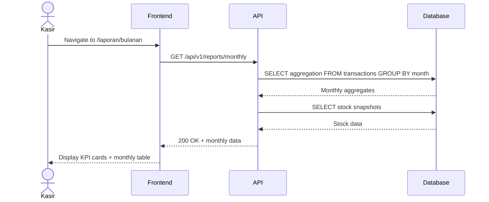
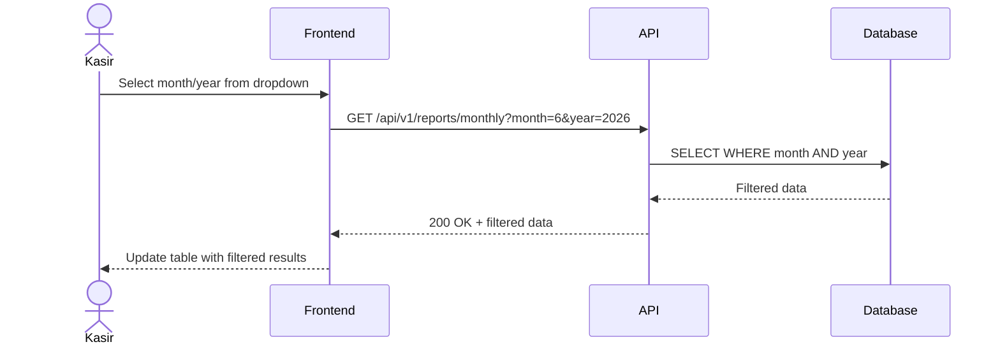

# System Logic: UC-006 View Monthly Report

Document Version: v1.0

Use Case ID: UC-006

Use Case Name: View Monthly Report

Status: Draft

Last Updated: 2026-06-16

Author: System Analyst AI

---

## 1. Overview

This document defines the system logic for viewing monthly sales and stock reports with filtering capabilities.

---

## 2. Sequence Diagram

### 2.1 Load Monthly Report



### 2.2 Filter by Month



---

## 3. API Contract

### 3.1 GET /api/v1/reports/monthly

Get monthly report summary.

**Query Parameters:**

| Parameter | Type | Required | Description |
| --- | --- | --- | --- |
| month | integer | No | Month (1-12, default: current month) |
| year | integer | No | Year (default: current year) |

**Success Response (200 OK):**

```json
{
  "success": true,
  "data": {
    "filters": {
      "month": 6,
      "year": 2026
    },
    "kpi": {
      "total_revenue": 12500000,
      "total_transactions": 320,
      "average_per_day": 416667,
      "total_items_sold": 890
    },
    "monthly_data": [
      {
        "month": "2026-06",
        "total_transactions": 320,
        "total_revenue": 12500000,
        "total_items_sold": 890
      }
    ],
    "daily_breakdown": [
      {
        "date": "2026-06-01",
        "transactions": 15,
        "revenue": 525000
      },
      {
        "date": "2026-06-02",
        "transactions": 12,
        "revenue": 420000
      }
    ],
    "stock_summary": {
      "total_products": 25,
      "in_stock": 20,
      "low_stock": 3,
      "out_of_stock": 2
    }
  },
  "message": "Success"
}
```

**Error Response (400 Bad Request):**

```json
{
  "success": false,
  "data": null,
  "message": "Format bulan/tahun tidak valid",
  "errors": []
}
```

---

### 3.2 GET /api/v1/reports/monthly/available

Get available months with data.

**Success Response (200 OK):**

```json
{
  "success": true,
  "data": {
    "available_periods": [
      {
        "month": 6,
        "year": 2026,
        "label": "Juni 2026"
      },
      {
        "month": 5,
        "year": 2026,
        "label": "Mei 2026"
      },
      {
        "month": 4,
        "year": 2026,
        "label": "April 2026"
      }
    ]
  },
  "message": "Success"
}
```

---

## 4. Data Aggregation Logic

### 4.1 Monthly KPI Calculation

```sql
SELECT
    SUM(total_amount) as total_revenue,
    COUNT(*) as total_transactions,
    SUM(item_count) as total_items_sold
FROM transaction
WHERE
    EXTRACT(MONTH FROM transaction_date) = :month
    AND EXTRACT(YEAR FROM transaction_date) = :year
    AND status = 'completed';
```

### 4.2 Daily Breakdown

```sql
SELECT
    DATE(transaction_date) as date,
    COUNT(*) as transactions,
    SUM(total_amount) as revenue
FROM transaction
WHERE
    EXTRACT(MONTH FROM transaction_date) = :month
    AND EXTRACT(YEAR FROM transaction_date) = :year
    AND status = 'completed'
GROUP BY DATE(transaction_date)
ORDER BY date;
```

### 4.3 Stock Summary

```sql
SELECT
    COUNT(*) as total_products,
    SUM(CASE WHEN stock_quantity > 5 THEN 1 ELSE 0 END) as in_stock,
    SUM(CASE WHEN stock_quantity BETWEEN 1 AND 5 THEN 1 ELSE 0 END) as low_stock,
    SUM(CASE WHEN stock_quantity = 0 THEN 1 ELSE 0 END) as out_of_stock
FROM product;
```

---

## 5. Business Rules

| Rule | Description |
| --- | --- |
| BR-001 | Monthly report is aggregated from daily transactions |
| BR-002 | Data is read-only (cannot be modified by Kasir) |
| BR-003 | Kasir can filter data by month and year |
| BR-004 | Only months with existing data appear in filter |

---

## 6. Traceability

| User Flow | Requirement | API Endpoints |
| --- | --- | --- |
| userflow_uc_006.md | F004 | GET /api/v1/reports/monthly, GET /api/v1/reports/monthly/available |
